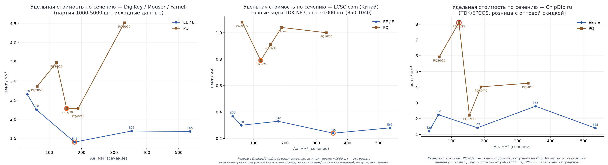

# ЭСКИЗНЫЙ ПРОЕКТ

## Двунаправленный изолированный DC-DC преобразователь

### Пояснительная записка

---

**Шифр документа:** ДЦ-ДД-001  
**Стадия:** Эскизный проект  
**Версия:** 0.1

---

# Содержание

* [Предисловие](#предисловие)
* [Перечень сокращений, обозначений и терминов](#перечень-сокращений-обозначений-и-терминов)
* [Введение](#введение)

1. [Выбор технического решения](#1-выбор-технического-решения)
   1. [Анализ возможных топологий изолированного двунаправленного DC-DC преобразователя](#11-анализ-возможных-топологий-изолированного-двунаправленного-dc-dc-преобразователя)
   2. [Сравнение вариантов и выбор топологии](#12-сравнение-вариантов-и-выбор-топологии)
   3. [Обоснование выбора способа управления преобразователем](#13-обоснование-выбора-способа-управления-преобразователем)
2. [Структурная схема преобразователя и выбор элементной базы](#2-структурная-схема-преобразователя-и-выбор-элементной-базы)
   1. [Выбор элементной базы](#21-выбор-элементной-базы)
   2. [Потоки энергии, сигналы управления и измерения](#22-потоки-энергии-сигналы-управления-и-измерения)
   3. [Взаимодействие с кластером и аккумуляторной батареей](#23-взаимодействие-с-кластером-и-аккумуляторной-батареей)
3. [Принцип действия преобразователя](#3-принцип-действия-преобразователя)
   1. [Интервалы периода коммутации](#31-интервалы-периода-коммутации)
   2. [Механизм включения при нулевом напряжении](#32-механизм-включения-при-нулевом-напряжении)
   3. [Передача энергии от высоковольтной шины к батарее](#33-передача-энергии-от-высоковольтной-шины-к-батарее)
   4. [Передача энергии от батареи к высоковольтной шине](#34-передача-энергии-от-батареи-к-высоковольтной-шине)
   5. [Пуск, переход через нулевую мощность и останов](#35-пуск-переход-через-нулевую-мощность-и-останов)
4. [Расчёт силовой части](#4-расчёт-силовой-части)
   1. [Выбор коэффициента трансформации](#41-выбор-коэффициента-трансформации)
   2. [Выбор частоты коммутации](#42-выбор-частоты-коммутации)
   3. [Выбор номинального фазового сдвига](#43-выбор-номинального-фазового-сдвига)
   4. [Расчёт передаточной индуктивности](#44-расчёт-передаточной-индуктивности)
   5. [Токи и напряжения элементов схемы по диапазону](#45-токи-и-напряжения-элементов-схемы-по-диапазону)
   6. [Границы диапазона ZVS](#46-границы-диапазона-zvs)
5. [Накопительные и фильтрующие элементы](#5-накопительные-и-фильтрующие-элементы)
   1. [Конденсаторы звена ВВ](#51-конденсаторы-звена-вв)
   2. [Конденсаторы звена НВ](#52-конденсаторы-звена-нв)
   3. [Действующие токи пульсаций и выбор типов конденсаторов](#53-действующие-токи-пульсаций-и-выбор-типов-конденсаторов)
6. [Система управления, измерения и защиты](#6-система-управления-измерения-и-защиты)
   1. [Микроконтроллер и формирование управляющих импульсов](#61-микроконтроллер-и-формирование-управляющих-импульсов)
   2. [Измерение токов и напряжений](#62-измерение-токов-и-напряжений)
   3. [Гальваническая развязка и интерфейс CAN](#63-гальваническая-развязка-и-интерфейс-can)
   4. [Защиты и поведение в аварийных режимах](#64-защиты-и-поведение-в-аварийных-режимах)
7. [Моделирование](#7-моделирование)
   1. [Состав модели и принятые параметры](#71-состав-модели-и-принятые-параметры)
   2. [Проверка режимов в номинальной точке](#72-проверка-режимов-в-номинальной-точке)
   3. [Проверка на границах диапазона напряжений и мощности](#73-проверка-на-границах-диапазона-напряжений-и-мощности)
   4. [Сопоставление результатов моделирования с расчётом](#74-сопоставление-результатов-моделирования-с-расчётом)
8. [Потери, КПД и тепловой режим](#8-потери-кпд-и-тепловой-режим)
    1. [Сводный баланс потерь](#81-сводный-баланс-потерь)
    2. [Расчётный КПД по диапазону работоспособности](#82-расчётный-кпд-по-диапазону-работоспособности)
    3. [Тепловой расчёт и система охлаждения](#83-тепловой-расчёт-и-система-охлаждения)
    4. [Конструктивное исполнение и компоновка](#84-конструктивное-исполнение-и-компоновка)
9. [Заключение](#9-заключение)
    1. [Результаты эскизного проекта](#91-результаты-эскизного-проекта)
    2. [Перечень работ последующих стадий](#92-перечень-работ-последующих-стадий)

* [Список литературы и других источников информации](#список-литературы-и-других-источников-информации)

---

# Предисловие

Настоящая пояснительная записка разработана в составе эскизного проекта двунаправленного изолированного DC-DC преобразователя.

Документ содержит обоснование принятых технических решений, описание структуры и принципа действия преобразователя, а также результаты предварительных инженерных расчётов, подтверждающих возможность реализации требований технического задания.

По мере выполнения работ содержание пояснительной записки уточняется и дополняется результатами расчётов, анализа и проектирования.

# Перечень сокращений, обозначений и терминов

| Обозначение | Определение |
|:--|:--|
| АКБ | Аккумуляторная батарея |
| ВВ | Высоковольтная шина постоянного тока |
| НВ | Низковольтная шина постоянного тока |
| DC | Постоянный ток (Direct Current) |
| DC-DC | Двунаправленный изолированный преобразователь постоянного тока |
| КПД | Коэффициент полезного действия |
| ШИМ | Широтно-импульсная модуляция |
| CAN | Controller Area Network |
| MCU | Микроконтроллер (Microcontroller Unit) |
| PWM | Pulse Width Modulation |
| ZVS | Коммутация при нулевом напряжении (Zero Voltage Switching) |
| ZCS | Коммутация при нулевом токе (Zero Current Switching) |
| EMI | Электромагнитные помехи (Electromagnetic Interference) |
| ESR | Эквивалентное последовательное сопротивление (Equivalent Series Resistance) |
| RMS | Среднеквадратичное значение (Root Mean Square) |

# Введение

Разрабатываемое семейство стабилизаторов однофазной сети 220/230 В, 50 Гц выпускается в кластерном исполнении. В состав кластера входят от двух до шести силовых инверторных модулей мощностью 2 кВт каждый, мастер-контроллер с устройством отображения информации и IoT-шлюз. Узлы кластера взаимодействуют по CAN-шине со скоростью 1 Мбит/с. Силовые модули формируют стабилизированное выходное напряжение в широком диапазоне входных напряжений, используя промежуточные звенья постоянного тока.

Разрабатываемый DC-DC является подсистемой накопления энергии в составе указанного стабилизатора. Каждый DC-DC подключается к высоковольтному звену постоянного тока соответствующего инверторного каскада и к аккумуляторной батарее LiFePO4 конфигурации 16S. Высоковольтные звенья постоянного тока отдельных инверторных каскадов не объединяются; низковольтные звенья DC-DC могут объединяться в общую аккумуляторную шину. DC-DC обеспечивает передачу энергии в обоих направлениях: от аккумуляторной батареи к DC-звену для питания нагрузки при отсутствии или недостаточном качестве сети, а также от DC-звена к аккумуляторной батарее при её заряде. Управление DC-DC, выдача команд и передача диагностической информации предусматриваются через CAN-интерфейс кластера.

Согласно техническому заданию, номинальная передаваемая мощность DC-DC равна номинальной мощности AC-каскада кластера и составляет 2 кВт. Рабочий диапазон напряжения высоковольтной стороны составляет 360…430 В, низковольтной стороны 40…60 В. Передача энергии между сторонами выполняется через высокочастотный трансформатор с гальванической изоляцией. Такое построение обеспечивает функциональное отделение аккумуляторной подсистемы от высоковольтного звена инвертора и создаёт основу для работы стабилизатора как UPS или гибридного инвертора.

Настоящая пояснительная записка содержит обоснование выбора технических решений, описание структуры и принципа действия DC-DC, а также предварительные расчёты силовой части, трансформатора, накопительных элементов, потерь и теплового режима. Документ предназначен для фиксации решений эскизного проекта и последующего перехода к разработке электрической принципиальной схемы, конструкции и программы управления.

# 1 Выбор технического решения

## 1.1 Анализ возможных топологий изолированного двунаправленного DC-DC преобразователя

### 1.1.1 Исходные данные и обозначения

По техническому заданию: сторона ВВ 360…430 В, сторона НВ 40…60 В, номинальная мощность 2000 Вт, передача энергии в обоих направлениях, кремниевые силовые ключи. Полная мощность требуется в диапазоне НВ 46…57 В; на краях диапазона работоспособности, то есть при 40…46 В и 57…60 В, достаточно 200 Вт.

**Коэффициент передачи** Кп = U_НВ/U_ВВ, отношение напряжений сторон, которое преобразователь обязан обеспечить. Требуемые значения:

- при полной мощности Кп = 0,107…0,158, то есть изменяется в 1,48 раза;
- во всём диапазоне работоспособности Кп = 0,093…0,167, то есть изменяется в 1,80 раза.

**Коэффициент трансформации** n задаётся числом витков и постоянен. Произведение

$$ {\Large d = n \cdot K_{\text{п}} } ,~(1.1)$$

показывает, насколько приведённое напряжение стороны НВ совпадает с напряжением стороны ВВ. При d = 1 приведённые напряжения сторон равны. Это оптимальная рабочая точка любой изолирующей топологии: реактивная составляющая тока минимальна, условия коммутации наилучшие. Поскольку n постоянен, а Кп меняется, удержать d = 1 во всём диапазоне невозможно. Выбрав n = 7,81 из условия d = 1 в номинальной точке 400 В и 51,2 В (формула (1.1)), получаем d = 0,84…1,24 при полной мощности и d = 0,73…1,30 во всём диапазоне работоспособности.

Второе исходное обстоятельство: токи сторон различаются почти на порядок. При номинальной мощности это до 50 А на стороне НВ против 5,6 А на стороне ВВ. Один и тот же по схеме узел на разных сторонах преобразователя обходится совершенно по-разному.

Ниже рассмотрены четыре возможные топологии: от простейшей, воспроизводящей силовой тракт серийного прототипа, до двойного активного моста, который в итоге и выбирается.

### 1.1.2 Вариант 1. Понижающая ячейка на стороне ВВ и раздельное регулирование направлений

Вариант воспроизводит силовой тракт серийного гибридного инвертора POW-HVM3.2H и ряда других недорогих инверторов китайского производства.

Рисунок 1.1 — Силовой тракт прототипа: понижающая ячейка на стороне ВВ

Регулирующая ячейка образована ключом VT5 в отрицательной шине ВВ, диодом VD1 и дросселем L1 в плюсовой шине. Конденсатора промежуточного звена нет: мост ВВ включён внутрь контура, образованного дросселем и диодом. На рисунке каскад НВ показан так, как он выполнен в прототипе: по схеме со средней точкой. На анализ это не влияет.

Двумя направлениями передачи энергии управляют разные узлы.

При **разряде** ведущим является каскад НВ. Он работает с изменяемой скважностью, L1 служит дросселем выходного фильтра, мост ВВ работает выпрямителем, VT5 удерживается открытым и только проводит ток. Напряжение шины

$$ {\Large U_{\text{ВВ}} = 2 \cdot D \cdot n \cdot U_{\text{НВ}} } ,~(1.2)$$

где D это скважность плеча каскада НВ, не превышающая 0,5.

При **заряде** ведущей становится ячейка. VT5 работает в режиме ШИМ, L1 служит дросселем понижающего преобразователя, VD1 работает его обратным диодом, мост ВВ инвертирует напряжение звена в трансформатор, ключи стороны НВ выпрямляют. Напряжение батареи

$$ {\Large U_{\text{НВ}} = \dfrac{D' \cdot U_{\text{ВВ}}}{n} } ,~(1.3)$$

где D′ это коэффициент заполнения VT5.

Преобразователь двунаправлен и регулируется в обе стороны. Но регулирующие узлы разнесены по разные стороны гальванической развязки, а оба направления являются понижающими: каждое способно только уменьшать напряжение своего источника.

Все каскады коммутируют жёстко; в прототипе ключи моста ВВ снабжены снабберными конденсаторами.

### 1.1.3 Вариант 2. Мост с фиксированной скважностью и повышающий каскад на стороне ВВ

Тот же принцип разделения функций, что и в варианте 1, но регулирующая ячейка здесь содержит не один ключ и диод, а два ключа: обычный неизолированный повышающий преобразователь между промежуточным звеном и стороной ВВ. Изоляция и регулирование по-прежнему разнесены по разным каскадам, и каждый занимается только своим делом.

Рисунок 1.2 — Мост с фиксированной скважностью и повышающий каскад на стороне ВВ

Изолирующий каскад: два полных моста и трансформатор со скважностью 50 % без всякого регулирования, то есть трансформатор постоянного тока. Он ничего не стабилизирует: напряжение промежуточного звена просто следует за напряжением батареи, умноженным на n. Благодаря этому каскад всегда работает при d = 1, в оптимальной рабочей точке (формула (1.1)). Реактивная составляющая тока минимальна. Подмагничивание при этом не исчезает: скважность 50 % даёт нулевой вольт-секундный баланс лишь при идеально симметричных плечах, а реальная несимметрия сопротивлений открытых ключей и мёртвого времени накапливается и требует коррекции по измеренному току, так же, как в варианте 4 (см. п. 1.1.5).

Регулирующий каскад стабилизирует напряжение, задаёт передаваемую мощность, отрабатывает профиль заряда батареи и задаёт направление передачи энергии; изолирующий каскад собственной логики направления не содержит. В отличие от варианта 1, где эти функции разнесены по обе стороны гальванической развязки, здесь оба ключа регулирующей ячейки стоят по одну сторону, на стороне ВВ.

Коэффициент трансформации выбирается из условия

$$ {\Large n \cdot U_{\text{НВ.макс}} \le U_{\text{ВВ.мин}} } ,~(1.4)$$

откуда n ≤ 6. При n = 6 промежуточное звено работает в диапазоне 240…360 В, а наибольшее требуемое отношение напряжений регулирующего каскада составляет 430/240 = 1,79 при коэффициенте заполнения 0,44.

Существенно, что регулирующий каскад стоит на стороне ВВ. Через него проходит та же мощность, но при напряжении 240…430 В, поэтому ток составляет 5,6…8,3 А вместо 50 А: дроссель рассчитывается на ток менее 10 А, конденсатор промежуточного звена на пульсации того же порядка. На стороне НВ тот же каскад потребовал бы дросселя на 50 А и конденсаторной батареи на такую же пульсацию.

Расплата за развязку функций: две составляющие потерь, присутствующие постоянно. Первая: условие ZVS по знаку тока в изолирующем каскаде выполняется при любой нагрузке, а по энергии нет, поэтому индуктивность намагничивания приходится намеренно занижать, и создаваемый ею циркулирующий ток присутствует всегда, включая полную мощность. Вторая: ключи регулирующего каскада ZVS не имеют вовсе. При непрерывном токе дросселя нижний ключ включается на открытый встроенный диод верхнего, и тот восстанавливается под напряжением 360…430 В; при заряде обратного восстановления в единицы микрокулон и частоте 65 кГц это 25…50 Вт на полной мощности. Устраняется переводом каскада на границу прерывистых токов, ценой переменной частоты и удвоенной пульсации тока, либо снижением частоты коммутации.

Дополнительно индуктивность рассеяния трансформатора создаёт просадку промежуточного напряжения, пропорциональную току. Регулирующий каскад её отрабатывает, но при выборе n она уменьшает располагаемый запас.

### 1.1.4 Вариант 3. Резонансный преобразователь CLLLC

Оба предыдущих варианта разносят изоляцию и регулирование по разным каскадам. Здесь, как и в варианте 4 (см. п. 1.1.5), используется единый двухмостовой каркас, два полных моста с трансформатором между ними, но между мостами дополнительно включён симметричный резонансный контур: последовательные индуктивность и ёмкость с каждой стороны трансформатора, а роль параллельной индуктивности играет индуктивность намагничивания. Схема ведёт себя как трансформатор с частотно-управляемым коэффициентом передачи, а форма тока в ней близка к синусоиде.

Рисунок 1.3 — Резонансный преобразователь CLLLC

В точке резонанса преобразователь работает безупречно: действующий ток минимален, мост ВВ включается при нулевом напряжении, мост НВ выключается при нулевом токе, крутых фронтов нет и уровень помех низкий. ZVS моста ВВ обеспечивается током намагничивания и потому не зависит от нагрузки, сохраняется вплоть до холостого хода.

Но именно в точке резонанса преобразователь не регулируется. Чтобы отработать изменение Кп в 1,48 раза, приходится уходить от резонанса и вверх, и вниз по частоте, а вместе с этим уходят и все перечисленные достоинства: выше резонанса теряется ZCS моста НВ, ниже резонанса уход в ёмкостную область срывает ZVS моста ВВ, растёт циркулирующая энергия. Требуемый диапазон регулирования шире того окна, в котором топология выигрывает.

Второе ограничение конструктивное. Через резонансный конденсатор стороны НВ проходит весь ток этой стороны, то есть 40…60 А действующего значения на частоте в десятки килогерц. Это самый нагруженный элемент схемы, и именно он определяет её ресурс.

Наконец, обе резонансные частоты задаются произведением индуктивности на ёмкость, поэтому производственный разброс магнитопроводов и конденсаторов смещает рабочую точку независимо с каждой стороны.

### 1.1.5 Вариант 4. Двойной активный мост

Тот же двухмостовой каркас, что и в варианте 3, но без резонансного контура: последовательные индуктивность и ёмкости исключены, а функцию передаточной индуктивности выполняет индуктивность рассеяния самого трансформатора. Это самая экономная по составу из двунаправленных изолирующих схем: два одинаковых полных моста, между ними трансформатор и последовательная индуктивность. Больше ничего: ни выпрямителя, ни дросселя фильтра, ни разделительного конденсатора.

Рисунок 1.4 — Двойной активный мост

Оба моста формируют прямоугольное напряжение со скважностью 50 % на одной частоте. Разность фаз между этими напряжениями приложена к индуктивности, и вся передаваемая мощность определяется одной величиной, фазовым сдвигом φ:

$$ {\Large P = \dfrac{n \cdot U_{\text{ВВ}} \cdot U_{\text{НВ}} \cdot \varphi \cdot (\pi - \varphi)}{2\pi^2 f L} } ,~(1.5)$$

Смена знака φ разворачивает поток энергии. Никаких переключений в силовой части при этом не происходит, реверс занимает один период.

ZVS обеспечивается током индуктивности: к моменту коммутации он должен течь в нужную сторону и иметь достаточную энергию для перезаряда выходных ёмкостей плеча. Условие по знаку тока даёт границы по углу: для моста ВВ

$$ {\Large \varphi > \dfrac{\pi (d-1)}{2d} } ,~(1.6)$$

для моста НВ

$$ {\Large \varphi > \dfrac{\pi (1-d)}{2} } ,~(1.7)$$

В окне полной мощности, где d = 0,84…1,24, эти границы составляют 17,2° и 14,8°, а рабочий угол при 2000 Вт равен 35…37°. Запас двукратный, ZVS обеспечивается на обоих мостах во всём окне полной мощности.

Теряется ZVS при снижении мощности: при 200 Вт фазовый угол падает примерно до 3°, чего не хватает ни по знаку тока, ни по энергии даже в точке d = 1. ZCS в этой топологии не достигается нигде: оба моста выключаются вблизи максимума тока, где выключение частично демпфируется собственной ёмкостью ключей.

Отклонение d от единицы добавляет в ток трансформатора реактивную составляющую. На краях окна полной мощности действующий ток стороны ВВ растёт с 5,8 до 6,1…6,2 А, то есть на 5…6 %, а потери проводимости примерно на 12 %.

Слабое место топологии: подмагничивание трансформатора. Управление по фазовому сдвигу не следит за вольт-секундным балансом обмотки, а разброс сопротивлений открытых ключей и длительности пауз создаёт небольшую несимметрию напряжения. При малом активном сопротивлении силового контура она накапливается в постоянную составляющую тока и смещает рабочую точку магнитопровода. Разделительный конденсатор не применяется, поэтому подавлять эту составляющую должна система управления по результатам измерения тока.

## 1.2 Сравнение вариантов и выбор топологии

Сравнение выполнено по электрическим показателям. Удобство реализации системы управления, стоимость и площадь печатной платы не рассматриваются.

Конфигурация выпрямительной части стороны НВ (полный мост или схема со средней точкой) на выбор топологии не влияет и в сравнении не учитывается: во всех вариантах она принята полномостовой, в том числе при подсчёте числа ключей.

Таблица 1.1 — Сравнение вариантов

| Показатель | Вариант 1 (мост + понижающая ячейка) | Вариант 2 (мост + повышающий каскад) | Вариант 3 (CLLLC) | Вариант 4 (DAB) |
|:--|:--|:--|:--|:--|
| Число преобразований энергии | 2 | 2 | 1 | 1 |
| Число ключей в тракте передачи энергии | 9 | 10 | 8 | 8 |
| Реактивные элементы | дроссель регулирующей ячейки | дроссель регулирующего каскада | 2 дросселя и 2 конденсатора | дроссель |
| Управление передаваемой мощностью | два контура: скважность каскада НВ при разряде, скважность ячейки при заряде | коэффициентом заполнения ячейки, один контур | частотой, один контур | фазовым сдвигом, один контур |
| Отработка изменения Кп | оба направления понижающие, требуемого n не существует (см. п. 1.2) | регулирующим каскадом, изолирующий остаётся при d = 1 | уходом от резонанса | не отрабатывается, d уходит от единицы |
| ZVS в окне полной мощности | не обеспечивается ни в одном каскаде | обеспечивается в изолирующем каскаде, отсутствует в регулирующем | ZVS моста ВВ только выше резонанса | обеспечивается на обоих мостах, запас по углу двукратный |
| ZVS при мощности 200 Вт | не обеспечивается | обеспечивается в изолирующем каскаде | обеспечивается током намагничивания | не обеспечивается |
| ZCS моста НВ | не достигается | не достигается | на резонансе и ниже | не достигается |
| Реактивная и циркулирующая составляющие тока | растут при снижении скважности каскада НВ | присутствуют постоянно, от заниженной индуктивности намагничивания | растут вне резонанса | растут на 5…6 % на краях окна полной мощности |
| Наиболее нагруженный элемент стороны НВ | ключи моста | ключи моста | резонансный конденсатор, 40…60 А | ключи моста |
| Дополнительные элементы стороны ВВ | дроссель ячейки; конденсатора промежуточного звена нет | дроссель и конденсатор промежуточного звена, 5,6…8,3 А | нет | нет |
| Подмагничивание трансформатора | то же, что в варианте 4 | то же, что в варианте 4 | блокируется резонансным конденсатором | накапливается при несимметрии плеч, требуется коррекция по току |
| Частота коммутации | постоянная | постоянная, кроме режима ZVS регулирующего каскада | переменная | постоянная |
| Чувствительность к разбросу параметров | низкая | низкая | высокая, две резонансные частоты | низкая |
| КПД в номинальной точке | 93,5…95 % | 93,5…95 % | 96…97 % | 95…96 % |
| КПД на краях окна полной мощности | 93,5…95 % | 93,5…95 % | 93…95 % | 94…95 % |
| КПД при 200 Вт на краю диапазона работоспособности | около 92 % | около 92 % | 90…93 % | около 92 % |
| Устранение слабого места | в пределах топологии не устраняется | изменением режима работы регулирующего каскада | изменением параметров резонансного контура | второй управляющей переменной, без изменения силовой схемы |

Число каскадов итоговый КПД не определяет: два каскада перемножают свои коэффициенты, но каждый из них может быть выше, чем у однокаскадной схемы, работающей вне оптимума. Однако у варианта 2 обе составляющие потерь, циркулирующий ток изолирующего каскада и обратное восстановление в регулирующем, присутствуют постоянно, поэтому его пологая характеристика проходит ниже, чем характеристика варианта 4 в окне полной мощности.

**Выбор: вариант 4, двойной активный мост.**

Решающим оказалось разделение диапазонов в техническом задании. Полная мощность требуется в окне 46…57 В, где d = 0,84…1,24, а границы сохранения ZVS составляют 17,2° и 14,8° против рабочего угла 35…37° (формулы (1.6) и (1.7)). Там, где передаётся вся мощность, обеспечивается ZVS на обоих мостах, а рост действующего тока на краях окна не превышает 6 %. Расширенный диапазон 40…60 В, где ZVS теряется, требует всего 200 Вт, и потери на перезаряд выходных ёмкостей составляют там около 5 Вт.

Вариант 3 при этом же условии выигрывает только в узкой полосе вокруг резонанса, а требуемое изменение Кп в 1,48 раза из неё выводит. Кроме того, резонансный конденсатор стороны НВ на 40…60 А остаётся самым нагруженным элементом схемы независимо от режима, а переменная частота коммутации не позволяет рассчитать фильтр электромагнитной совместимости и магнитные элементы на одну частоту.

Вариант 2 обеспечивает наиболее ровный КПД по диапазону, но его уровень ниже, поскольку обе дополнительные составляющие потерь действуют постоянно, а не только на краях. Он остаётся резервным решением на случай, если измеренный КПД варианта 4 на краях окна полной мощности не удовлетворит требованиям технического задания.

Вариант 1 двунаправлен и регулируется в обе стороны, поэтому по управляемости мощностью вариантам 2–4 он не уступает. Его ограничение количественное. Регулирование в обоих направлениях способно только снижать напряжение относительно значения, заданного коэффициентом трансформации: при разряде U_ВВ = 2·D·n·U_НВ ≤ n·U_НВ (формула (1.2)), при заряде U_НВ = D′·U_ВВ/n ≤ U_ВВ/n (формула (1.3)). Первое требует n ≥ 430/46 = 9,35, второе n ≤ 360/57 = 6,32. Такого коэффициента трансформации не существует. Прототип с этим не сталкивается, поскольку его шина не нормирована: 300…450 В там результат, а не требование. Здесь же диапазон 360…430 В задан инверторным каскадом.

Второе отличие структурное. Регулирующие узлы разнесены по разные стороны гальванической развязки, поэтому нужны два контура регулирования с собственными датчиками, а смена направления означает передачу управления с одной стороны на другую. Вариант 2 обходится одним контуром: изолирующий каскад всегда работает при фиксированной скважности, всё регулирование ведёт ячейка.

По КПД варианты 1 и 2 на этой стадии неразличимы. У варианта 1 при разряде ячейка не преобразует энергию, а только проводит ток, но каскад НВ работает при скважности ниже предельной, что повышает действующие токи; у варианта 2 ячейка преобразует энергию в обоих направлениях, зато изолирующий каскад всегда остаётся при d = 1. Различие между ними лежит не в КПД, а в структуре регулирования.

Существенно и то, как устраняются слабые места. У варианта 4 потеря ZVS при малой мощности и рост реактивного тока при отклонении d от единицы устраняются введением второй управляющей переменной, дополнительного фазового сдвига внутри моста, то есть правкой программы управления без изменения силовой схемы. Подмагничивание трансформатора устраняется там же, коррекцией по измеренному току. У варианта 3 расширение рабочего диапазона потребовало бы пересчёта резонансного контура и переделки магнитных элементов, у варианта 2 изменения режима работы регулирующего каскада с потерей постоянной частоты коммутации.

## 1.3 Обоснование выбора способа управления преобразователем

Базовый способ управления: однофазный сдвиг (SPS). Оба моста работают со скважностью 50 %, а единственной управляющей переменной служит фазовый сдвиг φ между ними. Мощность и её направление задаются одной величиной, поэтому контур регулирования получается простым, а реверс занимает один период коммутации. Частота коммутации постоянная.

Ограничения SPS показаны в п. 1.2: ZVS сохраняется только при достаточном фазовом угле, а при отклонении d от единицы растёт реактивная составляющая тока. Поэтому предусматривается переход к расширенному фазовому сдвигу (EPS): помимо межмостового угла φ вводится внутримостовой сдвиг, укорачивающий импульс напряжения одного из мостов. Это снижает реактивный ток при d ≠ 1 и расширяет диапазон ZVS в сторону малых мощностей. Силовая схема при этом не изменяется.

Дополнительно система управления решает две задачи, вытекающие из выбранной топологии:

- подавление постоянной составляющей тока трансформатора, коррекцией длительностей импульсов по результатам измерения тока;
- плавный пуск, нарастанием φ от нуля, что исключает бросок тока и одностороннее намагничивание магнитопровода при включении.

Профиль заряда аккумуляторной батареи реализуется внешним контуром, задающим φ по командам, поступающим от кластера по CAN-интерфейсу.

# 2 Структурная схема преобразователя и выбор элементной базы

Раздел 1 определил топологию и способ управления, но не зафиксировал состав конкретных узлов и связи между силовой частью и контуром управления. Прежде чем переходить к расчётам, эту связь нужно зафиксировать целиком, одной схемой, а не по частям.

Предлагается следующая структурная схема преобразователя.

Рисунок 2.1 — Структурная схема преобразователя

Силовая часть построена на общем мосте ВВ (VT1–VT4), обмотки ВВ трансформаторов T1 и T2 включены последовательно в его диагональ, а каждая обмотка НВ нагружена на собственный полный мост НВ (VT5–VT8 и VT9–VT12 соответственно). Оба моста НВ запараллелены по шинам LV+ и LV−. Мощность делится между каналами поровну благодаря последовательному включению обмоток ВВ: через них течёт один и тот же ток, а числа витков у обоих трансформаторов одинаковы и целые, поэтому одинаковы и токи обмоток НВ. Параллельное соединение мостов НВ задаёт не деление тока, а равенство напряжений на обмотках НВ. Датчики тока ДТ1 и ДТ2 контролируют, соответственно, ток моста ВВ и суммарный ток стороны НВ; их показания используются как для регулирования, так и для защиты по току.

Управляет преобразователем контроллер CH32V303: он формирует сигналы ШИМ для драйверов затворов моста ВВ (опто-изолированный TLP155×4) и мостов НВ (полумостовой драйвер), опрашивает датчики тока и обменивается данными с кластером по CAN через гальванический изолятор и трансивер TJA1040. Питание контроллера и обвязки идёт от собственного источника, понижающего напряжение батареи до 3,3 В независимо от состояния моста ВВ, что обеспечивает работоспособность цепей управления при пуске и в аварийных режимах.

Далее по разделу конкретизируются выбор элементной базы и принятые схемные решения для каждого функционального узла в отдельности.

## 2.1 Выбор элементной базы

### 2.1.1 Выбор силовых транзисторов

Помимо статических потерь проводимости, важным параметром остаётся заряд обратного восстановления Qrr и время trr. ZVS в выбранной топологии гарантирован только внутри окна полной мощности (п. 1.1.5); в расширенном диапазоне 40…46 В и 57…60 В фазовый угол падает почти до нуля, условие ZVS не выполняется, и диод плеча восстанавливается под полным напряжением шины. Кроме того, выключение в DAB никогда не бывает мягким: оба моста выключаются вблизи максимума тока, ZCS не достигается нигде (п. 1.1.5). Реальные допуски мёртвого времени и разброс параметров ключей сужают идеализированную границу ZVS и на практике. По этим причинам Qrr/trr остаётся значимым критерием отбора даже для топологии, штатный режим которой в окне полной мощности мягкая коммутация. Второй по значимости параметр: заряды затвора и выходные ёмкости (Qg, Coss, Crss), определяющие потери на переключение и требования к драйверу. Третий: тепловое сопротивление переход-корпус RthJC. При заданном токе оно напрямую определяет допустимую температуру перехода и требования к теплоотводу, а разброс этого параметра между корпусами одного класса нередко превышает разброс самого RDS(on).

Отдельно оговаривается способ пересчёта RDS(on) в нагретом состоянии. Распространённое приближение «горячее сопротивление в полтора раза больше холодного» занижает потери проводимости почти вдвое: у проверенных по даташитам приборов множитель фактически составляет ×2,5…2,7 для 650-вольтовых Super Junction при 150 °C и ×1,8 для низковольтных Trench/SGT при 125 °C. Там, где производитель не приводит горячее значение явно, ниже применены именно эти множители, а не ×1,5.

**Таблица 2.1 — Сравнение кандидатов, сторона ВВ (650 В)**

| Параметр | [SPP20N60C3](../PDF/SPP20N60C3.pdf) | [CRJT99N65G2](../PDF/CRJT99N65G2.pdf) | [JCS20N65FH](../PDF/JCS20N65FH.pdf) | [NCE65TF099](../PDF/NCE65TF099.pdf) | [NCE65T180](../PDF/NCE65T180.pdf) |
|:--|:--|:--|:--|:--|:--|
| Технология | CoolMOS C3 | Super Junction | планарная | Super Junction | Super Junction |
| Корпус | TO-220 | TO-220 | TO-220MF (изолир.) | TO-220 | TO-220 |
| RDS(on), 25 °C | 160 мОм | 81 мОм | 440 мОм | 89 мОм | 150 мОм |
| RDS(on), горячий | 430 мОм @150 °C | 205 мОм @150 °C | ~1100 мОм (оц.) | ~222 мОм (оц.) | ~375 мОм (оц.) |
| Qg | 87 нКл | 70 нКл | 45 нКл | 45 нКл | 36 нКл |
| Qrr / trr | 11 мкКл / 500 нс | 5,92 мкКл / 347 нс | 9,3 мкКл / 660 нс | **1,6 мкКл / 180 нс** | 5,0 мкКл / 310 нс |
| Pd, 25 °C | 208 Вт | 252 Вт | 62,2 Вт | 322 Вт | 188 Вт |
| Цена, грн | 89,50 | 91,50 | 83,50 | 82,50 | 60,00 |
| Цена опт, грн | 73,48 (от 91) | 79,24 (от 25) | 68,58 (от 29) | 67,55 (от 99) | 49,28 (от 135) |
| Купить | [Купить](https://kosmodrom.ua/ru/tranzistor-polevoy-mosfet/spp20n60c3.html) | [Купить](http://www.kosmodrom.com.ua/el.php?name=CRJT99N65G2) | [Купить](http://www.kosmodrom.com.ua/el.php?name=JCS20N65FH-220MF) | [Купить](https://kosmodrom.ua/ru/tranzistor-polevoy-mosfet/nce65tf099t.html) | [Купить](https://kosmodrom.ua/ru/tranzistor-polevoy-mosfet/nce65t180.html) |

Действующий ток моста ВВ составляет 6,6 А (принято по предварительной оценке контура), но каждый ключ полного моста проводит только половину периода, поэтому его собственный действующий ток равен 6,6/√2 = 4,67 А, и потери проводимости считаются по нему, а не по току обмотки.

Расчёт исключает двух кандидатов сразу. У JCS20N65FH при 1,1 Ом горячего сопротивления потери на ключе составляют 24 Вт. Само по себе это ниже паспортных 62,2 Вт, но Pd при 25 °C ничего не говорит о работе в изделии: из него следует RthJC = (150−25)/62,2 = 2,0 °C/Вт, и при 24 Вт перегрев перехода относительно корпуса составляет 48 °C ещё до теплоотвода и без учёта коммутации. У NCE65TF099 при RthJC = 0,39 °C/Вт и 4,8 Вт тот же перепад равен 1,9 °C. Изолированный корпус такой разницы не окупает. У SPP20N60C3 реальное BVDSS составляет 600 В, а не 650, как заявлено в шапке даташита (650 В там значение при Tj max); для шины 360…430 В запас 1,40× недостаточен с учётом выбросов на индуктивности рассеяния, а горячее сопротивление 430 мОм худшее в подборке.

Из оставшихся трёх CRJT99N65G2 даёт наименьшие потери проводимости (4,5 Вт против 4,8 Вт у NCE65TF099), но проигрывает по всем остальным показателям: заряд затвора выше на треть, а главное, заряд обратного восстановления в 3,7 раза больше (5,92 против 1,6 мкКл). На границах рабочего диапазона, где ZVS теряется (п. 1.1.5), это становится определяющим фактором. **Выбор: NCE65TF099**, по совокупности Qrr, Qg, теплового сопротивления (RthJC = 0,39 °C/Вт) и цены.

**Таблица 2.2 — Сравнение кандидатов, сторона НВ (80…100 В)**

| Параметр | [AONR62818](../PDF/AONR62818.pdf) | [CSD19503KCS](../PDF/CSD19503KCS.pdf) | [AON6226](../PDF/AON6226.pdf) | [CRSM038N10N4](../PDF/CRSM038N10N4.pdf) |
|:--|:--|:--|:--|:--|
| VDS | 80 В | 80 В | 100 В | 100 В |
| Корпус | DFN 3.3×3.3 | TO-220 | DFN 5×6 | DFN 5×6 clip |
| RDS(on), 25 °C | 5,5 мОм | 7,6 мОм | 6,4 мОм | 3,0 мОм |
| RDS(on), горячий | 9,5 мОм @125 °C | ~13,7 мОм (оц.) | 11,7 мОм @125 °C | ~5,4 мОм (оц.) |
| Qrr / trr | 100 нКл / 24 нс | 119 нКл / 72 нс | 150 нКл / 30 нс | н/д |
| RthJC | 1,8 °C/Вт | 0,8 °C/Вт | 0,9 °C/Вт | 0,5 °C/Вт |
| Цена, грн | 29,00 | 99,00 | 27,50 | 32,50 |
| Цена опт, грн | 23,73 (от 84) | 92,71 (от 22) | 22,42 (от 89) | 26,63 (от 75) |
| Купить | [Купить](https://kosmodrom.ua/ru/tranzistor-polevoy-mosfet/aonr62818.html) | [Купить](http://www.kosmodrom.com.ua/el.php?name=CSD19503KCS) | [Купить](https://kosmodrom.ua/ru/tranzistor-polevoy-mosfet/aon6226.html) | [Купить](http://www.kosmodrom.com.ua/el.php?name=CRSM038N10N4) |

Запас по напряжению у всех четырёх кандидатов достаточен: даже у приборов на 80 В он составляет не менее 20 В сверх максимума батареи 60 В, то есть треть напряжения шины. Поэтому отбор по напряжению не проводится, сравнение ведётся по проводимости, тепловому сопротивлению, полноте данных и цене. CSD19503KCS проигрывает по проводимости и AONR62818, и AON6226, а стоит втрое дороже любого из них, поэтому исключается сразу. CRSM038N10N4 формально лидирует по RDS(on) и RthJC, но для него производитель не приводит Qrr/trr, параметр, значимость которого на границах ZVS-диапазона показана в начале раздела. Выигрыш в потерях проводимости при этом составляет около 16 Вт на восемь ключей стороны НВ (29,2 против 13,5 Вт при токе ключа 25/√2 = 17,7 А), менее 1 % от номинальной мощности преобразователя, что несущественно на фоне непроверенного параметра коммутации и цены на 18 % выше.

**Выбор: AON6226.** Полностью документированный прибор (включая Qrr = 150 нКл), устойчиво доступный по складским остаткам, при цене 27,50 грн, самой низкой в подборке. RDS(on) горячий 11,7 мОм уступает CRSM038N10N4, но в пересчёте на потери разница не оправдывает риск недоказанной характеристики переключения. Корпус DFN 5×6: теплоотвод идёт через массив переходных отверстий в плате, а не через радиатор, что становится входным условием для теплового расчёта (п. 8.3) и компоновки платы (п. 8.4).

Для NCE65TF099 производитель не приводит RDS(on) при верхней рабочей температуре; расчёты раздела 4 ведутся по множителю ×2,5, как принятое допущение до получения данных от производителя или прямого измерения. Для AON6226 горячее значение (11,7 мОм @125 °C) указано в даташите напрямую и оценки не требует.

**Итог выбора силовых ключей**

| Сторона | Позиции | Прибор | Цена, грн/шт | Цена опт, грн/шт | Сумма опт, грн | Купить |
|:--|:--|:--|:--|:--|:--|:--|
| ВВ (мост, VT1–VT4) | 4 | **NCE65TF099** | 82,50 | 67,55 (от 99) | 270,20 | [Купить](https://kosmodrom.ua/ru/tranzistor-polevoy-mosfet/nce65tf099t.html) |
| НВ (два моста, VT5–VT12) | 8 | **AON6226** | 27,50 | 22,42 (от 89) | 179,36 | [Купить](https://kosmodrom.ua/ru/tranzistor-polevoy-mosfet/aon6226.html) |
| **Итого** | **12** | — | — | — | **449,56** | — |

Оптовая цена в столбце «Сумма опт» указана справочно: минимальный порог партии (89 и 99 шт) намного превышает потребность изделия (4 и 8 шт), поэтому по факту для одного комплекта действует цена «от 1 шт», 550,00 грн (см. таблицу выше).

Полные даташиты всех девяти рассмотренных кандидатов лежат в [`PDF/`](../PDF/).

### 2.1.2 Расчёт параметров трансформатора

**Мощность.** 2000 Вт номинальных: на стороне ВВ 6,6 А действующего тока моста (п. 2.1.1), на стороне НВ до 50 А суммарного тока обмоток (п. 1.1.1). Ток обмотки НВ велик для одной обмотки, поэтому трансформатор предлагается разделить на два (рисунок 2.1), по половине мощности и тока на каждый.

**Диапазон частот.** Для двухтактных схем без резонансного контура, к которым относится и DAB (сердечник возбуждается биполярным прямоугольным напряжением на постоянной частоте), при этой мощности и на кремниевых ключах типовой диапазон составляет 50…100 кГц. Конкретное значение внутри диапазона подтверждается ниже, после расчёта индукции.

**Обмотки.** Сторона НВ: мало витков и большой ток, поэтому обмотку предлагается выполнить печатными платами, по одному витку на плату, платы надеваются на центральный керн и соединяются последовательно. Это удобно и повторяемо, без ручной намотки толстым проводом, и позволяет отдать витку всю ширину окна. Сторона ВВ наоборот, много витков при небольшом токе; для неё предлагается провод, поскольку такое число витков платами не разместить.

**Плотность тока.** Сечение меди обмотки НВ ограничено окном сердечника, поэтому её сопротивление задано конструкцией и от тока не зависит, а потери растут как квадрат тока. Полные 50 А в одной обмотке дали бы 109 Вт (расчёт сопротивления ниже), что неприемлемо; разделение на два трансформатора по 25 А снижает суммарные потери вдвое, до 55 Вт. Это и есть количественное основание для двух трансформаторов.

Обмотки ВВ включены последовательно в диагональ моста ВВ: через обе течёт один и тот же ток 6,6 А, напряжение делится пополам. Обмотки НВ работают каждая на свой мост НВ, мосты запараллелены по LV+/LV−. Равенство токов каналов обеспечивается последовательным включением обмоток ВВ и одинаковым целым числом витков, а не параллельным соединением мостов НВ, которое задаёт лишь равенство напряжений.

**Выбор сердечника.** Проведём анализ стоимости. Для сравнения используется удельная величина: отношение цены к площади сечения магнитопровода, цент/мм². Стоимость сердечников EE/E и PQ без зазора проверена по трём независимым источникам, без смешивания между собой (`DC-DC/Ferrites/ferrite_cores_data.md`):

Таблица 2.3 — Минимум удельной стоимости (цент/мм²) по источникам

| Источник | Минимум EE | Минимум PQ |
|:--|:--|:--|
| DigiKey / Mouser / Farnell | E42/21/15 | **PQ32/30** |
| ChipDip.ru (розница, TDK/EPCOS) | E42/21/15 | **PQ32/30** |
| LCSC.com (Китай, точные коды TDK N87, опт ~1000 шт) | E55/28/21 | PQ26/25 |

Рисунок 2.2 — Удельная стоимость по сечению: DigiKey/Mouser/Farnell, LCSC.com (Китай), ChipDip.ru

Два источника из трёх сходятся на PQ32/30. Третий (китайская площадка) даёт PQ26/25, но с отрывом всего 15 % (0,79 против 0,91 цент/мм²), что не перекрывает довод ниже. **PQ32/30 уже массово применяется в каскадах переменного тока выпускаемых стабилизаторов** (см. Введение), то есть это освоенная позиция закупки, а не новая номенклатура. Выбор: **PQ32/30, материал N87**.

**Параметры магнитопровода.** Комплект PQ32/30 из двух половин имеет эффективное сечение Ae = 153,8 мм² при минимальном сечении Amin = 127,5 мм², среднюю длину магнитной линии le = 67,8 мм, эффективный объём Ve = 10 440 мм³ и магнитный формфактор Σl/A = 0,441 мм⁻¹ при массе комплекта 57,4 г. Для материала N87 без зазора индуктивность на квадрат числа витков AL = 4800 нГн с допуском +30/−20 %, эффективная магнитная проницаемость µe = 1700, удельные потери PV < 7,00 Вт на комплект в точке 200 мТл / 100 кГц / 100 °C. Габарит сердечника 32 × 27,5 мм при высоте 30,35 мм, диаметр центрального керна 13,45 мм, высота окна 21,3 мм.

Штатный каркас не применяется: платы обмотки НВ и провод обмотки ВВ размещаются непосредственно на керне, поэтому окно доступно целиком. Наибольший диаметр обмотки составляет 26,4 мм, откуда радиальная глубина окна равна (26,4 − 13,45)/2 = 6,5 мм, а сечение окна Aw = 6,5 × 21,3 = 138 мм² против 104 мм² при намотке на каркас. Средняя длина витка принята 62 мм.

Допуск на AL в +30/−20 % относится к индуктивности намагничивания и определяет разброс параметров между двумя трансформаторами, что учитывается при проверке деления напряжений.

**Проверка сердечника по площади-произведению.** Пригодность типоразмера проверяется методом площади-произведения (area product), стандартным для расчёта импульсных трансформаторов [1]. Исходная величина метода это расчётная мощность Pt, равная сумме полных мощностей обмоток:

$$ {\Large P_t = U_1 I_1 + U_2 I_2 } ,~(2.1)$$

Каждая обмотка ВВ работает под половиной напряжения шины, то есть под 200 В в номинале при токе 6,6 А, что даёт 1320 ВА. Обмотка НВ работает под 51,2 В при токе 25 А, то есть 1280 ВА. Отсюда Pt = 2600 ВА. Половину этой величины, 1300 ВА, в отечественной литературе называют габаритной или типовой мощностью трансформатора.

Требуемое произведение сечения сердечника на сечение окна составляет

$$ {\Large A_p = A_e \cdot A_w = \dfrac{P_t}{K_f \cdot K_u \cdot B_{\text{max}} \cdot J \cdot f} } ,~(2.2)$$

где Kf = 4 коэффициент формы прямоугольного напряжения (для синусоиды 4,44), Ku коэффициент заполнения окна медью, J плотность тока в обмотке. При Ku = 0,7, типичном для фольговых и планарных обмоток, плотности тока 4 А/мм², рабочей индукции 231 мТл и частоте 60 кГц требуется Ap = 16 750 мм⁴.

Выбранный сердечник без каркаса даёт Ap = 153,8 × 138 = 21 200 мм⁴, то есть на 27 % больше требуемого. Запас приемлемый, но не избыточный, и получен он именно за счёт отказа от каркаса: с каркасом окно составило бы 104 мм², Ap = 16 000 мм⁴, и сердечник оказался бы на пределе.

Формула (2.2) предполагает одну плотность тока для обеих обмоток, тогда как здесь они различаются в пятнадцать раз: провод обмотки ВВ работает при 4 А/мм², фольга обмотки НВ при 60 А/мм². В расчёт входит произведение Ku·J, то есть ампер-витки на единицу сечения окна; для принятой конструкции оно равно 301,8 А / 138 мм² = 2,2 А/мм² против принятых в оценке 2,8 А/мм². Прямая проверка размещения меди в окне выполнена ниже, после выбора числа витков.

**Витки и частота.** Число витков и частота выбираются совместно: индукция зависит от их произведения, поэтому раздельно их зафиксировать нельзя. Отправная точка это обмотка НВ, у неё витков меньше всего и округление до целого сказывается сильнее. Индукция считается по уравнению трансформатора для прямоугольного напряжения:

$$ {\Large U = 4 \cdot f \cdot N \cdot B_{\text{max}} \cdot A_e } ,~(2.3)$$

Проверка ведётся по верхней границе напряжения батареи 60 В: это худший случай по насыщению. Индукция насыщения N87 при 100 °C составляет около 390 мТл.

Таблица 2.4 — Bmax на обмотке НВ при U_НВ = 60 В, мТл

| Витков НВ | 60 кГц | 80 кГц | 100 кГц |
|:--|:--|:--|:--|
| 2 | 813 | 610 | 488 |
| 4 | 406 | 305 | 244 |
| **6** | **271** | 203 | 163 |

Два витка непригодны на любой частоте диапазона: индукция превышает насыщение в полтора-два раза. Четыре витка на 60 кГц дают 406 мТл, то есть тоже за пределом, и остаются работоспособными только от 80 кГц. Шесть витков проходят везде.

Для оставшихся вариантов посчитаны потери в номинальной точке 51,2 В.

Таблица 2.5 — Потери одного трансформатора по вариантам

| Витков НВ / ВВ | Частота | Bmax ном. | Запас до насыщения | Медь | Феррит | Всего |
|:--|:--|:--|:--|:--|:--|:--|
| 4 / 16 | 80 кГц | 260 мТл | 22 % | 8,9 Вт | 10,2 Вт | 19,1 Вт |
| 4 / 16 | 100 кГц | 208 мТл | 37 % | 8,9 Вт | 7,8 Вт | 16,7 Вт |
| **6 / 23** | **60 кГц** | **231 мТл** | **31 %** | **13,3 Вт** | **4,8 Вт** | **18,1 Вт** |
| 6 / 23 | 80 кГц | 173 мТл | 48 % | 13,3 Вт | 3,4 Вт | 16,7 Вт |
| 6 / 23 | 100 кГц | 139 мТл | 58 % | 13,3 Вт | 2,6 Вт | 15,9 Вт |

Разброс по суммарным потерям между всеми проходными вариантами укладывается в 3,2 Вт, то есть 0,16 % от передаваемой мощности, поэтому выбор определяется не ими. Существенно, что выбранный вариант 6 витков на 60 кГц по сумме потерь выигрывает у варианта 4 витка на 80 кГц (18,1 против 19,1 Вт), работая при этом на более низкой частоте.

Формально минимум лежит на 100 кГц при шести витках, 15,9 Вт. Причина в том, что при постоянном числе витков индукция падает обратно пропорционально частоте, а показатель Штейнмеца по индукции (2,7) больше, чем по частоте (1,5), поэтому потери в феррите с ростом частоты снижаются. Но выигрыш в 2,2 Вт относительно выбранного варианта не окупается: частоту задаёт не трансформатор, а ключи, которых в преобразователе двенадцать против двух магнитопроводов, и все составляющие их потерь переключения пропорциональны частоте. Переход с 60 на 100 кГц увеличил бы их на 67 %, причём именно тот механизм, ради минимизации которого выбирались приборы с малым Qrr (п. 2.1.1). Количественная проверка выполняется в п. 2.1.3.

Второй довод касается распределения потерь, а не их суммы. Вариант 6 витков на 60 кГц оставляет в феррите 4,8 Вт против 10,2 Вт у варианта 4 витка на 80 кГц, перенося разницу в медь. Феррит охлаждается заметно хуже: он находится в середине конструкции, закрыт обмотками, а его удельные потери с ростом температуры увеличиваются, что даёт положительную обратную связь по нагреву. Медь же лежит на плате, распределяющей тепло по всей площади витка.

Третий довод это запас по насыщению: 31 % против 22 % у варианта 4 витка на 80 кГц. С учётом производственного разброса Bsat, его снижения с температурой и вольт-секундной несимметрии при фазовом управлении (п. 1.1.5) двадцатипроцентный запас тесноват.

**Выбор: 6 витков обмотки НВ на частоте 60 кГц.** Это же значение частоты принято в модели силового каскада (QSpice, `fsw = 60000`), расхождения между разделами нет.

**Обмотка ВВ.** Коэффициент трансформации одного трансформатора вдвое меньше найденного в п. 1.1.1 коэффициента n = 7,8125 для системы в целом (формула (1.1)): каждая обмотка ВВ видит только половину напряжения ВВ, а обмотка НВ должна воспроизвести полное напряжение НВ, то есть n_т = n/2 = 3,906. При шести витках НВ это даёт 23,4 витка, округляем до **23**.

Фактическое n_т = 23/6 = 3,833 вместо идеальных 3,906 (n_эфф = 7,667 вместо 7,8125, расхождение 1,9 %). Диапазон d в окне полной мощности смещается с 0,84…1,24 (п. 1.1.1) до 0,82…1,21; по формулам (1.6)–(1.7) границы ZVS составляют 15,7° и 16,2° вместо 17,2° и 14,8°, по-прежнему более чем вдвое меньше рабочего угла 35…37° (п. 1.1.5). Запас не нарушен.

Индукция на обмотке ВВ (U1 = U_ВВ/2, N_ВВ = 23) по диапазону ВВ составляет 196 мТл при 360 В, 217 мТл при 400 В и 234 мТл при 430 В. Согласуется с расчётом по обмотке НВ (217 против 231 мТл в номинале), небольшая разница из-за округления витков.

**Размещение обмоток в окне.** Радиально доступно 6,5 мм при высоте окна 21,3 мм. Обмотки располагаются одна над другой по высоте окна, а не концентрически. Шесть плат толщиной 1 мм занимают 6 мм по высоте и всю глубину окна по радиусу (медь шириной 6,0 мм, остальное на технологические зазоры), то есть 39 мм². Оставшиеся 15,3 мм высоты отводятся под обмотку ВВ: провод AWG15 с изоляцией имеет диаметр около 1,51 мм, значит в слое размещается 10 витков, а 23 витка требуют трёх слоёв и 4,5 мм по радиусу из имеющихся 6,5 мм, то есть 69 мм². Суммарное заполнение окна составляет 78 %, свободными остаются около 2 мм по радиусу под межобмоточную изоляцию. Требуемое изоляционное расстояние определяется испытательным напряжением по техническому заданию и уточняется при разработке конструкции.

Обмотки не чередуются: в DAB индуктивность рассеяния выполняет роль передаточной (п. 1.1.5), поэтому её снижение перемежением слоёв здесь не требуется.

**Расчёт обмотки НВ.** Каждый виток выполнен на отдельной двухсторонней плате: медь нанесена с обеих сторон и соединена по всей длине витка переходными отверстиями, так что обе стороны работают как один проводник.

*Ширина меди.* Задана глубиной окна за вычетом технологического допуска на посадку платы:

b = 6,5 − 0,5 = **6,0 мм**

*Сечение меди витка.* Складывается из двух сторон платы толщиной δ = 35 мкм каждая:

$$ {\Large A_{\text{в}} = 2 \cdot b \cdot \delta } ,~(2.4)$$

A_в = 2 × 6,0 × 0,035 = **0,420 мм²**

*Удельное сопротивление меди при рабочей температуре.* Принята температура обмотки 100 °C:

$$ {\Large \rho_T = \rho_{20} \cdot [1 + \alpha (T - 20)] } ,~(2.5)$$

ρ₁₀₀ = 1,72·10⁻⁸ × [1 + 0,0039 × (100 − 20)] = **2,26·10⁻⁸ Ом·м**

*Сопротивление витка.* Средняя длина витка l_ср = 62 мм:

$$ {\Large R_{\text{в}} = \rho_T \cdot \dfrac{l_{\text{ср}}}{A_{\text{в}}} } ,~(2.6)$$

R_в = 2,26·10⁻⁸ × 0,062 / 0,420·10⁻⁶ = 3,33·10⁻³ Ом = **3,33 мОм**

*Сопротивление обмотки.* Шесть витков соединены последовательно:

$$ {\Large R_{\text{обм}} = N_{\text{НВ}} \cdot R_{\text{в}} } ,~(2.7)$$

R_обм = 6 × 3,33 = **20,0 мОм**

*Потери в одном витке.* При действующем токе обмотки 25 А:

$$ {\Large P_{\text{в}} = I^2 \cdot R_{\text{в}} } ,~(2.8)$$

P_в = 25² × 3,33·10⁻³ = **2,08 Вт**

*Потери в обмотке.*

$$ {\Large P_{\text{обм}} = N_{\text{НВ}} \cdot P_{\text{в}} } ,~(2.9)$$

P_обм = 6 × 2,08 = **12,5 Вт**

*Плотность тока.* J = 25 / 0,420 = **60 А/мм²**, что в пятнадцать раз выше обычных для провода 4 А/мм². Допустимость такой плотности определяется не сечением, а теплоотводом: 2,08 Вт рассеиваются на площади витка 62 × 6,0 = 372 мм² на сторону, то есть 0,56 Вт/см². Медь лежит на диэлектрике платы, отводящем тепло по всей площади витка к выходящей за пределы сердечника части платы. Тепловой расчёт этого пути выполняется в п. 8.3; при неудовлетворительном результате толщина фольги увеличивается до 70 мкм на сторону.

*Вытеснение тока.* Глубина скин-слоя на 60 кГц при 100 °C равна 309 мкм, толщина фольги 35 мкм, отношение Δ = 0,11. По формуле Доуэлла для двенадцати медных слоёв коэффициент увеличения сопротивления составляет 1,003, то есть расчёт по постоянному току даёт погрешность в доли процента. Это следствие выбранной конструкции: тонкая фольга исключает и поверхностный эффект, и эффект близости, тогда как сплошной проводник того же сечения на этой частоте использовался бы лишь частично.

*Не учтено.* Сопротивление переходных отверстий между сторонами платы и сопротивление пяти соединений между шестью платами. При качественном исполнении их вклад составляет единицы процентов, но проверить его следует измерением: при 25 А каждый лишний миллиом добавляет 0,6 Вт.

**Расчёт обмотки ВВ.** Сечение провода принято по плотности тока 4 А/мм² при токе 6,6 А, что даёт 1,65 мм² (провод AWG15). Дальнейший расчёт по тем же формулам (2.6)–(2.9): R_в = 2,26·10⁻⁸ × 0,062 / 1,65·10⁻⁶ = 0,85 мОм, R_обм = 23 × 0,85 = 19,5 мОм, P_обм = 6,6² × 19,5·10⁻³ = **0,85 Вт**.

Для провода, в отличие от фольги, расчёт по постоянному току занижен: диаметр AWG15 около 1,45 мм, то есть в пять раз больше скин-слоя, и с учётом эффекта близости в трёх слоях потери могут превысить расчётные вдвое. Абсолютная величина при этом остаётся около ватта и на баланс не влияет, но уточнить её следует измерением.

Таблица 2.6 — Потери в меди, на один трансформатор

| Обмотка | Витков | I, А | A_в, мм² | R_в, мОм | R_обм, мОм | P_обм, Вт |
|:--|:--|:--|:--|:--|:--|:--|
| ВВ (провод AWG15) | 23 | 6,6 | 1,65 | 0,85 | 19,5 | 0,9 |
| НВ (6 двухсторонних плат) | 6 | 25 | 0,420 | 3,33 | 20,0 | 12,5 |
| **Сумма на трансформатор** | | | | | | **13,4** |
| **Сумма на два трансформатора** | | | | | | **26,8** |

**Потери в феррите.** Даташит на PQ32/30 нормирует потери для этого сердечника напрямую: для N87 P_V < 7,00 Вт на комплект в точке 200 мТл / 100 кГц / 100 °C. При Ve = 10 440 мм³ это соответствует 670 кВт/м³. Значение гарантированное, то есть верхняя граница, и для расчёта берётся именно оно. Пересчёт на рабочую точку (60 кГц, Bmax = 231 мТл) ведётся по степенной аппроксимации Штейнмеца (показатель по частоте x ≈ 1,5, по индукции y ≈ 2,7, типичные для N87 в этом диапазоне):

$$ {\Large P_v = P_{v0} \cdot \left(\dfrac{f}{f_0}\right)^{x} \cdot \left(\dfrac{B_{\text{max}}}{B_0}\right)^{y} } ,~(2.10)$$

P_v ≈ 460 кВт/м³, то есть 4,8 Вт на трансформатор и 9,6 Вт на два. По типовым, а не гарантированным данным материала значение было бы примерно вдвое меньше.

**Итог.** 26,8 Вт (медь) + 9,6 Вт (феррит) = **36,4 Вт** на два трансформатора, 1,8 % от 2000 Вт. Потери в меди почти втрое больше, чем в феррите, и на 93 % приходятся на обмотку НВ: конструкция ограничена сечением меди в окне, а не объёмом магнитопровода. Значение войдёт в общий баланс потерь вместе с проводимостью и коммутацией ключей (п. 2.1.1, п. 2.1.3) при расчёте КПД (п. 8.1–8.2).

Методика взята стандартная: уравнение трансформатора для прямоугольного напряжения и метод площади-произведения по [1]. Отдельной статьи или референс-дизайна под этот расчёт не привлекалось.

### 2.1.3 Расчёт потерь в ключах

### 2.1.4 Драйверы затворов и изолированное питание

## 2.2 Потоки энергии, сигналы управления и измерения

## 2.3 Взаимодействие с кластером и аккумуляторной батареей

# 3 Принцип действия преобразователя

## 3.1 Интервалы периода коммутации

## 3.2 Механизм включения при нулевом напряжении

## 3.3 Передача энергии от высоковольтной шины к батарее

## 3.4 Передача энергии от батареи к высоковольтной шине

## 3.5 Пуск, переход через нулевую мощность и останов

# 4 Расчёт силовой части

Расчёт ведётся в порядке, при котором каждая величина опирается только на найденные ранее. Сначала определяется коэффициент трансформации, поскольку он один следует прямо из напряжений технического задания. Затем выбирается частота, далее назначается номинальный фазовый сдвиг, и уже из него получается передаточная индуктивность — центральная величина топологии, задающая все токи. Токи, в свою очередь, служат исходными данными для выбора элементной базы (раздел 2), конденсаторов звеньев (раздел 5) и расчёта потерь (раздел 8).

## 4.1 Выбор коэффициента трансформации

Приведённое напряжение стороны НВ совпадает с напряжением стороны ВВ при d = 1 (формула (1.1)). Это единственная точка, где реактивная составляющая тока минимальна, поэтому коэффициент трансформации выбирается из условия d = 1 в номинальном режиме:

$$ {\Large n = \dfrac{U_{\text{ВВ.ном}}}{U_{\text{НВ.ном}}} } ,~(4.1)$$

n = 400 / 51,2 = 7,8125. Число витков целое, поэтому фактическое значение отличается: при 23 витках обмотки ВВ и 6 витках обмотки НВ на каждом из двух трансформаторов (п. 2.1.2) полный коэффициент составляет n = 2 × 23/6 = **7,667**, что на 1,9 % ниже идеального.

По окну полной мощности 46…57 В это даёт диапазон

d = n·U_НВ/U_ВВ = 0,820…1,214

## 4.2 Выбор частоты коммутации

Частота ограничена сверху потерями переключения, снизу — габаритами магнитных элементов. Для кремниевых ключей при мощности порядка 2 кВт практический диапазон составляет 50…100 кГц; карбидокремниевые приборы позволяют подниматься до сотен килогерц, но техническим заданием не предусмотрены.

Принимается **f = 60 кГц**. Выбор подтверждается двумя независимыми проверками: расчётом индукции и потерь магнитопровода (п. 2.1.2), где 60 кГц при шести витках обмотки НВ даёт запас до насыщения 31 %, и оценкой потерь переключения (п. 2.1.3), которые растут пропорционально частоте. Это же значение принято в модели силового каскада, что исключает расхождение между расчётом и моделированием.

## 4.3 Выбор номинального фазового сдвига

Передаваемая мощность связана с фазовым сдвигом соотношением (1.5) и достигает максимума при φ = 90°. Номинальный режим на вершину кривой не ставят по двум причинам: там обнуляется производная dP/dφ, то есть теряется управляемость, и не остаётся запаса на броски нагрузки и просадки шины. Практика проектирования размещает номинальную мощность в пределах 20…40 % от π.

Выбор внутри этого интервала определяется тремя факторами, действующими в разные стороны:

- **запас по мощности**: чем меньше φ_ном, тем дальше рабочая точка от вершины кривой;
- **действующий ток**: растёт вместе с φ_ном, поскольку увеличивается реактивная составляющая;
- **разрешение регулирования**: шаг мощности на такт таймера обратно пропорционален φ_ном.

Таблица 4.1 — Сопоставление вариантов номинального угла

| φ_ном | L | I_RMS ВВ | Потери проводимости | Шаг на такт | Запас до потолка |
|:--|:--|:--|:--|:--|:--|
| 15° | 50,0 мкГн | 5,36 А | 32,6 Вт | 18,2 Вт | 227 % |
| 20° | 64,6 мкГн | 5,47 А | 33,9 Вт | 13,1 Вт | 153 % |
| **25°** | **78,2 мкГн** | **5,59 А** | **35,3 Вт** | **10,1 Вт** | **109 %** |
| 30° | 90,9 мкГн | 5,71 А | 36,9 Вт | 8,0 Вт | 80 % |
| 35° | 102,5 мкГн | 5,85 А | 38,7 Вт | 6,5 Вт | 60 % |
| 45° | 122,7 мкГн | 6,15 А | 42,7 Вт | 4,4 Вт | 33 % |

Принимается **φ_ном = 25°**. Потери проводимости на 3,4 Вт ниже, чем при 35°, запас по мощности почти двукратный, а шаг регулирования 10,1 Вт составляет 0,5 % номинала, что для профиля заряда аккумуляторной батареи достаточно. Дальнейшее уменьшение угла ухудшает разрешение быстрее, чем улучшает остальное.

Ухудшение диапазона ZVS, сопровождающее уменьшение угла, компенсируется расширенным фазовым сдвигом (п. 4.5).

## 4.4 Расчёт передаточной индуктивности

Разрешая (1.5) относительно индуктивности при номинальных напряжениях и выбранном угле:

$$ {\Large L = \dfrac{n \cdot U_{\text{ВВ}} \cdot U_{\text{НВ}} \cdot \varphi(\pi - \varphi)}{2\pi^2 f P} } ,~(4.2)$$

L = 7,667 × 400 × 51,2 × 0,436 × (π − 0,436) / (2π² × 60000 × 2000) = **78,2 мкГн**

Величина приведена к стороне ВВ и включает индуктивность рассеяния обоих трансформаторов и внешний дроссель. Трансформаторы выполняются без зазора, их рассеяние не нормируется, поэтому вся передаточная индуктивность задаётся дискретным дросселем, а рассеяние вычитается из его расчётного значения по результатам измерения.

Дроссель работает при действующем токе 6,2 А и пиковом 9,6 А (п. 4.5), запасённая энергия составляет ½·L·I² = 3,6 мДж.

## 4.5 Токи и напряжения элементов схемы по диапазону

Ток передаточной индуктивности на интервале полупериода описывается двумя линейными участками: до момента коммутации второго моста напряжение на индуктивности равно U_ВВ + n·U_НВ, после — разности U_ВВ − n·U_НВ. Из условия полуволновой симметрии i(π) = −i(0) находятся токи в моменты коммутации:

$$ {\Large i(0) = -\dfrac{\pi U_{\text{ВВ}} + n U_{\text{НВ}}(2\varphi - \pi)}{2 \omega L} } ,~(4.3)$$

$$ {\Large i(\varphi) = i(0) + \dfrac{(U_{\text{ВВ}} + n U_{\text{НВ}}) \varphi}{\omega L} } ,~(4.4)$$

Действующее значение вычисляется интегрированием квадрата тока по обоим участкам.

Таблица 4.2 — Токи в углах окна полной мощности при 2000 Вт

| Режим | d | φ | i(0), мост ВВ | i(φ), мосты НВ | I_RMS ВВ | I обмотки НВ | На ключ ВВ | На ключ НВ |
|:--|:--|:--|:--|:--|:--|:--|:--|:--|
| 430 В / 46 В | 0,820 | 26,1° | −9,56 А | +2,51 А | 6,18 А | 23,7 А | 4,37 А | 16,8 А |
| 400 В / 51,2 В | 0,981 | 25,0° | −6,20 А | +5,52 А | 5,59 А | 21,4 А | 3,95 А | 15,1 А |
| 360 В / 57 В | 1,214 | 24,9° | −2,35 А | +9,41 А | 6,06 А | 23,2 А | 4,28 А | 16,4 А |

Худшим по току оказывается режим 430 В / 46 В, а не номинальный: отклонение d от единицы в любую сторону добавляет реактивную составляющую. Ток обмотки НВ получен приведением тока стороны ВВ через коэффициент одного трансформатора; ток ключа меньше тока обмотки в √2 раз, поскольку каждый ключ полного моста проводит половину периода.

Эти значения служат исходными для выбора транзисторов (п. 2.1.1), расчёта обмоток трансформатора (п. 2.1.2) и конденсаторов звеньев (раздел 5).

Напряжения элементов определяются шинами непосредственно: ключи моста ВВ находятся под напряжением до 430 В, ключи мостов НВ — до 60 В. Выбросы на паразитной индуктивности силовой петли в расчёте не учтены и подлежат оценке при разработке компоновки.

## 4.6 Границы диапазона ZVS

Мягкое включение обеспечивается током передаточной индуктивности, который к моменту коммутации должен течь в направлении, разряжающем выходную ёмкость выключаемого прибора, и нести энергию, достаточную для её перезаряда:

$$ {\Large \tfrac{1}{2} L i^2 \ge 2 \, C_{oss} U^2 } ,~(4.5)$$

Множитель два учитывает оба плеча полного моста, коммутирующих одновременно. Выходная ёмкость взята из технических условий приборов: 97 пФ для NCE65TF099 и 245 пФ для AON6226. Отсюда требуемые токи коммутации: **0,97 А** для моста ВВ при 430 В и **0,30 А** для мостов НВ при 60 В.

При номинальной мощности условие выполняется с многократным запасом во всех режимах (таблица 4.2). При снижении мощности угол уменьшается вместе с током, и ZVS теряется:

Таблица 4.3 — Границы сохранения ZVS при однофазном сдвиге

| Режим | Мост ВВ | Мосты НВ |
|:--|:--|:--|
| 430 В / 46 В | сохраняется всегда | ниже **1400 Вт** теряется |
| 400 В / 51,2 В | ниже 225 Вт | ниже 250 Вт |
| 360 В / 57 В | ниже **1625 Вт** | сохраняется всегда |

Картина асимметрична. Вблизи d = 1 мягкая коммутация сохраняется почти до 200 Вт, то есть практически во всём диапазоне работоспособности. На краях окна теряет её всегда один мост: при d < 1 — мосты НВ, при d > 1 — мост ВВ, что соответствует условиям (1.6) и (1.7), выраженным здесь через мощность, а не через угол.

**Расширенный фазовый сдвиг.** Ограничение снимается введением второй управляющей переменной. Если в мосте с бóльшим приведённым напряжением сформировать паузы нулевого напряжения длительностью α, разность напряжений на индуктивности на этих интервалах обнуляется, форма тока меняется, и ток в момент коммутации восстанавливает нужное направление.

Таблица 4.4 — Режим 360 В / 57 В: однофазный и расширенный сдвиг

| Мощность | SPS: φ, I_RMS, ZVS | EPS: α, φ, I_RMS, ZVS |
|:--|:--|:--|
| 1600 Вт | 19,2°, 4,96 А, нет | 14°, 20,6°, 4,88 А, да |
| 1200 Вт | 14,0°, 3,98 А, нет | 20°, 16,6°, 3,87 А, да |
| 900 Вт | 10,2°, 3,34 А, нет | 22°, 12,8°, 3,13 А, да |
| 600 Вт | 6,7°, 2,83 А, нет | 24°, 8,8°, 2,44 А, да |
| 400 Вт | 4,4°, 2,58 А, нет | 26°, 6,0°, 2,05 А, да |
| 200 Вт | 2,2°, 2,42 А, нет | 26°, 3,0°, 1,77 А, да |

Расширенный сдвиг не только возвращает мягкую коммутацию на всём диапазоне вплоть до 200 Вт, но и снижает действующий ток: на 6 % при 900 Вт и на 27 % при 200 Вт. Причина в том, что при d ≠ 1 разность напряжений непрерывно накачивает реактивный ток, а нулевые паузы её устраняют.

В зеркальном режиме 430 В / 46 В паузы вводятся в мост ВВ, и результат аналогичен, за исключением диапазона 900…1200 Вт, где решения с паузами в одном мосте не найдено. Этот участок требует независимых сдвигов в обоих мостах, то есть перехода к двойному фазовому сдвигу.

Поскольку без расширенного сдвига углы окна полной мощности на частичной нагрузке работают с жёсткой коммутацией, он относится к обязательным режимам системы управления, а не к резерву развития.

# 5 Накопительные и фильтрующие элементы

## 5.1 Конденсаторы звена ВВ

## 5.2 Конденсаторы звена НВ

## 5.3 Действующие токи пульсаций и выбор типов конденсаторов

# 6 Система управления, измерения и защиты

## 6.1 Микроконтроллер и формирование управляющих импульсов

## 6.2 Измерение токов и напряжений

## 6.3 Гальваническая развязка и интерфейс CAN

## 6.4 Защиты и поведение в аварийных режимах

# 7 Моделирование

## 7.1 Состав модели и принятые параметры

## 7.2 Проверка режимов в номинальной точке

## 7.3 Проверка на границах диапазона напряжений и мощности

## 7.4 Сопоставление результатов моделирования с расчётом

# 8 Потери, КПД и тепловой режим

## 8.1 Сводный баланс потерь

## 8.2 Расчётный КПД по диапазону работоспособности

## 8.3 Тепловой расчёт и система охлаждения

## 8.4 Конструктивное исполнение и компоновка

# 9 Заключение

## 9.1 Результаты эскизного проекта

## 9.2 Перечень работ последующих стадий

# Список литературы и других источников информации

1. McLyman C. W. T. Transformer and Inductor Design Handbook. 4th ed. CRC Press, 2011.
