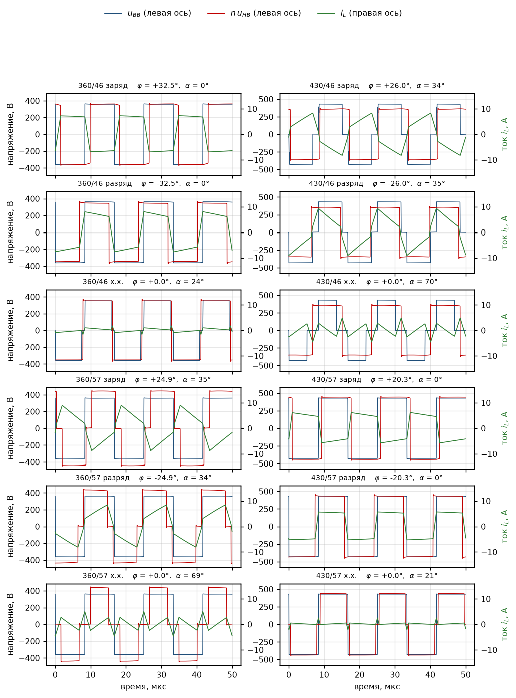
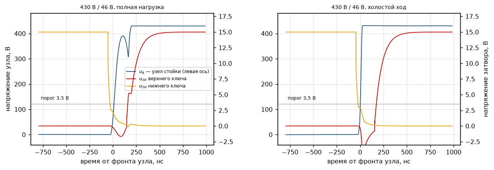
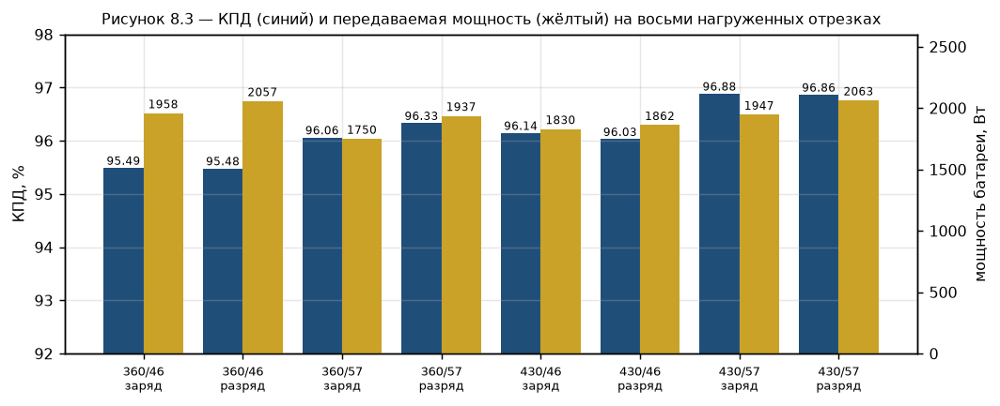
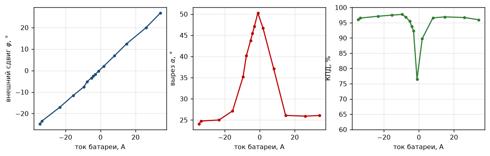
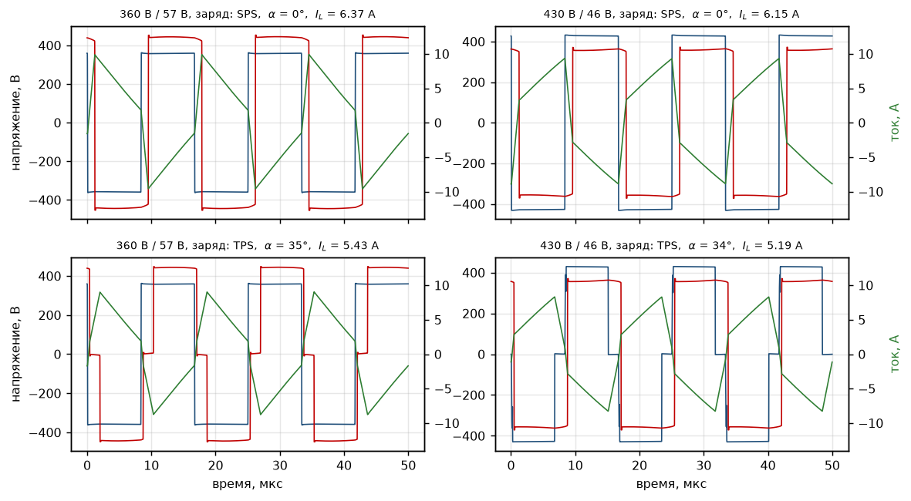

# ЭСКИЗНЫЙ ПРОЕКТ

## Двунаправленный изолированный DC-DC преобразователь

### Пояснительная записка

---

**Шифр документа:** ДЦ-ДД-001  
**Стадия:** Эскизный проект  
**Версия:** 0.1

---

# Содержание

* [Предисловие](#предисловие)
* [Перечень сокращений, обозначений и терминов](#перечень-сокращений-обозначений-и-терминов)
* [Введение](#введение)

1. [Выбор технического решения](#1-выбор-технического-решения)
   1. [Анализ возможных топологий изолированного двунаправленного DC-DC преобразователя](#11-анализ-возможных-топологий-изолированного-двунаправленного-dc-dc-преобразователя)
   2. [Сравнение вариантов и выбор топологии](#12-сравнение-вариантов-и-выбор-топологии)
   3. [Обоснование выбора способа управления преобразователем](#13-обоснование-выбора-способа-управления-преобразователем)
2. [Структурная схема преобразователя](#2-структурная-схема-преобразователя)
   1. [Потоки энергии, сигналы управления и измерения](#21-потоки-энергии-сигналы-управления-и-измерения)
   2. [Взаимодействие с кластером и аккумуляторной батареей](#22-взаимодействие-с-кластером-и-аккумуляторной-батареей)
3. [Принцип действия преобразователя](#3-принцип-действия-преобразователя)
   1. [Интервалы периода коммутации](#31-интервалы-периода-коммутации)
   2. [Механизм включения при нулевом напряжении](#32-механизм-включения-при-нулевом-напряжении)
   3. [Передача энергии от высоковольтной шины к батарее](#33-передача-энергии-от-высоковольтной-шины-к-батарее)
   4. [Передача энергии от батареи к высоковольтной шине](#34-передача-энергии-от-батареи-к-высоковольтной-шине)
   5. [Пуск, переход через нулевую мощность и останов](#35-пуск-переход-через-нулевую-мощность-и-останов)
4. [Расчёт силовой части](#4-расчёт-силовой-части)
   1. [Выбор коэффициента трансформации](#41-выбор-коэффициента-трансформации)
   2. [Выбор частоты коммутации](#42-выбор-частоты-коммутации)
   3. [Выбор номинального фазового сдвига](#43-выбор-номинального-фазового-сдвига)
   4. [Расчёт передаточной индуктивности](#44-расчёт-передаточной-индуктивности)
   5. [Токи и напряжения элементов схемы по диапазону](#45-токи-и-напряжения-элементов-схемы-по-диапазону)
   6. [Границы диапазона ZVS](#46-границы-диапазона-zvs)
5. [Выбор элементной базы](#5-выбор-элементной-базы)
   1. [Выбор силовых транзисторов](#51-выбор-силовых-транзисторов)
   2. [Расчёт параметров трансформатора](#52-расчёт-параметров-трансформатора)
   3. [Расчёт потерь в ключах](#53-расчёт-потерь-в-ключах)
   4. [Драйверы затворов и изолированное питание](#54-драйверы-затворов-и-изолированное-питание)
6. [Накопительные и фильтрующие элементы](#6-накопительные-и-фильтрующие-элементы)
   1. [Конденсаторы звена ВВ](#61-конденсаторы-звена-вв)
   2. [Конденсаторы звена НВ](#62-конденсаторы-звена-нв)
   3. [Керамические конденсаторы блокировки](#63-керамические-конденсаторы-блокировки)
7. [Система управления, измерения и защиты](#7-система-управления-измерения-и-защиты)
   1. [Микроконтроллер и формирование управляющих импульсов](#71-микроконтроллер-и-формирование-управляющих-импульсов)
   2. [Измерение токов и напряжений](#72-измерение-токов-и-напряжений)
   3. [Гальваническая развязка и интерфейс CAN](#73-гальваническая-развязка-и-интерфейс-can)
   4. [Защиты и поведение в аварийных режимах](#74-защиты-и-поведение-в-аварийных-режимах)
   5. [Алгоритм управления с тремя фазовыми сдвигами](#75-алгоритм-управления-с-тремя-фазовыми-сдвигами)
8. [Моделирование](#8-моделирование)
   1. [Состав модели и принятые параметры](#81-состав-модели-и-принятые-параметры)
   2. [Проверка режимов работы](#82-проверка-режимов-работы)
   3. [Результаты по диапазону работоспособности](#83-результаты-по-диапазону-работоспособности)
   4. [Сопоставление результатов моделирования с расчётом](#84-сопоставление-результатов-моделирования-с-расчётом)
9. [Потери, КПД и тепловой режим](#9-потери-кпд-и-тепловой-режим)
    1. [Сводный баланс потерь](#91-сводный-баланс-потерь)
    2. [Расчётный КПД по диапазону работоспособности](#92-расчётный-кпд-по-диапазону-работоспособности)
    3. [Тепловой расчёт и система охлаждения](#93-тепловой-расчёт-и-система-охлаждения)
    4. [Конструктивное исполнение и компоновка](#94-конструктивное-исполнение-и-компоновка)
10. [Заключение](#10-заключение)
    1. [Результаты эскизного проекта](#101-результаты-эскизного-проекта)
    2. [Перечень работ последующих стадий](#102-перечень-работ-последующих-стадий)

* [Список литературы и других источников информации](#список-литературы-и-других-источников-информации)

---

# Предисловие

Настоящая пояснительная записка разработана в составе эскизного проекта двунаправленного изолированного DC-DC преобразователя.

Документ содержит обоснование принятых технических решений, описание структуры и принципа действия преобразователя, а также результаты предварительных инженерных расчётов, подтверждающих возможность реализации требований технического задания.

По мере выполнения работ содержание пояснительной записки уточняется и дополняется результатами расчётов, анализа и проектирования.

# Перечень сокращений, обозначений и терминов

| Обозначение | Определение |
|:--|:--|
| АКБ | Аккумуляторная батарея |
| ВВ | Высоковольтная шина постоянного тока |
| НВ | Низковольтная шина постоянного тока |
| DC | Постоянный ток (Direct Current) |
| DC-DC | Двунаправленный изолированный преобразователь постоянного тока |
| КПД | Коэффициент полезного действия |
| ШИМ | Широтно-импульсная модуляция |
| CAN | Controller Area Network |
| MCU | Микроконтроллер (Microcontroller Unit) |
| PWM | Pulse Width Modulation |
| ZVS | Коммутация при нулевом напряжении (Zero Voltage Switching) |
| ZCS | Коммутация при нулевом токе (Zero Current Switching) |
| EMI | Электромагнитные помехи (Electromagnetic Interference) |
| ESR | Эквивалентное последовательное сопротивление (Equivalent Series Resistance) |
| RMS | Среднеквадратичное значение (Root Mean Square) |

# Введение

Разрабатываемое семейство стабилизаторов однофазной сети 220/230 В, 50 Гц выпускается в кластерном исполнении. В состав кластера входят от двух до шести силовых инверторных модулей мощностью 2 кВт каждый, мастер-контроллер с устройством отображения информации и IoT-шлюз. Узлы кластера взаимодействуют по CAN-шине со скоростью 1 Мбит/с. Силовые модули формируют стабилизированное выходное напряжение в широком диапазоне входных напряжений, используя промежуточные звенья постоянного тока.

Разрабатываемый DC-DC является подсистемой накопления энергии в составе указанного стабилизатора. Каждый DC-DC подключается к высоковольтному звену постоянного тока соответствующего инверторного каскада и к аккумуляторной батарее LiFePO4 конфигурации 16S. Высоковольтные звенья постоянного тока отдельных инверторных каскадов не объединяются; низковольтные звенья DC-DC могут объединяться в общую аккумуляторную шину. DC-DC обеспечивает передачу энергии в обоих направлениях: от аккумуляторной батареи к DC-звену для питания нагрузки при отсутствии или недостаточном качестве сети, а также от DC-звена к аккумуляторной батарее при её заряде. Управление DC-DC, выдача команд и передача диагностической информации предусматриваются через CAN-интерфейс кластера.

Согласно техническому заданию, номинальная передаваемая мощность DC-DC равна номинальной мощности AC-каскада кластера и составляет 2 кВт. Рабочий диапазон напряжения высоковольтной стороны составляет 360…430 В, низковольтной стороны 40…60 В. Передача энергии между сторонами выполняется через высокочастотный трансформатор с гальванической изоляцией. Такое построение обеспечивает функциональное отделение аккумуляторной подсистемы от высоковольтного звена инвертора и создаёт основу для работы стабилизатора как UPS или гибридного инвертора.

Настоящая пояснительная записка содержит обоснование выбора технических решений, описание структуры и принципа действия DC-DC, а также предварительные расчёты силовой части, трансформатора, накопительных элементов, потерь и теплового режима. Документ предназначен для фиксации решений эскизного проекта и последующего перехода к разработке электрической принципиальной схемы, конструкции и программы управления.

# 1 Выбор технического решения

## 1.1 Анализ возможных топологий изолированного двунаправленного DC-DC преобразователя

### 1.1.1 Исходные данные и обозначения

По техническому заданию: сторона ВВ 360…430 В, сторона НВ 40…60 В, номинальная мощность 2000 Вт, передача энергии в обоих направлениях, кремниевые силовые ключи. Полная мощность требуется в диапазоне НВ 46…57 В; на краях диапазона работоспособности, то есть при 40…46 В и 57…60 В, достаточно 200 Вт.

**Коэффициент передачи** Кп = U_НВ/U_ВВ, отношение напряжений сторон, которое преобразователь обязан обеспечить. Требуемые значения:

- при полной мощности Кп = 0,107…0,158, то есть изменяется в 1,48 раза;
- во всём диапазоне работоспособности Кп = 0,093…0,167, то есть изменяется в 1,80 раза.

**Коэффициент трансформации** n задаётся числом витков и постоянен. Произведение

$$ {\Large d = n \cdot K_{\text{п}} } ,~(1.1)$$

показывает, насколько приведённое напряжение стороны НВ совпадает с напряжением стороны ВВ. При d = 1 приведённые напряжения сторон равны. Это оптимальная рабочая точка любой изолирующей топологии: реактивная составляющая тока минимальна, условия коммутации наилучшие. Поскольку n постоянен, а Кп меняется, удержать d = 1 во всём диапазоне невозможно. Выбрав n = 7,81 из условия d = 1 в номинальной точке 400 В и 51,2 В (формула (1.1)), получаем d = 0,84…1,24 при полной мощности и d = 0,73…1,30 во всём диапазоне работоспособности.

Второе исходное обстоятельство: токи сторон различаются почти на порядок. При номинальной мощности это до 50 А на стороне НВ против 5,6 А на стороне ВВ. Один и тот же по схеме узел на разных сторонах преобразователя обходится совершенно по-разному.

Ниже рассмотрены четыре возможные топологии: от простейшей, воспроизводящей силовой тракт серийного прототипа, до двойного активного моста, который в итоге и выбирается.

### 1.1.2 Вариант 1. Понижающая ячейка на стороне ВВ и раздельное регулирование направлений

Вариант воспроизводит силовой тракт серийного гибридного инвертора POW-HVM3.2H и ряда других недорогих инверторов китайского производства.

Рисунок 1.1 — Силовой тракт прототипа: понижающая ячейка на стороне ВВ

Регулирующая ячейка образована ключом VT5 в отрицательной шине ВВ, диодом VD1 и дросселем L1 в плюсовой шине. Конденсатора промежуточного звена нет: мост ВВ включён внутрь контура, образованного дросселем и диодом. На рисунке каскад НВ показан так, как он выполнен в прототипе: по схеме со средней точкой. На анализ это не влияет.

Двумя направлениями передачи энергии управляют разные узлы.

При **разряде** ведущим является каскад НВ. Он работает с изменяемой скважностью, L1 служит дросселем выходного фильтра, мост ВВ работает выпрямителем, VT5 удерживается открытым и только проводит ток. Напряжение шины

$$ {\Large U_{\text{ВВ}} = 2 \cdot D \cdot n \cdot U_{\text{НВ}} } ,~(1.2)$$

где D это скважность плеча каскада НВ, не превышающая 0,5.

При **заряде** ведущей становится ячейка. VT5 работает в режиме ШИМ, L1 служит дросселем понижающего преобразователя, VD1 работает его обратным диодом, мост ВВ инвертирует напряжение звена в трансформатор, ключи стороны НВ выпрямляют. Напряжение батареи

$$ {\Large U_{\text{НВ}} = \dfrac{D' \cdot U_{\text{ВВ}}}{n} } ,~(1.3)$$

где D′ это коэффициент заполнения VT5.

Преобразователь двунаправлен и регулируется в обе стороны. Но регулирующие узлы разнесены по разные стороны гальванической развязки, а оба направления являются понижающими: каждое способно только уменьшать напряжение своего источника.

Все каскады коммутируют жёстко; в прототипе ключи моста ВВ снабжены снабберными конденсаторами.

### 1.1.3 Вариант 2. Мост с фиксированной скважностью и повышающий каскад на стороне ВВ

Тот же принцип разделения функций, что и в варианте 1, но регулирующая ячейка здесь содержит не один ключ и диод, а два ключа: обычный неизолированный повышающий преобразователь между промежуточным звеном и стороной ВВ. Изоляция и регулирование по-прежнему разнесены по разным каскадам, и каждый занимается только своим делом.

Рисунок 1.2 — Мост с фиксированной скважностью и повышающий каскад на стороне ВВ

Изолирующий каскад: два полных моста и трансформатор со скважностью 50 % без всякого регулирования, то есть трансформатор постоянного тока. Он ничего не стабилизирует: напряжение промежуточного звена просто следует за напряжением батареи, умноженным на n. Благодаря этому каскад всегда работает при d = 1, в оптимальной рабочей точке (формула (1.1)). Реактивная составляющая тока минимальна. Подмагничивание при этом не исчезает: скважность 50 % даёт нулевой вольт-секундный баланс лишь при идеально симметричных плечах, а реальная несимметрия сопротивлений открытых ключей и мёртвого времени накапливается и требует коррекции по измеренному току, так же, как в варианте 4 (см. п. 1.1.5).

Регулирующий каскад стабилизирует напряжение, задаёт передаваемую мощность, отрабатывает профиль заряда батареи и задаёт направление передачи энергии; изолирующий каскад собственной логики направления не содержит. В отличие от варианта 1, где эти функции разнесены по обе стороны гальванической развязки, здесь оба ключа регулирующей ячейки стоят по одну сторону, на стороне ВВ.

Коэффициент трансформации выбирается из условия

$$ {\Large n \cdot U_{\text{НВ.макс}} \le U_{\text{ВВ.мин}} } ,~(1.4)$$

откуда n ≤ 6. При n = 6 промежуточное звено работает в диапазоне 240…360 В, а наибольшее требуемое отношение напряжений регулирующего каскада составляет 430/240 = 1,79 при коэффициенте заполнения 0,44.

Существенно, что регулирующий каскад стоит на стороне ВВ. Через него проходит та же мощность, но при напряжении 240…430 В, поэтому ток составляет 5,6…8,3 А вместо 50 А: дроссель рассчитывается на ток менее 10 А, конденсатор промежуточного звена на пульсации того же порядка. На стороне НВ тот же каскад потребовал бы дросселя на 50 А и конденсаторной батареи на такую же пульсацию.

Расплата за развязку функций: две составляющие потерь, присутствующие постоянно. Первая: условие ZVS по знаку тока в изолирующем каскаде выполняется при любой нагрузке, а по энергии нет, поэтому индуктивность намагничивания приходится намеренно занижать, и создаваемый ею циркулирующий ток присутствует всегда, включая полную мощность. Вторая: ключи регулирующего каскада ZVS не имеют вовсе. При непрерывном токе дросселя нижний ключ включается на открытый встроенный диод верхнего, и тот восстанавливается под напряжением 360…430 В; при заряде обратного восстановления в единицы микрокулон и частоте 65 кГц это 25…50 Вт на полной мощности. Устраняется переводом каскада на границу прерывистых токов, ценой переменной частоты и удвоенной пульсации тока, либо снижением частоты коммутации.

Дополнительно индуктивность рассеяния трансформатора создаёт просадку промежуточного напряжения, пропорциональную току. Регулирующий каскад её отрабатывает, но при выборе n она уменьшает располагаемый запас.

### 1.1.4 Вариант 3. Резонансный преобразователь CLLLC

Оба предыдущих варианта разносят изоляцию и регулирование по разным каскадам. Здесь, как и в варианте 4 (см. п. 1.1.5), используется единый двухмостовой каркас, два полных моста с трансформатором между ними, но между мостами дополнительно включён симметричный резонансный контур: последовательные индуктивность и ёмкость с каждой стороны трансформатора, а роль параллельной индуктивности играет индуктивность намагничивания. Схема ведёт себя как трансформатор с частотно-управляемым коэффициентом передачи, а форма тока в ней близка к синусоиде.

Рисунок 1.3 — Резонансный преобразователь CLLLC

В точке резонанса преобразователь работает безупречно: действующий ток минимален, мост ВВ включается при нулевом напряжении, мост НВ выключается при нулевом токе, крутых фронтов нет и уровень помех низкий. ZVS моста ВВ обеспечивается током намагничивания и потому не зависит от нагрузки, сохраняется вплоть до холостого хода.

Но именно в точке резонанса преобразователь не регулируется. Чтобы отработать изменение Кп в 1,48 раза, приходится уходить от резонанса и вверх, и вниз по частоте, а вместе с этим уходят и все перечисленные достоинства: выше резонанса теряется ZCS моста НВ, ниже резонанса уход в ёмкостную область срывает ZVS моста ВВ, растёт циркулирующая энергия. Требуемый диапазон регулирования шире того окна, в котором топология выигрывает.

Второе ограничение конструктивное. Через резонансный конденсатор стороны НВ проходит весь ток этой стороны, то есть 40…60 А действующего значения на частоте в десятки килогерц. Это самый нагруженный элемент схемы, и именно он определяет её ресурс.

Наконец, обе резонансные частоты задаются произведением индуктивности на ёмкость, поэтому производственный разброс магнитопроводов и конденсаторов смещает рабочую точку независимо с каждой стороны.

### 1.1.5 Вариант 4. Двойной активный мост

Тот же двухмостовой каркас, что и в варианте 3, но без резонансного контура: последовательные индуктивность и ёмкости исключены, а функцию передаточной индуктивности выполняет индуктивность рассеяния самого трансформатора. Это самая экономная по составу из двунаправленных изолирующих схем: два одинаковых полных моста, между ними трансформатор и последовательная индуктивность. Больше ничего: ни выпрямителя, ни дросселя фильтра, ни разделительного конденсатора.

Рисунок 1.4 — Двойной активный мост

Оба моста формируют прямоугольное напряжение со скважностью 50 % на одной частоте. Разность фаз между этими напряжениями приложена к индуктивности, и вся передаваемая мощность определяется одной величиной, фазовым сдвигом φ:

$$ {\Large P = \dfrac{n \cdot U_{\text{ВВ}} \cdot U_{\text{НВ}} \cdot \varphi \cdot (\pi - \varphi)}{2\pi^2 f L} } ,~(1.5)$$

Смена знака φ разворачивает поток энергии. Никаких переключений в силовой части при этом не происходит, реверс занимает один период.

ZVS обеспечивается током индуктивности: к моменту коммутации он должен течь в нужную сторону и иметь достаточную энергию для перезаряда выходных ёмкостей плеча. Условие по знаку тока даёт границы по углу: для моста ВВ

$$ {\Large \varphi > \dfrac{\pi (d-1)}{2d} } ,~(1.6)$$

для моста НВ

$$ {\Large \varphi > \dfrac{\pi (1-d)}{2} } ,~(1.7)$$

В окне полной мощности, где d = 0,84…1,24, эти границы составляют 17,2° и 14,8°, а рабочий угол при 2000 Вт равен 35…37°. Запас двукратный, ZVS обеспечивается на обоих мостах во всём окне полной мощности.

Теряется ZVS при снижении мощности: при 200 Вт фазовый угол падает примерно до 3°, чего не хватает ни по знаку тока, ни по энергии даже в точке d = 1. ZCS в этой топологии не достигается нигде: оба моста выключаются вблизи максимума тока, где выключение частично демпфируется собственной ёмкостью ключей.

Отклонение d от единицы добавляет в ток трансформатора реактивную составляющую. На краях окна полной мощности действующий ток стороны ВВ растёт с 5,8 до 6,1…6,2 А, то есть на 5…6 %, а потери проводимости примерно на 12 %.

Слабое место топологии: подмагничивание трансформатора. Управление по фазовому сдвигу не следит за вольт-секундным балансом обмотки, а разброс сопротивлений открытых ключей и длительности пауз создаёт небольшую несимметрию напряжения. При малом активном сопротивлении силового контура она накапливается в постоянную составляющую тока и смещает рабочую точку магнитопровода. Разделительный конденсатор не применяется, поэтому подавлять эту составляющую должна система управления по результатам измерения тока.

## 1.2 Сравнение вариантов и выбор топологии

Сравнение выполнено по электрическим показателям. Удобство реализации системы управления, стоимость и площадь печатной платы не рассматриваются.

Конфигурация выпрямительной части стороны НВ (полный мост или схема со средней точкой) на выбор топологии не влияет и в сравнении не учитывается: во всех вариантах она принята полномостовой, в том числе при подсчёте числа ключей.

Таблица 1.1 — Сравнение вариантов

| Показатель | Вариант 1 (мост + понижающая ячейка) | Вариант 2 (мост + повышающий каскад) | Вариант 3 (CLLLC) | Вариант 4 (DAB) |
|:--|:--|:--|:--|:--|
| Число преобразований энергии | 2 | 2 | 1 | 1 |
| Число ключей в тракте передачи энергии | 9 | 10 | 8 | 8 |
| Реактивные элементы | дроссель регулирующей ячейки | дроссель регулирующего каскада | 2 дросселя и 2 конденсатора | дроссель |
| Управление передаваемой мощностью | два контура: скважность каскада НВ при разряде, скважность ячейки при заряде | коэффициентом заполнения ячейки, один контур | частотой, один контур | фазовым сдвигом, один контур |
| Отработка изменения Кп | оба направления понижающие, требуемого n не существует (см. п. 1.2) | регулирующим каскадом, изолирующий остаётся при d = 1 | уходом от резонанса | не отрабатывается, d уходит от единицы |
| ZVS в окне полной мощности | не обеспечивается ни в одном каскаде | обеспечивается в изолирующем каскаде, отсутствует в регулирующем | ZVS моста ВВ только выше резонанса | обеспечивается на обоих мостах, запас по углу двукратный |
| ZVS при мощности 200 Вт | не обеспечивается | обеспечивается в изолирующем каскаде | обеспечивается током намагничивания | не обеспечивается |
| ZCS моста НВ | не достигается | не достигается | на резонансе и ниже | не достигается |
| Реактивная и циркулирующая составляющие тока | растут при снижении скважности каскада НВ | присутствуют постоянно, от заниженной индуктивности намагничивания | растут вне резонанса | растут на 5…6 % на краях окна полной мощности |
| Наиболее нагруженный элемент стороны НВ | ключи моста | ключи моста | резонансный конденсатор, 40…60 А | ключи моста |
| Дополнительные элементы стороны ВВ | дроссель ячейки; конденсатора промежуточного звена нет | дроссель и конденсатор промежуточного звена, 5,6…8,3 А | нет | нет |
| Подмагничивание трансформатора | то же, что в варианте 4 | то же, что в варианте 4 | блокируется резонансным конденсатором | накапливается при несимметрии плеч, требуется коррекция по току |
| Частота коммутации | постоянная | постоянная, кроме режима ZVS регулирующего каскада | переменная | постоянная |
| Чувствительность к разбросу параметров | низкая | низкая | высокая, две резонансные частоты | низкая |
| КПД в номинальной точке | 93,5…95 % | 93,5…95 % | 96…97 % | 95…96 % |
| КПД на краях окна полной мощности | 93,5…95 % | 93,5…95 % | 93…95 % | 94…95 % |
| КПД при 200 Вт на краю диапазона работоспособности | около 92 % | около 92 % | 90…93 % | около 92 % |
| Устранение слабого места | в пределах топологии не устраняется | изменением режима работы регулирующего каскада | изменением параметров резонансного контура | второй управляющей переменной, без изменения силовой схемы |

Число каскадов итоговый КПД не определяет: два каскада перемножают свои коэффициенты, но каждый из них может быть выше, чем у однокаскадной схемы, работающей вне оптимума. Однако у варианта 2 обе составляющие потерь, циркулирующий ток изолирующего каскада и обратное восстановление в регулирующем, присутствуют постоянно, поэтому его пологая характеристика проходит ниже, чем характеристика варианта 4 в окне полной мощности.

**Выбор: вариант 4, двойной активный мост.**

Решающим оказалось разделение диапазонов в техническом задании. Полная мощность требуется в окне 46…57 В, где d = 0,84…1,24, а границы сохранения ZVS составляют 17,2° и 14,8° против рабочего угла 35…37° (формулы (1.6) и (1.7)). Там, где передаётся вся мощность, обеспечивается ZVS на обоих мостах, а рост действующего тока на краях окна не превышает 6 %. Расширенный диапазон 40…60 В, где ZVS теряется, требует всего 200 Вт, и потери на перезаряд выходных ёмкостей составляют там около 5 Вт.

Вариант 3 при этом же условии выигрывает только в узкой полосе вокруг резонанса, а требуемое изменение Кп в 1,48 раза из неё выводит. Кроме того, резонансный конденсатор стороны НВ на 40…60 А остаётся самым нагруженным элементом схемы независимо от режима, а переменная частота коммутации не позволяет рассчитать фильтр электромагнитной совместимости и магнитные элементы на одну частоту.

Вариант 2 обеспечивает наиболее ровный КПД по диапазону, но его уровень ниже, поскольку обе дополнительные составляющие потерь действуют постоянно, а не только на краях. Он остаётся резервным решением на случай, если измеренный КПД варианта 4 на краях окна полной мощности не удовлетворит требованиям технического задания.

Вариант 1 двунаправлен и регулируется в обе стороны, поэтому по управляемости мощностью вариантам 2–4 он не уступает. Его ограничение количественное. Регулирование в обоих направлениях способно только снижать напряжение относительно значения, заданного коэффициентом трансформации: при разряде U_ВВ = 2·D·n·U_НВ ≤ n·U_НВ (формула (1.2)), при заряде U_НВ = D′·U_ВВ/n ≤ U_ВВ/n (формула (1.3)). Первое требует n ≥ 430/46 = 9,35, второе n ≤ 360/57 = 6,32. Такого коэффициента трансформации не существует. Прототип с этим не сталкивается, поскольку его шина не нормирована: 300…450 В там результат, а не требование. Здесь же диапазон 360…430 В задан инверторным каскадом.

Второе отличие структурное. Регулирующие узлы разнесены по разные стороны гальванической развязки, поэтому нужны два контура регулирования с собственными датчиками, а смена направления означает передачу управления с одной стороны на другую. Вариант 2 обходится одним контуром: изолирующий каскад всегда работает при фиксированной скважности, всё регулирование ведёт ячейка.

По КПД варианты 1 и 2 на этой стадии неразличимы. У варианта 1 при разряде ячейка не преобразует энергию, а только проводит ток, но каскад НВ работает при скважности ниже предельной, что повышает действующие токи; у варианта 2 ячейка преобразует энергию в обоих направлениях, зато изолирующий каскад всегда остаётся при d = 1. Различие между ними лежит не в КПД, а в структуре регулирования.

Существенно и то, как устраняются слабые места. У варианта 4 потеря ZVS при малой мощности и рост реактивного тока при отклонении d от единицы устраняются введением второй управляющей переменной, дополнительного фазового сдвига внутри моста, то есть правкой программы управления без изменения силовой схемы. Подмагничивание трансформатора устраняется там же, коррекцией по измеренному току. У варианта 3 расширение рабочего диапазона потребовало бы пересчёта резонансного контура и переделки магнитных элементов, у варианта 2 изменения режима работы регулирующего каскада с потерей постоянной частоты коммутации.

## 1.3 Обоснование выбора способа управления преобразователем

Базовый способ управления: однофазный сдвиг (SPS). Оба моста работают со скважностью 50 %, а единственной управляющей переменной служит фазовый сдвиг φ между ними. Мощность и её направление задаются одной величиной, поэтому контур регулирования получается простым, а реверс занимает один период коммутации. Частота коммутации постоянная.

Ограничения SPS показаны в п. 1.2: ZVS сохраняется только при достаточном фазовом угле, а при отклонении d от единицы растёт реактивная составляющая тока. Поэтому предусматривается переход к расширенному фазовому сдвигу (EPS): помимо межмостового угла φ вводится внутримостовой сдвиг, укорачивающий импульс напряжения одного из мостов. Это снижает реактивный ток при d ≠ 1 и расширяет диапазон ZVS в сторону малых мощностей. Силовая схема при этом не изменяется.

Дополнительно система управления решает две задачи, вытекающие из выбранной топологии:

- подавление постоянной составляющей тока трансформатора, коррекцией длительностей импульсов по результатам измерения тока;
- плавный пуск, нарастанием φ от нуля, что исключает бросок тока и одностороннее намагничивание магнитопровода при включении.

Профиль заряда аккумуляторной батареи реализуется внешним контуром, задающим φ по командам, поступающим от кластера по CAN-интерфейсу.

# 2 Структурная схема преобразователя

Раздел 1 определил топологию и способ управления, но не зафиксировал состав конкретных узлов и связи между силовой частью и контуром управления. Прежде чем переходить к расчётам, эту связь нужно зафиксировать целиком, одной схемой, а не по частям.

Предлагается следующая структурная схема преобразователя.

Рисунок 2.1 — Структурная схема преобразователя

Силовая часть построена на общем мосте ВВ (VT1–VT4), обмотки ВВ трансформаторов T1 и T2 включены последовательно в его диагональ, а каждая обмотка НВ нагружена на собственный полный мост НВ (VT5–VT8 и VT9–VT12 соответственно). Оба моста НВ запараллелены по шинам LV+ и LV−. Мощность делится между каналами поровну благодаря последовательному включению обмоток ВВ: через них течёт один и тот же ток, а числа витков у обоих трансформаторов одинаковы и целые, поэтому одинаковы и токи обмоток НВ. Параллельное соединение мостов НВ задаёт не деление тока, а равенство напряжений на обмотках НВ. Датчики тока ДТ1 и ДТ2 контролируют, соответственно, ток моста ВВ и суммарный ток стороны НВ; их показания используются как для регулирования, так и для защиты по току.

Управляет преобразователем контроллер CH32V303: он формирует сигналы ШИМ для драйверов затворов моста ВВ (опто-изолированный TLP155×4) и мостов НВ (полумостовой драйвер), опрашивает датчики тока и обменивается данными с кластером по CAN через гальванический изолятор и трансивер TJA1040. Питание контроллера и обвязки идёт от собственного источника, понижающего напряжение батареи до 3,3 В независимо от состояния моста ВВ, что обеспечивает работоспособность цепей управления при пуске и в аварийных режимах.

Выбор конкретных приборов и расчёт магнитных элементов выполняются в разделе 5, после того как в разделе 4 будут определены токи и напряжения.

## 2.1 Потоки энергии, сигналы управления и измерения

## 2.2 Взаимодействие с кластером и аккумуляторной батареей

# 3 Принцип действия преобразователя

## 3.1 Интервалы периода коммутации

## 3.2 Механизм включения при нулевом напряжении

## 3.3 Передача энергии от высоковольтной шины к батарее

## 3.4 Передача энергии от батареи к высоковольтной шине

## 3.5 Пуск, переход через нулевую мощность и останов

# 4 Расчёт силовой части

Расчёт ведётся в порядке, при котором каждая величина опирается только на найденные ранее. Сначала определяется коэффициент трансформации, поскольку он один следует прямо из напряжений технического задания. Затем выбирается частота, далее назначается номинальный фазовый сдвиг, и уже из него получается передаточная индуктивность — центральная величина топологии, задающая все токи. Токи, в свою очередь, служат исходными данными для выбора элементной базы (раздел 5), конденсаторов звеньев (раздел 6) и расчёта потерь (раздел 9).

Единственное место, где порядок замыкается в цикл, — число витков: коэффициент трансформации нужен, чтобы рассчитать обмотки, но округление витков до целого его изменяет. Цикл разрывается за одну итерацию: сначала берётся идеальное значение, по нему в п. 5.2 подбираются витки, и полученное фактическое значение возвращается сюда.

## 4.1 Выбор коэффициента трансформации

Приведённое напряжение стороны НВ совпадает с напряжением стороны ВВ при d = 1 (формула (1.1)). Это единственная точка, где реактивная составляющая тока минимальна, поэтому коэффициент трансформации выбирается из условия d = 1 в номинальном режиме:

$$ {\Large n = \dfrac{U_{\text{ВВ.ном}}}{U_{\text{НВ.ном}}} } ,~(4.1)$$

n = 400 / 51,2 = 7,8125. Число витков целое, поэтому фактическое значение отличается: при 23 витках обмотки ВВ и 6 витках обмотки НВ на каждом из двух трансформаторов (п. 5.2) полный коэффициент составляет n = 2 × 23/6 = **7,667**, что на 1,9 % ниже идеального.

По окну полной мощности 46…57 В это даёт диапазон

d = n·U_НВ/U_ВВ = 0,820…1,214

## 4.2 Выбор частоты коммутации

Частота ограничена сверху потерями переключения, снизу — габаритами магнитных элементов. Для кремниевых ключей при мощности порядка 2 кВт практический диапазон составляет 50…100 кГц; карбидокремниевые приборы позволяют подниматься до сотен килогерц, но техническим заданием не предусмотрены.

Принимается **f = 60 кГц**. Выбор подтверждается двумя независимыми проверками: расчётом индукции и потерь магнитопровода (п. 5.2), где 60 кГц при шести витках обмотки НВ даёт запас до насыщения 31 %, и оценкой потерь переключения (п. 5.3), которые растут пропорционально частоте. Это же значение принято в модели силового каскада, что исключает расхождение между расчётом и моделированием.

## 4.3 Выбор номинального фазового сдвига

Передаваемая мощность связана с фазовым сдвигом соотношением (1.5) и достигает максимума при φ = 90°. Номинальный режим на вершину кривой не ставят по двум причинам: там обнуляется производная dP/dφ, то есть теряется управляемость, и не остаётся запаса на броски нагрузки и просадки шины. Практика проектирования размещает номинальную мощность в пределах 20…40 % от π.

Выбор внутри этого интервала определяется тремя факторами, действующими в разные стороны:

- **запас по мощности**: чем меньше φ_ном, тем дальше рабочая точка от вершины кривой;
- **действующий ток**: растёт вместе с φ_ном, поскольку увеличивается реактивная составляющая;
- **разрешение регулирования**: шаг мощности на такт таймера обратно пропорционален φ_ном.

Таблица 4.1 — Сопоставление вариантов номинального угла

| φ_ном | L | I_RMS ВВ | Потери проводимости | Шаг на такт | Запас до потолка |
|:--|:--|:--|:--|:--|:--|
| 15° | 50,0 мкГн | 5,36 А | 32,6 Вт | 18,2 Вт | 227 % |
| 20° | 64,6 мкГн | 5,47 А | 33,9 Вт | 13,1 Вт | 153 % |
| **25°** | **78,2 мкГн** | **5,59 А** | **35,3 Вт** | **10,1 Вт** | **109 %** |
| 30° | 90,9 мкГн | 5,71 А | 36,9 Вт | 8,0 Вт | 80 % |
| 35° | 102,5 мкГн | 5,85 А | 38,7 Вт | 6,5 Вт | 60 % |
| 45° | 122,7 мкГн | 6,15 А | 42,7 Вт | 4,4 Вт | 33 % |

Принимается **φ_ном = 25°**. Потери проводимости на 3,4 Вт ниже, чем при 35°, запас по мощности почти двукратный, а шаг регулирования 10,1 Вт составляет 0,5 % номинала, что для профиля заряда аккумуляторной батареи достаточно. Дальнейшее уменьшение угла ухудшает разрешение быстрее, чем улучшает остальное.

Ухудшение диапазона ZVS, сопровождающее уменьшение угла, компенсируется расширенным фазовым сдвигом (п. 4.5).

## 4.4 Расчёт передаточной индуктивности

Разрешая (1.5) относительно индуктивности при номинальных напряжениях и выбранном угле:

$$ {\Large L = \dfrac{n \cdot U_{\text{ВВ}} \cdot U_{\text{НВ}} \cdot \varphi(\pi - \varphi)}{2\pi^2 f P} } ,~(4.2)$$

L = 7,667 × 400 × 51,2 × 0,436 × (π − 0,436) / (2π² × 60000 × 2000) = **78,2 мкГн**

Величина приведена к стороне ВВ и включает индуктивность рассеяния обоих трансформаторов и внешний дроссель. Трансформаторы выполняются без зазора, их рассеяние не нормируется, поэтому вся передаточная индуктивность задаётся дискретным дросселем, а рассеяние вычитается из его расчётного значения по результатам измерения.

Дроссель работает при действующем токе 6,2 А и пиковом 9,6 А (п. 4.5), запасённая энергия составляет ½·L·I² = 3,6 мДж.

## 4.5 Токи и напряжения элементов схемы по диапазону

Ток передаточной индуктивности на интервале полупериода описывается двумя линейными участками: до момента коммутации второго моста напряжение на индуктивности равно U_ВВ + n·U_НВ, после — разности U_ВВ − n·U_НВ. Из условия полуволновой симметрии i(π) = −i(0) находятся токи в моменты коммутации:

$$ {\Large i(0) = -\dfrac{\pi U_{\text{ВВ}} + n U_{\text{НВ}}(2\varphi - \pi)}{2 \omega L} } ,~(4.3)$$

$$ {\Large i(\varphi) = i(0) + \dfrac{(U_{\text{ВВ}} + n U_{\text{НВ}}) \varphi}{\omega L} } ,~(4.4)$$

Действующее значение вычисляется интегрированием квадрата тока по обоим участкам.

Таблица 4.2 — Токи в углах окна полной мощности при 2000 Вт

| Режим | d | φ | i(0), мост ВВ | i(φ), мосты НВ | I_RMS ВВ | I обмотки НВ | На ключ ВВ | На ключ НВ |
|:--|:--|:--|:--|:--|:--|:--|:--|:--|
| 430 В / 46 В | 0,820 | 26,1° | −9,56 А | +2,51 А | 6,18 А | 23,7 А | 4,37 А | 16,8 А |
| 400 В / 51,2 В | 0,981 | 25,0° | −6,20 А | +5,52 А | 5,59 А | 21,4 А | 3,95 А | 15,1 А |
| 360 В / 57 В | 1,214 | 24,9° | −2,35 А | +9,41 А | 6,06 А | 23,2 А | 4,28 А | 16,4 А |

Худшим по току оказывается режим 430 В / 46 В, а не номинальный: отклонение d от единицы в любую сторону добавляет реактивную составляющую. Ток обмотки НВ получен приведением тока стороны ВВ через коэффициент одного трансформатора; ток ключа меньше тока обмотки в √2 раз, поскольку каждый ключ полного моста проводит половину периода.

Эти значения служат исходными для выбора транзисторов (п. 5.1), расчёта обмоток трансформатора (п. 5.2) и конденсаторов звеньев (раздел 6).

Напряжения элементов определяются шинами непосредственно: ключи моста ВВ находятся под напряжением до 430 В, ключи мостов НВ — до 60 В. Выбросы на паразитной индуктивности силовой петли в расчёте не учтены и подлежат оценке при разработке компоновки.

## 4.6 Границы диапазона ZVS

Мягкое включение обеспечивается током передаточной индуктивности, который к моменту коммутации должен течь в направлении, разряжающем выходную ёмкость выключаемого прибора, и нести энергию, достаточную для её перезаряда:

$$ {\Large \tfrac{1}{2} L i^2 \ge 2 \, C_{oss} U^2 } ,~(4.5)$$

Множитель два учитывает оба плеча полного моста, коммутирующих одновременно. Выходная ёмкость взята из технических условий приборов: 97 пФ для NCE65TF099 и 245 пФ для AON6226. Отсюда требуемые токи коммутации: **0,97 А** для моста ВВ при 430 В и **0,30 А** для мостов НВ при 60 В.

При номинальной мощности условие выполняется с многократным запасом во всех режимах (таблица 4.2). При снижении мощности угол уменьшается вместе с током, и ZVS теряется:

Таблица 4.3 — Границы сохранения ZVS при однофазном сдвиге

| Режим | Мост ВВ | Мосты НВ |
|:--|:--|:--|
| 430 В / 46 В | сохраняется всегда | ниже **1400 Вт** теряется |
| 400 В / 51,2 В | ниже 225 Вт | ниже 250 Вт |
| 360 В / 57 В | ниже **1625 Вт** | сохраняется всегда |

Картина асимметрична. Вблизи d = 1 мягкая коммутация сохраняется почти до 200 Вт, то есть практически во всём диапазоне работоспособности. На краях окна теряет её всегда один мост: при d < 1 — мосты НВ, при d > 1 — мост ВВ, что соответствует условиям (1.6) и (1.7), выраженным здесь через мощность, а не через угол.

**Расширенный фазовый сдвиг.** Ограничение снимается введением второй управляющей переменной. Если в мосте с бóльшим приведённым напряжением сформировать паузы нулевого напряжения длительностью α, разность напряжений на индуктивности на этих интервалах обнуляется, форма тока меняется, и ток в момент коммутации восстанавливает нужное направление.

Таблица 4.4 — Режим 360 В / 57 В: однофазный и расширенный сдвиг

| Мощность | SPS: φ, I_RMS, ZVS | EPS: α, φ, I_RMS, ZVS |
|:--|:--|:--|
| 1600 Вт | 19,2°, 4,96 А, нет | 14°, 20,6°, 4,88 А, да |
| 1200 Вт | 14,0°, 3,98 А, нет | 20°, 16,6°, 3,87 А, да |
| 900 Вт | 10,2°, 3,34 А, нет | 22°, 12,8°, 3,13 А, да |
| 600 Вт | 6,7°, 2,83 А, нет | 24°, 8,8°, 2,44 А, да |
| 400 Вт | 4,4°, 2,58 А, нет | 26°, 6,0°, 2,05 А, да |
| 200 Вт | 2,2°, 2,42 А, нет | 26°, 3,0°, 1,77 А, да |

Расширенный сдвиг не только возвращает мягкую коммутацию на всём диапазоне вплоть до 200 Вт, но и снижает действующий ток: на 6 % при 900 Вт и на 27 % при 200 Вт. Причина в том, что при d ≠ 1 разность напряжений непрерывно накачивает реактивный ток, а нулевые паузы её устраняют.

В зеркальном режиме 430 В / 46 В паузы вводятся в мост ВВ, и результат аналогичен, за исключением диапазона 900…1200 Вт, где решения с паузами в одном мосте не найдено. Этот участок требует независимых сдвигов в обоих мостах, то есть перехода к двойному фазовому сдвигу.

Поскольку без расширенного сдвига углы окна полной мощности на частичной нагрузке работают с жёсткой коммутацией, он относится к обязательным режимам системы управления, а не к резерву развития.

# 5 Выбор элементной базы

Раздел 4 определил токи и напряжения элементов схемы во всём диапазоне работоспособности. Ниже по этим данным выбираются силовые приборы и рассчитываются магнитные элементы.

## 5.1 Выбор силовых транзисторов

Помимо статических потерь проводимости, важным параметром остаётся заряд обратного восстановления Qrr и время trr. ZVS в выбранной топологии гарантирован только внутри окна полной мощности (п. 1.1.5); в расширенном диапазоне 40…46 В и 57…60 В фазовый угол падает почти до нуля, условие ZVS не выполняется, и диод плеча восстанавливается под полным напряжением шины. Кроме того, выключение в DAB никогда не бывает мягким: оба моста выключаются вблизи максимума тока, ZCS не достигается нигде (п. 1.1.5). Реальные допуски мёртвого времени и разброс параметров ключей сужают идеализированную границу ZVS и на практике. По этим причинам Qrr/trr остаётся значимым критерием отбора даже для топологии, штатный режим которой в окне полной мощности мягкая коммутация. Второй по значимости параметр: заряды затвора и выходные ёмкости (Qg, Coss, Crss), определяющие потери на переключение и требования к драйверу. Третий: тепловое сопротивление переход-корпус RthJC. При заданном токе оно напрямую определяет допустимую температуру перехода и требования к теплоотводу, а разброс этого параметра между корпусами одного класса нередко превышает разброс самого RDS(on).

Отдельно оговаривается способ пересчёта RDS(on) в нагретом состоянии. Распространённое приближение «горячее сопротивление в полтора раза больше холодного» занижает потери проводимости почти вдвое: у проверенных по даташитам приборов множитель фактически составляет ×2,5…2,7 для 650-вольтовых Super Junction при 150 °C и ×1,8 для низковольтных Trench/SGT при 125 °C. Там, где производитель не приводит горячее значение явно, ниже применены именно эти множители, а не ×1,5.

**Таблица 5.1 — Сравнение кандидатов, сторона ВВ (650 В)**

| Параметр | [SPP20N60C3](../PDF/SPP20N60C3.pdf) | [CRJT99N65G2](../PDF/CRJT99N65G2.pdf) | [JCS20N65FH](../PDF/JCS20N65FH.pdf) | [NCE65TF099](../PDF/NCE65TF099.pdf) | [NCE65T180](../PDF/NCE65T180.pdf) |
|:--|:--|:--|:--|:--|:--|
| Технология | CoolMOS C3 | Super Junction | планарная | Super Junction | Super Junction |
| Корпус | TO-220 | TO-220 | TO-220MF (изолир.) | TO-220 | TO-220 |
| RDS(on), 25 °C | 160 мОм | 81 мОм | 440 мОм | 89 мОм | 150 мОм |
| RDS(on), горячий | 430 мОм @150 °C | 205 мОм @150 °C | ~1100 мОм (оц.) | ~222 мОм (оц.) | ~375 мОм (оц.) |
| Qg | 87 нКл | 70 нКл | 45 нКл | 45 нКл | 36 нКл |
| Qrr / trr | 11 мкКл / 500 нс | 5,92 мкКл / 347 нс | 9,3 мкКл / 660 нс | **1,6 мкКл / 180 нс** | 5,0 мкКл / 310 нс |
| Pd, 25 °C | 208 Вт | 252 Вт | 62,2 Вт | 322 Вт | 188 Вт |
| Цена, грн | 89,50 | 91,50 | 83,50 | 82,50 | 60,00 |
| Цена опт, грн | 73,48 (от 91) | 79,24 (от 25) | 68,58 (от 29) | 67,55 (от 99) | 49,28 (от 135) |
| Купить | [Купить](https://kosmodrom.ua/ru/tranzistor-polevoy-mosfet/spp20n60c3.html) | [Купить](http://www.kosmodrom.com.ua/el.php?name=CRJT99N65G2) | [Купить](http://www.kosmodrom.com.ua/el.php?name=JCS20N65FH-220MF) | [Купить](https://kosmodrom.ua/ru/tranzistor-polevoy-mosfet/nce65tf099t.html) | [Купить](https://kosmodrom.ua/ru/tranzistor-polevoy-mosfet/nce65t180.html) |

Действующий ток моста ВВ составляет 6,6 А (принято по предварительной оценке контура), но каждый ключ полного моста проводит только половину периода, поэтому его собственный действующий ток равен 6,6/√2 = 4,67 А, и потери проводимости считаются по нему, а не по току обмотки.

Расчёт исключает двух кандидатов сразу. У JCS20N65FH при 1,1 Ом горячего сопротивления потери на ключе составляют 24 Вт. Само по себе это ниже паспортных 62,2 Вт, но Pd при 25 °C ничего не говорит о работе в изделии: из него следует RthJC = (150−25)/62,2 = 2,0 °C/Вт, и при 24 Вт перегрев перехода относительно корпуса составляет 48 °C ещё до теплоотвода и без учёта коммутации. У NCE65TF099 при RthJC = 0,39 °C/Вт и 4,8 Вт тот же перепад равен 1,9 °C. Изолированный корпус такой разницы не окупает. У SPP20N60C3 реальное BVDSS составляет 600 В, а не 650, как заявлено в шапке даташита (650 В там значение при Tj max); для шины 360…430 В запас 1,40× недостаточен с учётом выбросов на индуктивности рассеяния, а горячее сопротивление 430 мОм худшее в подборке.

Из оставшихся трёх CRJT99N65G2 даёт наименьшие потери проводимости (4,5 Вт против 4,8 Вт у NCE65TF099), но проигрывает по всем остальным показателям: заряд затвора выше на треть, а главное, заряд обратного восстановления в 3,7 раза больше (5,92 против 1,6 мкКл). На границах рабочего диапазона, где ZVS теряется (п. 1.1.5), это становится определяющим фактором. **Выбор: NCE65TF099**, по совокупности Qrr, Qg, теплового сопротивления (RthJC = 0,39 °C/Вт) и цены.

**Таблица 5.2 — Сравнение кандидатов, сторона НВ (80…100 В)**

| Параметр | [AONR62818](../PDF/AONR62818.pdf) | [CSD19503KCS](../PDF/CSD19503KCS.pdf) | [AON6226](../PDF/AON6226.pdf) | [CRSM038N10N4](../PDF/CRSM038N10N4.pdf) |
|:--|:--|:--|:--|:--|
| VDS | 80 В | 80 В | 100 В | 100 В |
| Корпус | DFN 3.3×3.3 | TO-220 | DFN 5×6 | DFN 5×6 clip |
| RDS(on), 25 °C | 5,5 мОм | 7,6 мОм | 6,4 мОм | 3,0 мОм |
| RDS(on), горячий | 9,5 мОм @125 °C | ~13,7 мОм (оц.) | 11,7 мОм @125 °C | ~5,4 мОм (оц.) |
| Qrr / trr | 100 нКл / 24 нс | 119 нКл / 72 нс | 150 нКл / 30 нс | н/д |
| RthJC | 1,8 °C/Вт | 0,8 °C/Вт | 0,9 °C/Вт | 0,5 °C/Вт |
| Цена, грн | 29,00 | 99,00 | 27,50 | 32,50 |
| Цена опт, грн | 23,73 (от 84) | 92,71 (от 22) | 22,42 (от 89) | 26,63 (от 75) |
| Купить | [Купить](https://kosmodrom.ua/ru/tranzistor-polevoy-mosfet/aonr62818.html) | [Купить](http://www.kosmodrom.com.ua/el.php?name=CSD19503KCS) | [Купить](https://kosmodrom.ua/ru/tranzistor-polevoy-mosfet/aon6226.html) | [Купить](http://www.kosmodrom.com.ua/el.php?name=CRSM038N10N4) |

Запас по напряжению у всех четырёх кандидатов достаточен: даже у приборов на 80 В он составляет не менее 20 В сверх максимума батареи 60 В, то есть треть напряжения шины. Поэтому отбор по напряжению не проводится, сравнение ведётся по проводимости, тепловому сопротивлению, полноте данных и цене. CSD19503KCS проигрывает по проводимости и AONR62818, и AON6226, а стоит втрое дороже любого из них, поэтому исключается сразу. CRSM038N10N4 формально лидирует по RDS(on) и RthJC, но для него производитель не приводит Qrr/trr, параметр, значимость которого на границах ZVS-диапазона показана в начале раздела. Выигрыш в потерях проводимости при этом составляет около 16 Вт на восемь ключей стороны НВ (29,2 против 13,5 Вт при токе ключа 25/√2 = 17,7 А), менее 1 % от номинальной мощности преобразователя, что несущественно на фоне непроверенного параметра коммутации и цены на 18 % выше.

**Выбор: AON6226.** Полностью документированный прибор (включая Qrr = 150 нКл), устойчиво доступный по складским остаткам, при цене 27,50 грн, самой низкой в подборке. RDS(on) горячий 11,7 мОм уступает CRSM038N10N4, но в пересчёте на потери разница не оправдывает риск недоказанной характеристики переключения. Корпус DFN 5×6: теплоотвод идёт через массив переходных отверстий в плате, а не через радиатор, что становится входным условием для теплового расчёта (п. 9.3) и компоновки платы (п. 9.4).

Для NCE65TF099 производитель не приводит RDS(on) при верхней рабочей температуре; расчёты раздела 4 ведутся по множителю ×2,5, как принятое допущение до получения данных от производителя или прямого измерения. Для AON6226 горячее значение (11,7 мОм @125 °C) указано в даташите напрямую и оценки не требует.

**Итог выбора силовых ключей**

| Сторона | Позиции | Прибор | Цена, грн/шт | Цена опт, грн/шт | Сумма опт, грн | Купить |
|:--|:--|:--|:--|:--|:--|:--|
| ВВ (мост, VT1–VT4) | 4 | **NCE65TF099** | 82,50 | 67,55 (от 99) | 270,20 | [Купить](https://kosmodrom.ua/ru/tranzistor-polevoy-mosfet/nce65tf099t.html) |
| НВ (два моста, VT5–VT12) | 8 | **AON6226** | 27,50 | 22,42 (от 89) | 179,36 | [Купить](https://kosmodrom.ua/ru/tranzistor-polevoy-mosfet/aon6226.html) |
| **Итого** | **12** | — | — | — | **449,56** | — |

Оптовая цена в столбце «Сумма опт» указана справочно: минимальный порог партии (89 и 99 шт) намного превышает потребность изделия (4 и 8 шт), поэтому по факту для одного комплекта действует цена «от 1 шт», 550,00 грн (см. таблицу выше).

Полные даташиты всех девяти рассмотренных кандидатов лежат в [`PDF/`](../PDF/).

## 5.2 Расчёт параметров трансформатора

**Мощность.** 2000 Вт номинальных: на стороне ВВ 6,6 А действующего тока моста (п. 5.1), на стороне НВ до 50 А суммарного тока обмоток (п. 1.1.1). Ток обмотки НВ велик для одной обмотки, поэтому трансформатор предлагается разделить на два (рисунок 2.1), по половине мощности и тока на каждый.

**Диапазон частот.** Для двухтактных схем без резонансного контура, к которым относится и DAB (сердечник возбуждается биполярным прямоугольным напряжением на постоянной частоте), при этой мощности и на кремниевых ключах типовой диапазон составляет 50…100 кГц. Конкретное значение внутри диапазона подтверждается ниже, после расчёта индукции.

**Обмотки.** Сторона НВ: мало витков и большой ток, поэтому обмотку предлагается выполнить печатными платами, по одному витку на плату, платы надеваются на центральный керн и соединяются последовательно. Это удобно и повторяемо, без ручной намотки толстым проводом, и позволяет отдать витку всю ширину окна. Сторона ВВ наоборот, много витков при небольшом токе; для неё предлагается провод, поскольку такое число витков платами не разместить.

**Плотность тока.** Сечение меди обмотки НВ ограничено окном сердечника, поэтому её сопротивление задано конструкцией и от тока не зависит, а потери растут как квадрат тока. Полные 50 А в одной обмотке дали бы 109 Вт (расчёт сопротивления ниже), что неприемлемо; разделение на два трансформатора по 25 А снижает суммарные потери вдвое, до 55 Вт. Это и есть количественное основание для двух трансформаторов.

Обмотки ВВ включены последовательно в диагональ моста ВВ: через обе течёт один и тот же ток 6,6 А, напряжение делится пополам. Обмотки НВ работают каждая на свой мост НВ, мосты запараллелены по LV+/LV−. Равенство токов каналов обеспечивается последовательным включением обмоток ВВ и одинаковым целым числом витков, а не параллельным соединением мостов НВ, которое задаёт лишь равенство напряжений.

**Выбор сердечника.** Проведём анализ стоимости. Для сравнения используется удельная величина: отношение цены к площади сечения магнитопровода, цент/мм². Стоимость сердечников EE/E и PQ без зазора проверена по трём независимым источникам, без смешивания между собой (`DC-DC/Ferrites/ferrite_cores_data.md`):

Таблица 5.3 — Минимум удельной стоимости (цент/мм²) по источникам

| Источник | Минимум EE | Минимум PQ |
|:--|:--|:--|
| DigiKey / Mouser / Farnell | E42/21/15 | **PQ32/30** |
| ChipDip.ru (розница, TDK/EPCOS) | E42/21/15 | **PQ32/30** |
| LCSC.com (Китай, точные коды TDK N87, опт ~1000 шт) | E55/28/21 | PQ26/25 |

Рисунок 5.1 — Удельная стоимость по сечению: DigiKey/Mouser/Farnell, LCSC.com (Китай), ChipDip.ru

Два источника из трёх сходятся на PQ32/30. Третий (китайская площадка) даёт PQ26/25, но с отрывом всего 15 % (0,79 против 0,91 цент/мм²), что не перекрывает довод ниже. **PQ32/30 уже массово применяется в каскадах переменного тока выпускаемых стабилизаторов** (см. Введение), то есть это освоенная позиция закупки, а не новая номенклатура. Выбор: **PQ32/30, материал N87**.

**Параметры магнитопровода.** Комплект PQ32/30 из двух половин имеет эффективное сечение Ae = 153,8 мм² при минимальном сечении Amin = 127,5 мм², среднюю длину магнитной линии le = 67,8 мм, эффективный объём Ve = 10 440 мм³ и магнитный формфактор Σl/A = 0,441 мм⁻¹ при массе комплекта 57,4 г. Для материала N87 без зазора индуктивность на квадрат числа витков AL = 4800 нГн с допуском +30/−20 %, эффективная магнитная проницаемость µe = 1700, удельные потери PV < 7,00 Вт на комплект в точке 200 мТл / 100 кГц / 100 °C. Габарит сердечника 32 × 27,5 мм при высоте 30,35 мм, диаметр центрального керна 13,45 мм, высота окна 21,3 мм.

Штатный каркас не применяется: платы обмотки НВ и провод обмотки ВВ размещаются непосредственно на керне, поэтому окно доступно целиком. Наибольший диаметр обмотки составляет 26,4 мм, откуда радиальная глубина окна равна (26,4 − 13,45)/2 = 6,5 мм, а сечение окна Aw = 6,5 × 21,3 = 138 мм² против 104 мм² при намотке на каркас. Средняя длина витка принята 62 мм.

Допуск на AL в +30/−20 % относится к индуктивности намагничивания и определяет разброс параметров между двумя трансформаторами, что учитывается при проверке деления напряжений.

**Проверка сердечника по площади-произведению.** Пригодность типоразмера проверяется методом площади-произведения (area product), стандартным для расчёта импульсных трансформаторов [1]. Исходная величина метода это расчётная мощность Pt, равная сумме полных мощностей обмоток:

$$ {\Large P_t = U_1 I_1 + U_2 I_2 } ,~(5.1)$$

Каждая обмотка ВВ работает под половиной напряжения шины, то есть под 200 В в номинале при токе 6,6 А, что даёт 1320 ВА. Обмотка НВ работает под 51,2 В при токе 25 А, то есть 1280 ВА. Отсюда Pt = 2600 ВА. Половину этой величины, 1300 ВА, в отечественной литературе называют габаритной или типовой мощностью трансформатора.

Требуемое произведение сечения сердечника на сечение окна составляет

$$ {\Large A_p = A_e \cdot A_w = \dfrac{P_t}{K_f \cdot K_u \cdot B_{\text{max}} \cdot J \cdot f} } ,~(5.2)$$

где Kf = 4 коэффициент формы прямоугольного напряжения (для синусоиды 4,44), Ku коэффициент заполнения окна медью, J плотность тока в обмотке. При Ku = 0,7, типичном для фольговых и планарных обмоток, плотности тока 4 А/мм², рабочей индукции 231 мТл и частоте 60 кГц требуется Ap = 16 750 мм⁴.

Выбранный сердечник без каркаса даёт Ap = 153,8 × 138 = 21 200 мм⁴, то есть на 27 % больше требуемого. Запас приемлемый, но не избыточный, и получен он именно за счёт отказа от каркаса: с каркасом окно составило бы 104 мм², Ap = 16 000 мм⁴, и сердечник оказался бы на пределе.

Формула (5.2) предполагает одну плотность тока для обеих обмоток, тогда как здесь они различаются в пятнадцать раз: провод обмотки ВВ работает при 4 А/мм², фольга обмотки НВ при 60 А/мм². В расчёт входит произведение Ku·J, то есть ампер-витки на единицу сечения окна; для принятой конструкции оно равно 301,8 А / 138 мм² = 2,2 А/мм² против принятых в оценке 2,8 А/мм². Прямая проверка размещения меди в окне выполнена ниже, после выбора числа витков.

**Витки и частота.** Число витков и частота выбираются совместно: индукция зависит от их произведения, поэтому раздельно их зафиксировать нельзя. Отправная точка это обмотка НВ, у неё витков меньше всего и округление до целого сказывается сильнее. Индукция считается по уравнению трансформатора для прямоугольного напряжения:

$$ {\Large U = 4 \cdot f \cdot N \cdot B_{\text{max}} \cdot A_e } ,~(5.3)$$

Проверка ведётся по верхней границе напряжения батареи 60 В: это худший случай по насыщению. Индукция насыщения N87 при 100 °C составляет около 390 мТл.

Таблица 5.4 — Bmax на обмотке НВ при U_НВ = 60 В, мТл

| Витков НВ | 60 кГц | 80 кГц | 100 кГц |
|:--|:--|:--|:--|
| 2 | 813 | 610 | 488 |
| 4 | 406 | 305 | 244 |
| **6** | **271** | 203 | 163 |

Два витка непригодны на любой частоте диапазона: индукция превышает насыщение в полтора-два раза. Четыре витка на 60 кГц дают 406 мТл, то есть тоже за пределом, и остаются работоспособными только от 80 кГц. Шесть витков проходят везде.

Для оставшихся вариантов посчитаны потери в номинальной точке 51,2 В.

Таблица 5.5 — Потери одного трансформатора по вариантам

| Витков НВ / ВВ | Частота | Bmax ном. | Запас до насыщения | Медь | Феррит | Всего |
|:--|:--|:--|:--|:--|:--|:--|
| 4 / 16 | 80 кГц | 260 мТл | 22 % | 8,9 Вт | 10,2 Вт | 19,1 Вт |
| 4 / 16 | 100 кГц | 208 мТл | 37 % | 8,9 Вт | 7,8 Вт | 16,7 Вт |
| **6 / 23** | **60 кГц** | **231 мТл** | **31 %** | **13,3 Вт** | **4,8 Вт** | **18,1 Вт** |
| 6 / 23 | 80 кГц | 173 мТл | 48 % | 13,3 Вт | 3,4 Вт | 16,7 Вт |
| 6 / 23 | 100 кГц | 139 мТл | 58 % | 13,3 Вт | 2,6 Вт | 15,9 Вт |

Разброс по суммарным потерям между всеми проходными вариантами укладывается в 3,2 Вт, то есть 0,16 % от передаваемой мощности, поэтому выбор определяется не ими. Существенно, что выбранный вариант 6 витков на 60 кГц по сумме потерь выигрывает у варианта 4 витка на 80 кГц (18,1 против 19,1 Вт), работая при этом на более низкой частоте.

Формально минимум лежит на 100 кГц при шести витках, 15,9 Вт. Причина в том, что при постоянном числе витков индукция падает обратно пропорционально частоте, а показатель Штейнмеца по индукции (2,7) больше, чем по частоте (1,5), поэтому потери в феррите с ростом частоты снижаются. Но выигрыш в 2,2 Вт относительно выбранного варианта не окупается: частоту задаёт не трансформатор, а ключи, которых в преобразователе двенадцать против двух магнитопроводов, и все составляющие их потерь переключения пропорциональны частоте. Переход с 60 на 100 кГц увеличил бы их на 67 %, причём именно тот механизм, ради минимизации которого выбирались приборы с малым Qrr (п. 5.1). Количественная проверка выполняется в п. 5.3.

Второй довод касается распределения потерь, а не их суммы. Вариант 6 витков на 60 кГц оставляет в феррите 4,8 Вт против 10,2 Вт у варианта 4 витка на 80 кГц, перенося разницу в медь. Феррит охлаждается заметно хуже: он находится в середине конструкции, закрыт обмотками, а его удельные потери с ростом температуры увеличиваются, что даёт положительную обратную связь по нагреву. Медь же лежит на плате, распределяющей тепло по всей площади витка.

Третий довод это запас по насыщению: 31 % против 22 % у варианта 4 витка на 80 кГц. С учётом производственного разброса Bsat, его снижения с температурой и вольт-секундной несимметрии при фазовом управлении (п. 1.1.5) двадцатипроцентный запас тесноват.

**Выбор: 6 витков обмотки НВ на частоте 60 кГц.** Это же значение частоты принято в модели силового каскада (QSpice, `fsw = 60000`), расхождения между разделами нет.

**Обмотка ВВ.** Коэффициент трансформации одного трансформатора вдвое меньше найденного в п. 1.1.1 коэффициента n = 7,8125 для системы в целом (формула (1.1)): каждая обмотка ВВ видит только половину напряжения ВВ, а обмотка НВ должна воспроизвести полное напряжение НВ, то есть n_т = n/2 = 3,906. При шести витках НВ это даёт 23,4 витка, округляем до **23**.

Фактическое n_т = 23/6 = 3,833 вместо идеальных 3,906 (n_эфф = 7,667 вместо 7,8125, расхождение 1,9 %). Диапазон d в окне полной мощности смещается с 0,84…1,24 (п. 1.1.1) до 0,82…1,21; по формулам (1.6)–(1.7) границы ZVS составляют 15,7° и 16,2° вместо 17,2° и 14,8°, по-прежнему более чем вдвое меньше рабочего угла 35…37° (п. 1.1.5). Запас не нарушен.

Индукция на обмотке ВВ (U1 = U_ВВ/2, N_ВВ = 23) по диапазону ВВ составляет 196 мТл при 360 В, 217 мТл при 400 В и 234 мТл при 430 В. Согласуется с расчётом по обмотке НВ (217 против 231 мТл в номинале), небольшая разница из-за округления витков.

**Размещение обмоток в окне.** Радиально доступно 6,5 мм при высоте окна 21,3 мм. Обмотки располагаются одна над другой по высоте окна, а не концентрически. Шесть плат толщиной 1 мм занимают 6 мм по высоте и всю глубину окна по радиусу (медь шириной 6,0 мм, остальное на технологические зазоры), то есть 39 мм². Оставшиеся 15,3 мм высоты отводятся под обмотку ВВ: провод AWG15 с изоляцией имеет диаметр около 1,51 мм, значит в слое размещается 10 витков, а 23 витка требуют трёх слоёв и 4,5 мм по радиусу из имеющихся 6,5 мм, то есть 69 мм². Суммарное заполнение окна составляет 78 %, свободными остаются около 2 мм по радиусу под межобмоточную изоляцию. Требуемое изоляционное расстояние определяется испытательным напряжением по техническому заданию и уточняется при разработке конструкции.

Обмотки не чередуются: в DAB индуктивность рассеяния выполняет роль передаточной (п. 1.1.5), поэтому её снижение перемежением слоёв здесь не требуется.

**Расчёт обмотки НВ.** Каждый виток выполнен на отдельной двухсторонней плате: медь нанесена с обеих сторон и соединена по всей длине витка переходными отверстиями, так что обе стороны работают как один проводник.

*Ширина меди.* Задана глубиной окна за вычетом технологического допуска на посадку платы:

b = 6,5 − 0,5 = **6,0 мм**

*Сечение меди витка.* Складывается из двух сторон платы толщиной δ = 35 мкм каждая:

$$ {\Large A_{\text{в}} = 2 \cdot b \cdot \delta } ,~(5.4)$$

A_в = 2 × 6,0 × 0,035 = **0,420 мм²**

*Удельное сопротивление меди при рабочей температуре.* Принята температура обмотки 100 °C:

$$ {\Large \rho_T = \rho_{20} \cdot [1 + \alpha (T - 20)] } ,~(5.5)$$

ρ₁₀₀ = 1,72·10⁻⁸ × [1 + 0,0039 × (100 − 20)] = **2,26·10⁻⁸ Ом·м**

*Сопротивление витка.* Средняя длина витка l_ср = 62 мм:

$$ {\Large R_{\text{в}} = \rho_T \cdot \dfrac{l_{\text{ср}}}{A_{\text{в}}} } ,~(5.6)$$

R_в = 2,26·10⁻⁸ × 0,062 / 0,420·10⁻⁶ = 3,33·10⁻³ Ом = **3,33 мОм**

*Сопротивление обмотки.* Шесть витков соединены последовательно:

$$ {\Large R_{\text{обм}} = N_{\text{НВ}} \cdot R_{\text{в}} } ,~(5.7)$$

R_обм = 6 × 3,33 = **20,0 мОм**

*Потери в одном витке.* При действующем токе обмотки 25 А:

$$ {\Large P_{\text{в}} = I^2 \cdot R_{\text{в}} } ,~(5.8)$$

P_в = 25² × 3,33·10⁻³ = **2,08 Вт**

*Потери в обмотке.*

$$ {\Large P_{\text{обм}} = N_{\text{НВ}} \cdot P_{\text{в}} } ,~(5.9)$$

P_обм = 6 × 2,08 = **12,5 Вт**

*Плотность тока.* J = 25 / 0,420 = **60 А/мм²**, что в пятнадцать раз выше обычных для провода 4 А/мм². Допустимость такой плотности определяется не сечением, а теплоотводом: 2,08 Вт рассеиваются на площади витка 62 × 6,0 = 372 мм² на сторону, то есть 0,56 Вт/см². Медь лежит на диэлектрике платы, отводящем тепло по всей площади витка к выходящей за пределы сердечника части платы. Тепловой расчёт этого пути выполняется в п. 9.3; при неудовлетворительном результате толщина фольги увеличивается до 70 мкм на сторону.

*Вытеснение тока.* Глубина скин-слоя на 60 кГц при 100 °C равна 309 мкм, толщина фольги 35 мкм, отношение Δ = 0,11. По формуле Доуэлла для двенадцати медных слоёв коэффициент увеличения сопротивления составляет 1,003, то есть расчёт по постоянному току даёт погрешность в доли процента. Это следствие выбранной конструкции: тонкая фольга исключает и поверхностный эффект, и эффект близости, тогда как сплошной проводник того же сечения на этой частоте использовался бы лишь частично.

*Не учтено.* Сопротивление переходных отверстий между сторонами платы и сопротивление пяти соединений между шестью платами. При качественном исполнении их вклад составляет единицы процентов, но проверить его следует измерением: при 25 А каждый лишний миллиом добавляет 0,6 Вт.

**Расчёт обмотки ВВ.** Сечение провода принято по плотности тока 4 А/мм² при токе 6,6 А, что даёт 1,65 мм² (провод AWG15). Дальнейший расчёт по тем же формулам (5.6)–(5.9): R_в = 2,26·10⁻⁸ × 0,062 / 1,65·10⁻⁶ = 0,85 мОм, R_обм = 23 × 0,85 = 19,5 мОм, P_обм = 6,6² × 19,5·10⁻³ = **0,85 Вт**.

Для провода, в отличие от фольги, расчёт по постоянному току занижен: диаметр AWG15 около 1,45 мм, то есть в пять раз больше скин-слоя, и с учётом эффекта близости в трёх слоях потери могут превысить расчётные вдвое. Абсолютная величина при этом остаётся около ватта и на баланс не влияет, но уточнить её следует измерением.

Таблица 5.6 — Потери в меди, на один трансформатор

| Обмотка | Витков | I, А | A_в, мм² | R_в, мОм | R_обм, мОм | P_обм, Вт |
|:--|:--|:--|:--|:--|:--|:--|
| ВВ (провод AWG15) | 23 | 6,6 | 1,65 | 0,85 | 19,5 | 0,9 |
| НВ (6 двухсторонних плат) | 6 | 25 | 0,420 | 3,33 | 20,0 | 12,5 |
| **Сумма на трансформатор** | | | | | | **13,4** |
| **Сумма на два трансформатора** | | | | | | **26,8** |

**Индуктивность намагничивания.** Определяется паспортной величиной A_L для выбранного сердечника без зазора и числом витков обмотки ВВ:

$$ {\Large L_{м} = A_L \cdot N^2 } ,~(5.10)$$

L_м = 4800·10⁻⁹ × 23² = **2,54 мГн** на обмотку ВВ одного трансформатора, или 5,08 мГн для двух последовательно включённых. Допуск на A_L составляет +30/−20 %, поэтому фактическое значение лежит в пределах 2,03…3,30 мГн.

Ток намагничивания при прямоугольном напряжении треугольный, его амплитуда

$$ {\Large I_{м} = \dfrac{U_1}{4 f L_{м}} } ,~(5.11)$$

При U₁ = 200 В и номинальной индуктивности I_м = 0,33 А, при нижней границе допуска 0,41 А, то есть 5,3…6,6 % от рабочего тока обмотки 6,2 А. Ток намагничивания активной мощности не передаёт и добавляется к рабочему геометрически, поэтому при такой доле увеличивает действующий ток менее чем на 0,3 % и в расчёте потерь не учитывается.

**Индуктивность рассеяния.** В отличие от намагничивания, рассеяние определяется не материалом, а взаимным расположением обмоток:

$$ {\Large L_{рас} = \mu_0 N^2 \dfrac{l_{ср}}{b} \left( \delta + \dfrac{a_1 + a_2}{3} \right) } ,~(5.12)$$

где b — размер обмоточного пространства вдоль направления нарастания магнитодвижущей силы, a₁ и a₂ — толщины обмоток поперёк этого направления, δ — зазор между ними.

Величина существенна потому, что складывается с индуктивностью дискретного дросселя: передаточная индуктивность, найденная в п. 4.4, равна сумме рассеяния двух трансформаторов и дросселя, и не может быть меньше одного только рассеяния.

| Расположение обмоток | L_рас на трансформатор | На два | Остаток на дроссель |
|:--|:--|:--|:--|
| Осевое разнесение, зазор 0,5 мм | 48 мкГн | 96 мкГн | **отрицательный** |
| Осевое разнесение, зазор 1,0 мм | 51 мкГн | 103 мкГн | **отрицательный** |
| Концентрическое, зазор 1,0 мм | 9 мкГн | 18 мкГн | 60 мкГн |

Требуемая суммарная величина составляет 78,2 мкГн. Осевое разнесение обмоток, принятое выше по соображениям простоты намотки, даёт рассеяние около 103 мкГн, то есть **превышает всю требуемую передаточную индуктивность**, и дискретный дроссель при таком расположении невозможен в принципе. Концентрическое расположение оставляет под дроссель 60 мкГн, но требует разделить радиальную глубину окна между платами и проводом, из-за чего ширина меди обмотки НВ падает с 6,0 до примерно 2,0 мм, а её потери возрастают с 12,5 до 37 Вт на трансформатор.

Расчётные значения рассеяния получены переносом формулы (5.8), выведенной для концентрических обмоток, на осевое разнесение перестановкой осей и достоверны лишь по порядку величины. Окончательное решение принимается по результатам измерения на макете; варианты и их последствия рассмотрены в п. 4.4.

**Зазор в магнитопроводе.** Не предусматривается. Зазор снижает индуктивность намагничивания и повышает устойчивость к подмагничиванию постоянной составляющей, но на индуктивность рассеяния практически не влияет, поэтому средством регулирования передаточной индуктивности служить не может. Подмагничивание в выбранной топологии подавляется системой управления по измеренному току (п. 1.1.5), и введение зазора не требуется.

Если измерения покажут остаточное подмагничивание, зазор вводится одновременно во все стержни величиной, кратной 0,5 мм. Уже минимальный шаг действует резко: при зазоре 0,5 мм величина A_L падает примерно с 4800 до 390 нГн, индуктивность намагничивания с 2,54 мГн до 0,20 мГн, а ток намагничивания возрастает с 0,33 до 4,1 А, то есть становится соизмерим с рабочим током обмотки. Поэтому зазор здесь является крайней мерой, а не средством настройки.

**Потери в феррите.** Даташит на PQ32/30 нормирует потери для этого сердечника напрямую: для N87 P_V < 7,00 Вт на комплект в точке 200 мТл / 100 кГц / 100 °C. При Ve = 10 440 мм³ это соответствует 670 кВт/м³. Значение гарантированное, то есть верхняя граница, и для расчёта берётся именно оно. Пересчёт на рабочую точку (60 кГц, Bmax = 231 мТл) ведётся по степенной аппроксимации Штейнмеца (показатель по частоте x ≈ 1,5, по индукции y ≈ 2,7, типичные для N87 в этом диапазоне):

$$ {\Large P_v = P_{v0} \cdot \left(\dfrac{f}{f_0}\right)^{x} \cdot \left(\dfrac{B_{\text{max}}}{B_0}\right)^{y} } ,~(5.13)$$

P_v ≈ 460 кВт/м³, то есть 4,8 Вт на трансформатор и 9,6 Вт на два. По типовым, а не гарантированным данным материала значение было бы примерно вдвое меньше.

**Итог.** 26,8 Вт (медь) + 9,6 Вт (феррит) = **36,4 Вт** на два трансформатора, 1,8 % от 2000 Вт. Потери в меди почти втрое больше, чем в феррите, и на 93 % приходятся на обмотку НВ: конструкция ограничена сечением меди в окне, а не объёмом магнитопровода. Значение войдёт в общий баланс потерь вместе с проводимостью и коммутацией ключей (п. 5.1, п. 5.3) при расчёте КПД (п. 9.1–9.2).

Методика взята стандартная: уравнение трансформатора для прямоугольного напряжения и метод площади-произведения по [1]. Отдельной статьи или референс-дизайна под этот расчёт не привлекалось.

## 5.3 Расчёт потерь в ключах

## 5.4 Драйверы затворов и изолированное питание

**Что определяет выбор.** Управление преобразователем замкнуто по току (п. 1.3), поэтому постоянная разница задержек между трактами моста ВВ и мостов НВ регулятором поглощается: она смещает соответствие между командным углом и мощностью, но не создаёт ошибки регулирования. То же относится к разбросу задержек между экземплярами и к их температурному дрейфу, поскольку контур отрабатывает их автоматически. Директивного задания угла без обратной связи не предусматривается.

Поэтому нормированный разброс задержки, критичный для разомкнутых схем, здесь определяющим критерием не является, и переплачивать за цифровые изолирующие драйверы с гарантированным skew оснований нет. Определяющими остаются импульсный ток затвора, напряжение изоляции и устойчивость к скорости нарастания синфазного напряжения.

Остаётся один эффект, который контуром не устраняется: несимметрия задержек между верхним и нижним каналами внутри одного полумоста искажает вольт-секундный баланс обмотки и подпитывает постоянную составляющую тока трансформатора. Это то самое слабое место топологии, отмеченное в п. 1.1.5, и подавляется оно коррекцией длительностей импульсов по измеренному току, а не выбором драйвера.

**Принятые приборы.** Сторона ВВ: **[TLP155E](../PDF/DRV/TLP155E.pdf)**, оптоизолированный драйвер с двухтактным выходом, по одному на ключ, четыре штуки. Изоляция здесь обязательна: контроллер питается от батареи и привязан к отрицательной шине НВ, тогда как мост ВВ работает относительно отрицательной шины ВВ, гальванически отделённой трансформатором. Каждый ключ имеет собственный драйвер, поэтому мёртвое время формируется исключительно микроконтроллером.

Сторона НВ: **[TNSG2186](../PDF/DRV/TNSG2186.pdf)**, полумостовой драйвер с бутстрепным питанием верхнего плеча, по одному на полумост, четыре штуки на два моста. Гальваническая изоляция здесь не требуется, поскольку мосты НВ и контроллер привязаны к одной шине. Прибор выбран по двум причинам, кроме цены.

Первая: **раздельные входы HIN и LIN без встроенного мёртвого времени**. Распространённые полумостовые драйверы серии IR2104 и её аналоги имеют единственный вход и аппаратно заданное мёртвое время порядка 520 нс, что при 60 кГц эквивалентно 6,2 % полупериода или 11,2° по фазе. Такая пауза действует как неустранимый внутримостовой сдвиг, вычитается из длительности импульса моста НВ и вмешивается в настройку расширенного фазового сдвига (п. 4.6), где внутримостовой сдвиг является управляющей переменной. Раздельные входы передают формирование пауз микроконтроллеру, где оно и должно находиться.

Вторая: **согласованные задержки включения и выключения**, 130 нс в обе стороны. Несимметрия задержек внутри полумоста искажает вольт-секундный баланс обмотки и подпитывает подмагничивание трансформатора (п. 1.1.5); у IR2104 она достигает сотен наносекунд, здесь отсутствует по построению.

Таблица 5.7 — Сопоставление драйвера стороны НВ с распространённой альтернативой

| Параметр | TNSG2186 | IR2104 и аналоги |
|:--|:--|:--|
| Входы | HIN и LIN раздельные | один вход |
| Аппаратное мёртвое время | отсутствует | около 520 нс |
| Задержки включения/выключения | 130 / 130 нс | 680 / 220 нс |
| Импульсный ток | 4,0 / 4,0 А | 0,13 / 0,27 А |
| Рабочее напряжение | 700 В | 600 В |
| Устойчивость к dV/dt | ±50 кВ/мкс | не нормируется |
| Ток покоя | 150 мкА | около 150 мкА |

Защита от сквозных токов у TNSG2186 отсутствует, ответственность за паузы полностью лежит на программе. Для преобразователя с фазовым управлением это не недостаток, а необходимое свойство: длительность пауз здесь расчётная величина, а не фиксированная константа.

**Проверка стороны ВВ.** Драйвер TLP155E обеспечивает импульсный ток 0,5 А типовой при 0,6 А предельном, напряжение изоляции 3750 В действующего значения, устойчивость к синфазной помехе ±15 кВ/мкс. Транзистор NCE65TF099 имеет полный заряд затвора 55 нКл в худшем случае и заряд Миллера 11,5 нКл.

Таблица 5.8 — Проверка драйвера стороны ВВ

| Величина | Расчёт | Значение |
|:--|:--|:--|
| Средний ток затвора | Q_g·f = 55·10⁻⁹ × 60·10³ | 3,3 мА |
| Рассеяние на канал | Q_g·U_др·f = 55·10⁻⁹ × 15 × 60·10³ | 49,5 мВт |
| Рассеяние на мост | четыре канала | 198 мВт |
| Полное время заряда затвора | Q_g/I = 55·10⁻⁹/0,47 | 117 нс, или 1,4 % полупериода |

Средний ток затвора на два порядка меньше импульсного, поэтому нагрузка на драйвер определяется исключительно импульсом. Время заряда затвора занимает менее полутора процентов полупериода и форму напряжения на трансформаторе не искажает. Напряжение изоляции вдвое превышает испытательное значение, заданное техническим заданием.

**Проверка стороны НВ.** Драйвер TNSG2186 обеспечивает 4 А в обоих направлениях, что для транзистора AON6226 с зарядом затвора 60 нКл избыточно. Избыток полезен: он позволяет задавать скорость переключения затворным резистором, а не упираться в возможности драйвера.

Таблица 5.9 — Проверка драйвера стороны НВ

| Величина | Расчёт | Значение |
|:--|:--|:--|
| Средний ток затвора | Q_g·f = 60·10⁻⁹ × 60·10³ | 3,6 мА |
| Рассеяние на канал | Q_g·U_др·f = 60·10⁻⁹ × 12 × 60·10³ | 43 мВт |
| Полное время заряда затвора | Q_g/I = 60·10⁻⁹/1,04 | 58 нс, или 0,7 % полупериода |

**Затворные резисторы.** Скорость заряда затвора не следует выбирать максимально возможной. В преобразователе с мягкой коммутацией она почти не влияет на потери, но прямо определяет амплитуду импульсов тока в затворной цепи, а с ней уровень излучаемых помех и склонность к звону. Рациональный критерий состоит в том, чтобы затвор не был узким местом, и не быстрее того.

Включение происходит при нулевом напряжении на ключе (п. 4.6), поэтому перекрытия тока и напряжения нет вовсе и потери включения от скорости не зависят. Единственная плата за медленное включение — задержка открытия канала, в течение которой ток продолжает нести встроенный диод.

Импульсный ток затвора определяется разностью между питанием драйвера и напряжением плато Миллера, делённой на полное сопротивление цепи:

$$ {\Large I_{з} = \dfrac{U_{др} - U_{пл}}{R_{вых} + R_{вн} + R_{внутр}} } ,~(5.14)$$

где U_др — напряжение питания драйвера, U_пл — напряжение плато Миллера, R_вых — выходное сопротивление драйвера, R_вн — внешний затворный резистор, R_внутр — внутреннее сопротивление затвора транзистора. Напряжение плато определяется порогом и крутизной:

$$ {\Large U_{пл} = U_{зи(пор)} + \dfrac{I_{с}}{g_{fs}} } ,~(5.15)$$

Для AON6226 при пороге 1,75 В, крутизне 90 См и токе ключа 17 А плато составляет 1,94 В. Для NCE65TF099 при пороге 3,5 В, крутизне порядка 20 См и токе 4,4 А плато составляет 3,7 В. Выходное сопротивление TLP155E принято 8 Ом по паспортным 0,5 А при падении 4 В на выходном каскаде.

Выключение всегда жёсткое (п. 1.1.5), но фронт напряжения на ключе задаётся не затвором, а перекладыванием тока нагрузки в выходную ёмкость:

$$ {\Large t_U = \dfrac{2 \, Q_{oss}}{I_{н}} } ,~(5.16)$$

где Q_oss — заряд выходной ёмкости при рабочем напряжении, I_н — ток нагрузки в момент коммутации, двойка учитывает оба ключа плеча. Если затвор успевает закрыться заметно быстрее этого времени, канал обесточивается раньше, чем напряжение поднимется, выходная ёмкость работает снаббером и выключение оказывается почти без потерь. Дальнейшее ускорение затвора смысла не имеет.

Стороны ведут себя противоположно, и это определяет разный подход к выбору номиналов.

*Сторона ВВ.* При Q_oss = 221 нКл (п. 4.6) и токе 4,4 А фронт напряжения длится 100 нс, что соответствует скорости 4,3 кВ/мкс. Затвор при любом разумном номинале закрывается быстрее, поэтому выключение снаббировано выходной ёмкостью и потери выключения малы. Номинал выбирается из условия трёхкратного запаса по быстродействию затвора относительно фронта напряжения.

Таблица 5.10 — Выбор затворного резистора стороны ВВ

| R_вн | I_з | Плато Миллера | Запас к t_U | Полное время заряда |
|:--|:--|:--|:--|:--|
| 15 Ом | 0,47 А | 24 нс | 4,1× | 117 нс |
| **22 Ом** | **0,36 А** | **32 нс** | **3,2×** | **151 нс** |
| 27 Ом | 0,31 А | 37 нс | 2,7× | 176 нс |
| 33 Ом | 0,27 А | 43 нс | 2,3× | 205 нс |
| 47 Ом | 0,20 А | 57 нс | 1,8× | 273 нс |

Принимается **22 Ом**. Импульс тока затвора снижен с 0,47 до 0,36 А, то есть на четверть, при сохранении трёхкратного запаса. Полное время заряда 151 нс составляет 1,8 % полупериода и на форму напряжения не влияет. Меньшие номиналы увеличивают импульс тока без какого-либо выигрыша, поскольку фронт напряжения всё равно определяется ёмкостью.

*Сторона НВ.* Здесь соотношение обратное. Заряд выходной ёмкости AON6226 оценивается величиной порядка 30 нКл, а ток коммутации достигает 21 А, поэтому фронт напряжения длится лишь около 3 нс. Затвор закрыться быстрее не может, снаббирования выходной ёмкостью практически нет, и замедление затвора переходит непосредственно в потери выключения.

Таблица 5.11 — Выбор затворного резистора стороны НВ

| R_вн | I_з | Плато Миллера | dU/dt | Потери выключения, 8 ключей | Доп. потери диода |
|:--|:--|:--|:--|:--|:--|
| 6,8 Ом | 1,04 А | 4,3 нс | 11,8 кВ/мкс | 1,1 Вт | 0,07 Вт |
| 12 Ом | 0,68 А | 6,7 нс | 7,7 кВ/мкс | 1,7 Вт | 0,10 Вт |
| **18 Ом** | **0,48 А** | **9,3 нс** | **5,5 кВ/мкс** | **2,4 Вт** | **0,14 Вт** |
| 22 Ом | 0,40 А | 11,1 нс | 4,6 кВ/мкс | 2,9 Вт | 0,17 Вт |
| 33 Ом | 0,28 А | 16,1 нс | 3,2 кВ/мкс | 4,1 Вт | 0,24 Вт |

Принимается **18 Ом**. Импульс тока затвора снижен вдвое относительно 6,8 Ом, скорость нарастания напряжения уменьшена с 11,8 до 5,5 кВ/мкс, что вдвое ослабляет возбуждение паразитных контуров платы. Ценой служат дополнительные 1,3 Вт потерь выключения, то есть 0,07 % передаваемой мощности. Дальнейшее замедление обходится непропорционально дорого: переход к 33 Ом добавляет ещё 1,7 Вт ради снижения скорости всего на 2,3 кВ/мкс.

Заряд выходной ёмкости AON6226 в технических условиях не нормирован и принят оценочно, поэтому длительность фронта на стороне НВ подлежит уточнению измерением. Номинал резистора при этом остаётся в силе: он выбран из соображений скорости нарастания напряжения, а не из расчёта потерь.

*Типоразмер резисторов.* Средняя рассеиваемая мощность определяется не номиналом, а зарядом затвора и напряжением питания драйвера: за цикл в сопротивлении затворной цепи выделяется Q_g·U_др, причём номинал задаёт лишь долю, приходящуюся на внешний резистор. На стороне НВ это 37 мВт, на стороне ВВ 35 мВт. Импульсная мощность достигает 4,15 и 2,85 Вт соответственно, но длится 125…153 нс при скважности 0,75 %, а энергия одиночного импульса не превышает 0,5 мкДж.

Принимается типоразмер **0603**: при номинальной мощности 0,1 Вт он даёт трёхкратный запас по средней мощности, а по импульсной стойкости толстоплёночные резисторы этого типоразмера на длительности порядка 100 нс выдерживают десятки ватт. Типоразмер 0402 формально проходит с двукратным запасом, но не оставляет резерва на возможное уменьшение номинала по результатам макетирования: вдвое меньший резистор учетверяет импульсную мощность. Типоразмер 0805 по средней мощности выигрывает незначительно, зато увеличивает площадь затворной петли, а с ней паразитную индуктивность и склонность к звону, что здесь важнее теплового запаса.

Даташиты обоих драйверов — в [`PDF/DRV/`](../PDF/DRV/).

*Возможное уточнение.* Поскольку требования к включению и выключению противоположны, оправдано разделение путей: резистор указанного номинала в цепи включения и меньший номинал с диодом в цепи выключения. Это сохраняет низкую скорость включения, где она бесплатна, и восстанавливает быстрое выключение, где оно окупается. Решение принимается при разработке платы по результатам измерения помех.

**Бутстрепное питание верхнего плеча.** Конденсатор заряжается через диод в тот полупериод, когда открыт нижний ключ и исток верхнего прижат к отрицательной шине. В следующий полупериод, пока открыт верхний ключ, подзарядки нет, и конденсатор питает драйвер в одиночку. Ёмкость определяется балансом заряда за этот полупериод:

$$ {\Large C_{б} \ge \dfrac{Q_g + I_{qbs} \cdot t_{полу} + Q_{ls}}{\Delta U} } ,~(5.17)$$

где Q_g — заряд затвора транзистора, I_qbs — ток покоя верхнего канала драйвера, Q_ls — заряд, затрачиваемый схемой сдвига уровня на одну коммутацию, t_полу = 1/(2f) — длительность полупериода, ΔU — допустимая просадка напряжения питания драйвера.

| Составляющая | Расчёт | Заряд |
|:--|:--|:--|
| Затвор транзистора | Q_g | 60,0 нКл |
| Ток покоя канала | I_qbs·t = 150·10⁻⁶ × 8,33·10⁻⁶ | 1,25 нКл |
| Сдвиг уровня | Q_ls | 5,0 нКл |
| **Итого** | | **66,3 нКл** |

При допустимой просадке ΔU = 0,5 В требуется не менее 133 нФ. Принимается 1 мкФ: запас в 7,5 раза покрывает разброс параметров и допускает работу при пониженной частоте, когда полупериод удлиняется и требуемый заряд растёт. Бутстрепный диод выбирается быстрым, на напряжение не ниже 100 В.

**Питание драйверов стороны ВВ.** Оптодрайвер изолирует только сигнал, выходная часть каждого канала требует собственного питания. Нижние ключи моста имеют общий исток и питаются от одного источника. Верхние ключи питаются бутстрепно, как и на стороне НВ: диод от источника нижнего плеча заряжает конденсатор, включённый между выводом питания драйвера и истоком верхнего ключа, в тот полупериод, когда нижний ключ открыт и исток верхнего прижат к отрицательной шине.

Расчёт ёмкости ведётся по балансу заряда за полупериод, в течение которого верхний ключ открыт и подзарядки не происходит. Потребители заряда:

$$ {\Large Q_{б} = Q_g + I_{CC} \cdot t_{полу} + I_{обр} \cdot t_{полу} } ,~(5.18)$$

где Q_g — заряд затвора транзистора, I_CC — ток потребления выходной части драйвера, I_обр — обратный ток бутстрепного диода под полным напряжением шины, t_полу = 1/(2f) — длительность полупериода.

Существенное отличие от стороны НВ состоит в токе потребления. Бутстрепный полумостовой драйвер имеет ток покоя верхнего канала порядка сотни микроампер, тогда как оптодрайвер содержит на выходной стороне усилитель и потребляет I_CC = 3,0 мА в худшем случае. За полупериод 8,33 мкс это даёт заряд, сопоставимый с зарядом самого затвора:

| Составляющая | Расчёт | Заряд |
|:--|:--|:--|
| Затвор транзистора | Q_g | 55,0 нКл |
| Питание драйвера | I_CC·t = 3,0·10⁻³ × 8,33·10⁻⁶ | 25,0 нКл |
| Утечка диода | I_обр·t = 10·10⁻⁶ × 8,33·10⁻⁶ | 0,08 нКл |
| **Итого Q_б** | | **80,1 нКл** |

Требуемая ёмкость получается из допустимой просадки питания драйвера:

$$ {\Large C_{б} \ge \dfrac{Q_{б}}{\Delta U} } ,~(5.19)$$

При просадке 0,5 В требуется не менее 160 нФ, при 0,3 В — не менее 267 нФ. Принимается **1 мкФ**, что ограничивает просадку величиной 0,08 В и сохраняет запас на понижение частоты и на разброс тока потребления. Бутстрепный диод выбирается на напряжение не ниже 600 В, быстрый, с малым обратным током: вклад утечки в баланс заряда при 10 мкА пренебрежимо мал, но при использовании обычного выпрямительного диода с током утечки в сотни микроампер он стал бы соизмерим с зарядом затвора.

Правомерность бутстрепного питания на стороне ВВ обеспечивается скважностью 50 %: нижний ключ открыт ровно полпериода каждого цикла, поэтому конденсатор подзаряжается непрерывно во всех режимах, включая холостой ход. Отдельного внимания требует лишь пуск, когда до подачи импульсов конденсатор разряжен; заряд обеспечивается первыми же периодами плавного нарастания угла (п. 1.3).

**Потребление драйверов стороны ВВ.** Мощность складывается из трёх составляющих. По входу это питание светодиодов оптронов:

$$ {\Large P_{вх} = k \cdot I_F \cdot U_F \cdot D } ,~(5.20)$$

где k = 4 — число каналов, I_F = 10 мА — прямой ток светодиода, U_F = 1,55 В — прямое падение, D = 0,5 — скважность. Отсюда P_вх = 31 мВт.

По выходу это ток потребления драйверов и перезаряд затворов:

$$ {\Large P_{вых} = k \cdot I_{CC} \cdot U_{др} + k \cdot Q_g \cdot U_{др} \cdot f } ,~(5.21)$$

При U_др = 15 В первое слагаемое даёт 4 × 3,0·10⁻³ × 15 = 180 мВт, второе 4 × 55·10⁻⁹ × 15 × 60·10³ = 198 мВт, суммарно **378 мВт**. На два верхних плеча, питаемых бутстрепно, приходится половина, то есть 189 мВт, остальное потребляется от источника нижнего плеча.

Ток, отбираемый от бутстрепного конденсатора одним верхним каналом, составляет I_CC + Q_g·f = 3,0 + 3,3 = **6,3 мА** — величина, определяющая требования к бутстрепному диоду по прямому току и не создающая затруднений.

Полное потребление цепей управления мостом ВВ, включая вход и выход, составляет около 0,41 Вт, что относительно передаваемой мощности 2 кВт пренебрежимо и на общий баланс потерь (раздел 9) не влияет.

**Мёртвое время.** На стороне ВВ оно формируется микроконтроллером и программно настраивается. У драйвера EG2104 мёртвое время задано внутренней схемой и по данным приборов этого класса составляет около 520 нс, что при частоте 60 кГц эквивалентно 6,2 % полупериода или 11,2° по фазе. Величину следует подтвердить по техническим условиям конкретной партии: она вычитается из длительности импульса моста НВ и действует как постоянный внутримостовой сдвиг, который необходимо учесть при настройке расширенного фазового сдвига (п. 4.6).

**Контрольные точки макетирования.** Скорость нарастания напряжения на плавающем истоке верхнего ключа моста ВВ при коммутации составляет от 5,6 кВ/мкс в среднем по перезаряду до 32…49 кВ/мкс на завершающем участке, где выходная ёмкость минимальна. Средняя скорость укладывается в паспортные 15 кВ/мкс с двукратным запасом, мгновенная на верхнем участке их превышает. Приборы этого класса в мостах на 400 В применяются повсеместно, однако отсутствие ложных срабатываний подлежит проверке осциллографированием выхода драйвера в момент коммутации. При обнаружении сбоев скорость перезаряда снижается увеличением затворного резистора либо добавлением ёмкости затвор-исток.

# 6 Накопительные и фильтрующие элементы

Конденсаторы звеньев выбираются не по ёмкости, а по действующему току пульсаций: требуемая ёмкость в обоих звеньях оказывается небольшой, тогда как токи пульсаций для одиночных приборов чрезмерны. Значения токов получены в п. 4.5 как разность между действующим током моста и постоянной составляющей.

## 6.1 Конденсаторы звена ВВ

Постоянная составляющая тока звена ВВ составляет 5,0 А, действующий ток моста 6,2 А, отсюда ток пульсаций

$$ {\Large I_C = \sqrt{I_{RMS}^2 - I_{пост}^2} } ,~(6.1)$$

I_C = 3,0 А. Требуемая ёмкость определяется допустимой пульсацией напряжения. За полупериод конденсатор отдаёт заряд порядка I_C·t, что при 8,33 мкс составляет 25 мкКл, и при допустимой пульсации 5 В достаточно 5 мкФ.

Ёмкость, однако, задаётся не пульсацией, а функцией промежуточного накопителя: звено ВВ принимает и отдаёт энергию при изменении нагрузки инверторного каскада, не допуская просадки шины. Поэтому применяется один **электролитический конденсатор в исполнении snap-in** на напряжение 450 В ёмкостью порядка сотен микрофарад. Решение выбрано по совокупности: один прибор вместо батареи мелких, приемлемая цена на единицу ёмкости, достаточный ток пульсаций в единицы ампер при высокочастотном пересчёте.

Конкретный номинал определяется требованиями к провалу напряжения при набросе нагрузки и уточняется совместно с расчётом инверторного каскада, поскольку звено является общим.

## 6.2 Конденсаторы звена НВ

Постоянная составляющая тока звена НВ составляет 39,1 А, суммарный действующий ток двух мостов 44,8 А, отсюда по (6.1) ток пульсаций **21,9 А**. Это наиболее нагруженный по току пассивный элемент преобразователя.

Требуемая ёмкость по-прежнему невелика: заряд за полупериод 182 мкКл, и при допустимой пульсации 0,5 В достаточно 365 мкФ. Определяющим остаётся ток.

Одиночный электролитический конденсатор такой ток не выдерживает: типовое допустимое значение для прибора на 63 В составляет единицы ампер. Поэтому применяется **группа конденсаторов небольшой ёмкости, включённых параллельно**. Такое построение решает три задачи сразу: ток пульсаций делится между приборами, суммарное эквивалентное последовательное сопротивление снижается пропорционально их числу, а рассеиваемая в каждом мощность падает как квадрат тока, поэтому при делении на n приборов суммарные потери уменьшаются в n раз.

Число приборов определяется из условия

$$ {\Large n \ge \dfrac{I_C}{I_{C.доп}} } ,~(6.2)$$

где I_C.доп — допустимый ток пульсаций одного прибора при рабочей частоте и температуре. При типовом значении 2…3 А для электролитических конденсаторов и 5…6 А для полимерных требуется от восьми до десяти электролитических либо четыре-пять полимерных приборов. Окончательный выбор типа делается по соотношению цены, габаритов и ресурса; полимерные предпочтительны по сроку службы и стабильности эквивалентного последовательного сопротивления при низких температурах.

## 6.3 Керамические конденсаторы блокировки

Электролитические и полимерные конденсаторы обладают собственной индуктивностью выводов и намотки в единицы и десятки наногенри. На фронтах коммутации, длительность которых по п. 5.4 составляет от единиц до десятков наносекунд, эта индуктивность не позволяет им отдать ток: за время фронта напряжение на индуктивности достигает значений, соизмеримых с напряжением звена.

Поэтому параллельно накопительным конденсаторам обоих звеньев устанавливаются **керамические конденсаторы**, размещаемые непосредственно у выводов мостов с минимальной площадью контура. Их задача не накапливать энергию, а обеспечивать ток на фронтах, пока основной накопитель ещё не включился в работу.

Требования к ним определяются не ёмкостью, а индуктивностью и стойкостью к напряжению:

- звено ВВ: несколько приборов ёмкостью 0,1…1 мкФ на напряжение не ниже 630 В, диэлектрик класса X7R или лучше;
- звено НВ: несколько приборов ёмкостью 1…10 мкФ на напряжение не ниже 100 В.

Диэлектрик класса Y5V и подобные неприменимы: их ёмкость падает в разы при рабочем напряжении и температуре. Для звена ВВ дополнительно учитывается снижение ёмкости керамики класса II под постоянным напряжением, достигающее половины номинала вблизи паспортного значения, из-за чего рабочее напряжение приборов берётся с полуторным запасом относительно 430 В.

Итоговая структура фильтрации каждого звена: один накопитель большой ёмкости, задающий энергетический запас, и керамика у выводов ключей, задающая поведение на фронтах. Разделение функций между ними принципиально, поскольку ни один тип приборов не выполняет обе задачи.

# 7 Система управления, измерения и защиты

## 7.1 Микроконтроллер и формирование управляющих импульсов

## 7.2 Измерение токов и напряжений

Измерение тока служит двум задачам: обратной связи контура регулирования мощности и защите по превышению тока. Дополнительно по измеренному току подавляется постоянная составляющая тока трансформатора (п. 1.1.5), для чего требуется знак и мгновенное значение, а не только действующая величина.

Применяются **интегральные датчики на эффекте Холла в корпусе SOIC-8 с диапазоном ±30 А**. Такое исполнение выбрано за встроенный измерительный проводник сопротивлением порядка миллиома, гальваническую развязку сигнальной части от силовой и отсутствие внешнего шунта с его паразитной индуктивностью.

**Число датчиков — три**, и оно определяется диапазоном прибора. Токи по п. 4.5 в худшем режиме:

| Точка измерения | Действующий ток | Пиковый ток | Загрузка датчика ±30 А |
|:--|:--|:--|:--|
| Мост ВВ | 6,2 А | 9,6 А | 32 % |
| Оба моста НВ вместе | 44,8 А | 72 А | **240 %, недопустимо** |
| Один мост НВ | 21,4 А | 36 А | 120 % по пику |

Суммарный ток стороны НВ выходит за диапазон более чем вдвое, поэтому измерение выполняется раздельно по каждому мосту: один датчик в цепи моста ВВ и по одному на каждый мост НВ. Раздельное измерение даёт и вторую выгоду: позволяет контролировать равенство токов каналов, которое по построению схемы (раздел 2) обеспечивается последовательным включением обмоток ВВ, но подлежит проверке при отладке.

Пиковое значение тока одного моста НВ превышает паспортный диапазон на 20 %. Датчики этого класса сохраняют работоспособность за пределами линейного участка, ограничивая выходное напряжение, поэтому превышение приводит к срезанию вершин сигнала, но не к отказу. Для контура регулирования, работающего по среднему значению, это допустимо; порог защиты по току устанавливается ниже границы линейности.

Рассматриваются два прибора:

| Параметр | [CC6902SO-30A](../PDF/IC/CC6902SO-30A.pdf) | [NSM2012-30B5R](../PDF/IC/NSM2012.pdf) |
|:--|:--|:--|
| Диапазон | ±30 А | ±30 А |
| Чувствительность | 67 мВ/А | 53 мВ/А |
| Сопротивление проводника | 1,5 мОм | 1,2 мОм |
| Полоса пропускания | 1 МГц | 400 кГц |
| Напряжение изоляции | 2000 В | 3000 В |
| Полная погрешность | не нормирована | ±2 % |
| Корпус | SOP-8 | SOIC-8 |

CC6902SO-30A дешевле и имеет более широкую полосу, NSM2012 точнее и лучше по изоляции, а благодаря дифференциальной паре элементов Холла устойчивее к внешним магнитным полям, что существенно при близком расположении трёх датчиков и силовых шин. Полоса 400 кГц при частоте коммутации 60 кГц достаточна для контура регулирования, но ограничивает наблюдение фронтов.

Предпочтителен **NSM2012-30B5R** как более точный и лучше защищённый от помех; CC6902SO-30A остаётся резервным вариантом по цене. Окончательный выбор делается после проверки на макете уровня наводок от соседних шин.

Напряжения обоих звеньев измеряются резистивными делителями. Делитель звена ВВ размещается на стороне ВВ, его сигнал передаётся через гальваническую развязку; делитель звена НВ подключается к входу микроконтроллера непосредственно, поскольку контроллер привязан к той же шине.

## 7.3 Гальваническая развязка и интерфейс CAN

Интерфейс связи с кластером выполняется по типовому решению, применённому в остальных каскадах изделия: **цифровой изолятор плюс приёмопередатчик CAN**. Единообразие с прочими узлами кластера здесь важнее оптимизации, поскольку упрощает закупку, освоение в производстве и обслуживание.

Базовое решение построено на ADuM1201 и TJA1040. Для снижения стоимости и обеспечения доступности приняты функциональные аналоги, совпадающие по назначению выводов:

| Функция | Базовый прибор | Принятый аналог | Ключевые отличия |
|:--|:--|:--|:--|
| Двухканальный цифровой изолятор | ADuM1201 | [NSI8221](../PDF/IC/NSI8221.pdf) | изоляция 3000 против 2500 В, задержка около 18 нс, корпус SOP-8 |
| Приёмопередатчик CAN | TJA1040 | [SIT1040T](../PDF/IC/SIT1040T.pdf) | защита шины ±40 В, скорость до 1 Мбит/с, корпус SOP-8 |

Изолятор содержит два канала встречного направления, что соответствует линиям передачи и приёма CAN. Приёмопередатчик размещается на изолированной стороне и питается от отдельного источника; сама шина CAN относительно преобразователя оказывается гальванически развязанной, чем исключается протекание уравнительных токов между узлами кластера по общему проводу шины.

Скорость обмена в кластере составляет 1 Мбит/с (см. Введение), что соответствует длительности бита 1 мкс. Задержка изолятора около 18 нс и задержка приёмопередатчика вносят в петлю распространения сигнала доли процента длительности бита и на арбитраж шины не влияют.

Питание изолированной стороны обеспечивается тем же источником, что и драйверы нижних ключей моста ВВ, либо отдельным маломощным преобразователем; потребление приёмопередатчика и изолятора не превышает десятков миллиампер.

Даташиты принятых приборов — в [`PDF/IC/`](../PDF/IC/).

## 7.4 Защиты и поведение в аварийных режимах

## 7.5 Алгоритм управления с тремя фазовыми сдвигами

Раздел 1.3 выбрал управление по фазовому сдвигу, раздел 4.6 показал, что при
однофазном сдвиге мягкая коммутация на краях окна напряжений теряется задолго до
нуля нагрузки, и назвал расширенный сдвиг обязательным режимом. Настоящий раздел
определяет полный алгоритм: какие сдвиги существуют, от чего зависит каждый,
как они связаны между собой и как это ложится на таймер микроконтроллера.

### 7.5.1 Откуда берутся три степени свободы

Силовая часть содержит четыре стойки: **A и B** образуют мост высоковольтной
стороны, **C и D** — мосты низковольтной (оба моста НВ управляются одинаково,
поэтому далее считаются одной парой). Каждая стойка выдаёт меандр со скважностью
50 %, а к передаточной индуктивности прикладывается разность:

$$ {\Large u_{\text{ВВ}} = u_A - u_B, \quad u_{\text{НВ}} = u_C - u_D, \quad u_L = u_{\text{ВВ}} - n \cdot u_{\text{НВ}} } ,~(7.1)$$

Абсолютное положение всей картины во времени физического смысла не имеет,
поэтому из четырёх положений стоек остаётся **три независимых сдвига**. Их
использование целиком и составляет алгоритм TPS (triple phase shift).

### 7.5.2 Определения

Далее 360° соответствует полному периоду коммутации, то есть 16,67 мкс при
частоте 60 кГц. Стойка A принята опорной и переключается в 0°.

**α₁ — внутренний сдвиг моста ВВ.** Отклонение стойки B от точной противофазы к
стойке A: B поднимается в 180° − α₁. При α₁ = 0 напряжение `u_ВВ` представляет
собой чистый меандр ±U_ВВ; при α₁ > 0 в нём появляются две паузы нулевого
напряжения шириной α₁ за период.

Таблица 7.5 — Форма напряжения моста ВВ при внутреннем сдвиге α₁

| Интервал | Состояние стоек | u_ВВ |
|:--|:--|:--|
| 0 … 180 − α₁ | A вверх, B вниз | +U_ВВ |
| 180 − α₁ … 180 | обе вверх | 0 |
| 180 … 360 − α₁ | A вниз, B вверх | −U_ВВ |
| 360 − α₁ … 360 | обе вниз | 0 |

Положительный импульс длится 180° − α₁ и центрирован в точке 90° − α₁/2.

**α₂ — внутренний сдвиг мостов НВ.** То же самое для пары C/D: стойка D
поднимается в 180° − α₂ относительно C, у `u_НВ` появляются паузы шириной α₂.

**φ — внешний сдвиг между мостами.** Сдвиг между *центрами* положительных
импульсов `u_ВВ` и `u_НВ`.

Определение φ именно между центрами принципиально. Если определить его как сдвиг
стойки C относительно стойки A, то при любом изменении α₁ или α₂ картина поедет
сама собой и φ перестанет быть независимой переменной. При определении через
центры три величины ортогональны: каждую можно менять, не трогая остальные.

### 7.5.3 Пересчёт в регистры таймера

Микроконтроллер задаёт положения стоек, а не центры импульсов, поэтому нужен
пересчёт. Обозначив через θ_B, θ_C, θ_D положения стоек относительно стойки A:

$$ {\Large \theta_B = 180^\circ - \alpha_1, \quad \theta_D = \theta_C + 180^\circ - \alpha_2 } ,~(7.2)$$

$$ {\Large \theta_C = \varphi - \dfrac{\alpha_1}{2} + \dfrac{\alpha_2}{2} } ,~(7.3)$$

Формула (7.3) — компенсация смещения центров, и это то место, где ошибка не
даёт себя обнаружить сразу: без неё введение выреза в один из мостов смещает
рабочую точку по мощности, хотя команда φ не менялась.

При тактовой частоте таймера 144 МГц и частоте коммутации 60 кГц период
составляет 2400 отсчётов, то есть **один отсчёт равен 0,15°**. Разрешение
избыточно по отношению к требуемому шагу регулирования (п. 4.3).

Все три регистра сравнения обновляются одновременно, по границе периода, через
теневые регистры. Обновление внутри периода даёт несимметричный полупериод,
то есть постоянную составляющую вольт-секунд и подмагничивание трансформатора.

### 7.5.4 От чего зависит каждый сдвиг

Три сдвига различаются не только физическим действием, но и местом в структуре
управления.

**φ зависит от команды мощности и замыкается обратной связью.** Связь с
передаваемой мощностью монотонна, знак задаёт направление потока энергии. Именно
φ является выходом регулятора тока (п. 1.3). Крутизна на нашем железе составляет
около 80 Вт на градус вблизи номинала.

**α₁ и α₂ зависят от рабочей точки, а не от команды, и вычисляются прямой
связью.** Их определяют две величины: отношение приведённых напряжений

$$ {\Large d = \dfrac{n \cdot U_{\text{НВ}}}{U_{\text{ВВ}}} } ,~(7.4)$$

измеряемое непосредственно, и уровень нагрузки. Обратная связь по ним не нужна
и вредна: она вводила бы второй контур с той же полосой, что и контур тока.

Отсюда структура алгоритма: **один замкнутый контур по току, задающий φ, и две
таблицы прямой связи, задающие α₁ и α₂ по измеренным напряжениям и текущей
команде.**

### 7.5.5 Почему вырез восстанавливает мягкую коммутацию

При d ≠ 1 разность u_ВВ − n·u_НВ не обращается в нуль ни на одном интервале
периода: к индуктивности постоянно приложена разность, которая накачивает
реактивную составляющую тока. Чем меньше нагрузка, тем большую долю тока
составляет эта накачка и тем менее определён знак тока в момент коммутации.

Пауза нулевого напряжения разрывает накачку. На интервале выреза индуктивность
видит только напряжение второй стороны, ток продолжает нарастать в прежнем
направлении вместо разворота, и к моменту переключения стойки он имеет знак,
разряжающий выходную ёмкость выключаемого прибора. Побочный эффект —
снижение действующего тока: по таблице 4.4 на 6 % при 900 Вт и на 27 % при 200 Вт.

### 7.5.6 Почему сдвигов должно быть три

За период существуют четыре момента коммутации, по одному на стойку, и для
каждого записывается собственное условие мягкого включения.

Таблица 7.6 — Моменты коммутации и условия ZVS

| Стойка | Момент | Условие |
|:--|:--|:--|
| A | 0° | ток контура отрицателен |
| B | 180° − α₁ | ток контура положителен |
| C | φ − α₁/2 + α₂/2 | ток обмотки НВ нужного знака |
| D | + 180° − α₂ от C | то же, знак обратный |

Итого четыре условия ZVS и одно уравнение передаваемой мощности при трёх
неизвестных. Система переопределена, и отсюда следует иерархия способов
управления:

- **SPS**, одна переменная φ: она целиком расходуется на мощность, на условия
  ZVS не остаётся ничего. Приемлемо только вблизи d = 1.
- **EPS**, две переменные (φ и один из вырезов): одна свободная степень свободы.
  Закрывает большинство рабочих точек. По п. 4.6 на угле 360 В / 57 В
  восстанавливает ZVS во всём диапазоне вплоть до 200 Вт.
- **TPS**, три переменные: две свободные степени свободы. Требуется там, где
  решения с вырезом в одном мосте не существует — по п. 4.6 это участок
  900…1200 Вт на угле 430 В / 46 В.

### 7.5.7 Закон жёсткой связки

Уравнение мощности расходует одну переменную, остаются две свободные. Полный
оптимизационный подход (минимум действующего тока при выполнении всех условий
ZVS) требует решения нелинейной задачи в реальном времени и для восьмиразрядного
бюджета вычислений контроллера избыточен. Вместо него две свободные переменные
задаются правилом.

**Основание правила.** Вырез шириной α ослабляет первую гармонику напряжения
моста в cos(α/2) раз. Если ввести вырез в тот мост, у которого приведённое
напряжение больше, и выбрать его так, чтобы гармоники сравнялись, преобразователь
на любых шинах будет работать так, как будто d = 1, а в этой точке мягкая
коммутация сохраняется до 200…250 Вт (таблица 4.3):

$$ {\Large \alpha_{\text{полн}} = 2 \arccos \left( \min \left( d, \dfrac{1}{d} \right) \right) } ,~(7.5)$$

причём при d > 1 вырез вводится в мосты НВ, при d < 1 — в мост ВВ.

**Масштаб по нагрузке.** С ростом нагрузки потребность в вырезе падает: ZVS
выполняется с запасом, а вырез добавляет действующий ток и отнимает потолок
мощности. Поэтому расчётная величина умножается на коэффициент, спадающий с
ростом команды, но не до нуля:

$$ {\Large \alpha = \alpha_{\text{полн}} \cdot \max \left( k_{\text{ном}},\ 1 - \dfrac{|\varphi|}{\varphi_{\text{ном}}} \right) } ,~(7.6)$$

Коэффициент k_ном задаёт остаточный вырез при полной нагрузке, и его величина
определена моделированием. Средний КПД по восьми нагруженным отрезкам диапазона:

| k_ном | 0 | **0,5** | 1,0 |
|:--|:--|:--|:--|
| Средний КПД | 95,92 % | **96,17 %** | 95,71 % |
| Средняя мощность | 2001 Вт | 1926 Вт | 1716 Вт |

Крайние значения проигрывают по разным причинам. При k_ном = 0 вырез на номинале
снимается полностью и теряется выигрыш на дальних углах диапазона. При k_ном = 1
вырез 70° съедает потолок мощности: на угле 430 В / 46 В преобразователь выдаёт
1248 Вт вместо 2006 Вт и вдобавок теряет 1,4 % КПД.

**Принимается k_ном = 0,5.** При φ = φ_ном вырез равен половине расчётного, при
φ → 0 раскрывается до полного выравнивания. Управляющая переменная остаётся одна,
и алгоритм работает на всём диапазоне нагрузок без переключения режимов.

Таблица 7.7 — Расчётный вырез по углам диапазона (при φ → 0)

| Режим | d | Куда вводится | α_полн |
|:--|:--|:--|:--|
| 430 В / 46 В | 0,820 | мост ВВ | 70° |
| 400 В / 51,2 В | 0,981 | мост ВВ | 22° |
| 360 В / 52 В | 1,107 | мосты НВ | 51° |
| 360 В / 57 В | 1,214 | мосты НВ | 69° |

**Мёртвая зона вблизи d = 1.** При отношении напряжений, близком к единице,
расчётный вырез мал, пользы не приносит, а знак разности d − 1 начинает
определяться пульсацией шины: вырез перескакивает между мостами от периода к
периоду. Моделированием это подтверждено прямо — на угле 360 В / 46 В (d = 0,979)
при отсутствии мёртвой зоны в одном и том же измерительном окне ненулевыми
оказывались оба выреза сразу, а потребление на холостом ходу выросло с 57 до
75 Вт. Поэтому вводятся два средства:

1. отношение d вычисляется по **отфильтрованным** напряжениям (в модели фильтр
   первого порядка на 1 кГц; в контроллере — усреднение результатов АЦП за период);
2. вырез включается только при α_полн ≥ **18°**, что соответствует |d − 1| ≥ 1,2 %.

Порог 18° выбран по суммарному потреблению на холостом ходу по четырём углам:
при 25° оно составляет 569 Вт, при 18° — 243 Вт. Понижать порог дальше нельзя:
вырез начнёт включаться при отношении напряжений, отличающемся от единицы на
доли процента, где он бесполезен, а знак разности определяется погрешностью АЦП.

**Расширение до полного TPS.** На участках, где вырез в одном мосте решения не
даёт (п. 4.6, 900…1200 Вт на угле 430 В / 46 В), расчётная величина
распределяется между обоими мостами:

$$ {\Large \alpha_1 = k \cdot \alpha, \quad \alpha_2 = (1-k) \cdot \alpha } ,~(7.7)$$

где коэффициент k задаётся таблицей по d из четырёх-восьми точек с линейной
интерполяцией. При k = 1 или k = 0 выражение вырождается в правило (7.5).

**Чего делать нельзя.** Связывать вырез с фазой линейно, вида α = k·φ. По таблице
4.4 вырез должен *расти* при снижении нагрузки (14° при 1600 Вт, 26° при 200 Вт),
тогда как φ при этом падает: линейная связка уводит в противоположную сторону.

### 7.5.8 Ограничения реализации

**Запретная зона малых вырезов.** Вырез укорачивает импульс стойки. При мёртвом
времени 200 нс, что на 60 кГц соответствует 4,3°, вырез менее примерно 10° даёт
вырожденный импульс. С учётом мёртвой зоны по п. 7.5.7 рабочий диапазон
составляет α ∈ {0} ∪ [25°, 90°], переход между режимами выполняется с
гистерезисом.

**Симметрия обязательна.** Оба выреза за период должны быть равны. Несимметричный
вырез эквивалентен постоянной составляющей вольт-секунд и уводит трансформатор
в насыщение за десятки периодов.

**Потолок мощности.** Вырез снижает передаваемую мощность в cos(α/2) раз: при
70° это множитель 0,82, то есть на краях окна потребуется примерно на 20 %
больший угол φ. Запас, заложенный в п. 4.3 (109 % при φ_ном = 25°), это покрывает.

**Смена направления.** При φ < 0 меняется, какой мост является ведущим, и
критичными становятся другие стойки. Само правило выбора моста для выреза от
направления не зависит, поскольку опирается только на отношение напряжений, но
границы ZVS требуют проверки в обе стороны.

**Алгоритм не заменяет исправную затворную цепь.** TPS убирает жёсткую
коммутацию в установившихся режимах, но при пуске, аварии и на любом переходе
мост окажется в жёстком режиме, и паразитное отпирание через ёмкость Миллера
(п. 5.4) вернётся. Порядок мероприятий: сначала несимметричная затворная цепь,
затем модуляция.

### 7.5.9 Проверка моделированием

Алгоритм реализован в модели `QSpice/All_bridge_60kHz_v1.2.0.qsch` пятью
поведенческими источниками и включается параметром `TPS`. Проверка выполнена на
двух прогонах одного файла, отличающихся только этим параметром.

Таблица 7.8 — Нагруженные отрезки: вырез и КПД

| Режим | d | α | P бат | КПД |
|:--|:--|:--|:--|:--|
| 360 В / 46 В заряд | 0,979 | 0° | 1958 Вт | 95,49 % |
| 360 В / 57 В заряд | 1,214 | 34,7° | 1750 Вт | 96,06 % |
| 430 В / 46 В заряд | 0,820 | 33,8° | 1830 Вт | 96,14 % |
| 430 В / 57 В заряд | 1,016 | 0° | 1947 Вт | 96,88 % |

На двух углах, где отношение напряжений близко к единице, вырез не вводится и
алгоритм вырождается в SPS. На двух дальних углах вырез составляет около 34°,
то есть половину расчётного по (7.5), в соответствии с принятым k_ном = 0,5.
Средний КПД по восьми нагруженным отрезкам 96,16 % против 95,92 % без выреза.

Таблица 7.9 — Холостой ход: мощность, отбираемая от батареи при нулевой команде

| Режим | d | SPS | TPS | Вырез |
|:--|:--|:--|:--|:--|
| 360 В / 46 В | 0,979 | 57 Вт | 175 Вт | 23,4° в мост ВВ |
| **360 В / 57 В** | 1,214 | **324 Вт** | **16 Вт** | 68,9° в мосты НВ |
| **430 В / 46 В** | 0,820 | **265 Вт** | **35 Вт** | 69,7° в мост ВВ |
| **430 В / 57 В** | 1,016 | **240 Вт** | **17 Вт** | 20,5° в мосты НВ |

Угол 360 В / 46 В остаётся единственным, где вырез не помогает, а мешает. Причина
не установлена; величина при этом составляет 9 % номинала и относится к режиму,
которого в замкнутом контуре не существует: холостой ход задаётся нулём тока, а
не нулём фазы, и развёртка тока (п. 7.5.9) показывает, что регулятор удерживает
нулевой ток без затруднений.

Проверка перекрытия затворов: **во всех двенадцати отрезках и во всех пятнадцати
точках развёртки тока перекрытие равно нулю**, то есть сквозной ток отсутствует
как на стороне ВВ, так и на стороне НВ.

# 8 Моделирование

Разделы 4 и 5 определили параметры силовой части аналитически, раздел 7.5 —
алгоритм управления. Настоящий раздел проверяет полученные решения численным
моделированием: воспроизводит все режимы окна работоспособности, оценивает
коэффициент полезного действия и сопоставляет результат с расчётом.

## 8.1 Состав модели и принятые параметры

### 8.1.1 Предмет и средства моделирования

Моделируется силовой каскад преобразователя целиком: мост высоковольтной стороны,
два трансформатора с последовательно включёнными обмотками ВВ, передаточная
индуктивность, два моста низковольтной стороны, конденсаторы звена и цепь
подключения аккумуляторной батареи, а также затворные цепи всех двенадцати
приборов и модулятор фазового сдвига.

Использована программа схемотехнического моделирования QSPICE (Qorvo) [1],
свободно распространяемая и использующая собственное ядро с методом трапеций.
Модели силовых приборов — встроенного типа VDMOS, параметры которых извлечены из
технических условий изготовителей (п. 8.1.3). Модулятор фазового сдвига выполнен
подключаемой библиотекой `PSM_4Outputs_DAB` в двух экземплярах.

Файл модели: `QSpice/All_bridge_60kHz_v1.3.0.qsch`. Полный прогон охватывает
14 мс модельного времени и занимает 97 с на настольном компьютере.

### 8.1.2 Параметры силовой части

Таблица 8.1 — Параметры силовой части, заложенные в модель

| Величина | Обозначение | Значение | Источник |
|:--|:--|:--|:--|
| Частота коммутации | f | 60 кГц | п. 4.2 |
| Напряжение высоковольтной шины | U_ВВ | 360 / 400 / 430 В | ТЗ |
| Напряжение батареи | U_НВ | 46 / 52 / 57 В | ТЗ |
| Полный коэффициент трансформации | n | 7,667 (2 × 23/6) | п. 5.2 |
| Индуктивность обмотки ВВ | L2, L4 | 2,5392 мГн | A_L·N² при A_L = 4800 нГн |
| Индуктивность обмотки НВ | L3, L5 | 172,8 мкГн | то же при N = 6 |
| Коэффициент связи | k | 0,998227 | даёт L_рас = 9 мкГн на трансформатор |
| Сопротивление обмотки ВВ | R_обм.ВВ | 19,5 мОм | табл. 5.6 |
| Сопротивление обмотки НВ | R_обм.НВ | 20,0 мОм | табл. 5.6 |
| Потери в магнитопроводе | R_FE | 8,33 кОм на первичку | 4,8 Вт при 200 В, п. 5.2 |
| Дискретный дроссель | L1 | 60 мкГн | 78 мкГн передаточной минус рассеяние |
| Активное сопротивление дросселя | R4 | 25 мОм | оценка, в ЭП не рассчитывалось |
| Конденсатор звена НВ | C1 | 100 мкФ, ЭПС 5 мОм | раздел 6 |
| Сопротивление подключения батареи | R5 | 8 мОм | оценка кабеля и предохранителя |
| Температура переходов | T_j | 100 °C | директива `.temp` |

Передаточная индуктивность, приведённая к стороне ВВ, складывается из дросселя
60 мкГн и индуктивностей рассеяния двух трансформаторов по 9 мкГн, что даёт
78 мкГн против 78,2 мкГн расчётных (п. 4.4).

### 8.1.3 Модели силовых приборов

Приборы заданы моделями типа VDMOS. Параметры ёмкостей извлечены из технических
условий по трём паспортным точкам (C_iss, C_oss, C_rss при U_си = 50 В), причём
ёмкость сток-исток описана степенной зависимостью C_j0/(1 + U/U_j)^M.

Таблица 8.2 — Сопоставление моделей с техническими условиями при 25 °C

| Параметр | NCE65TF099 [2] | модель | AON6226 [3] | модель |
|:--|:--|:--|:--|:--|
| C_iss при 50 В | 2800 пФ | 2800 пФ | 3130 пФ | 3130 пФ |
| C_oss при 50 В | 97 пФ | 97 пФ | 245 пФ | 244 пФ |
| C_rss при 50 В | 1,5 пФ | 1,5 пФ | 12,5 пФ | 12,5 пФ |
| R_си(вкл) | 89 тип / 109 макс мОм | 110 мОм | 6,4 тип / 7,9 макс мОм | 7,9 мОм |
| U_зи(пор) | 3,5 В | 3,5 В | 1,75 В | 1,75 В |
| U_си пробоя | 650 В | 650 В | 100 В | 100 В |

Отдельного внимания потребовала температурная зависимость. Встроенная модель
масштабирует с температурой подвижность канала, но не сопротивление дрейфовой
области `Rd`, вследствие чего при `.temp 100` полное сопротивление возрастало
лишь на 9 % вместо требуемых техническими условиями 75 % (сверхпереход) и 62 %
(траншейная структура). Параметр `Rd` установлен явно так, чтобы полное
сопротивление в рабочей точке соответствовало паспортному при 100 °C.

Таблица 8.3 — Корректировка сопротивления дрейфовой области

| Прибор | Rd исходное | Rd принятое | R_си(вкл) при 100 °C | Основание |
|:--|:--|:--|:--|:--|
| NCE65TF099 | 80 мОм | 115,7 мОм | 156 мОм | 89 мОм × 1,75 (типовая кривая) |
| AON6226 | 5 мОм | 6,78 мОм | 10,4 мОм | интерполяция 6,4 → 11,7 мОм при 125 °C |

Для NCE65TF099 технические условия горячего значения не приводят; принят
множитель 1,75 по типовой нормированной характеристике приборов класса
сверхпереход. Это допущение, а не паспортная величина, и оно подлежит уточнению
измерением. Модели построены по типовому прибору, как и расчёт потерь раздела 5.

### 8.1.4 Затворные цепи и модулятор

Таблица 8.4 — Параметры цепей управления

| Величина | Сторона ВВ | Сторона НВ |
|:--|:--|:--|
| Напряжение управления | 15 В | 12 В |
| Резистор включения | 22 Ом | 12 Ом |
| Цепь выключения | диод + 4,7 Ом | диод + 3 Ом |
| Мёртвое время | 200 нс | 150 нс |

Несимметричная затворная цепь введена по результатам моделирования (п. 8.2.3):
резистор включения сохраняет выбранную в п. 5.4 скорость нарастания напряжения,
а диод с малым сопротивлением ускоряет выключение и подавляет паразитное
отпирание через ёмкость Миллера.

Модулятор реализован двумя экземплярами библиотечного блока, поскольку блок
имеет единственный параметр мёртвого времени на все выходы, а сторонам требуются
разные значения. Синхронность двух внутренних генераторов проверена прямым
измерением в конце девятимиллисекундного прогона: длительности пауз составили
200,2 и 150,3 нс при заданных 200 и 150 нс, накопленного расхождения фаз нет.

### 8.1.5 Методика прогона

Один прогон содержит тринадцать интервалов.

Двенадцать первых интервалов длительностью 0,8 мс каждый образуют полный перебор
углов окна напряжений: четыре сочетания U_ВВ / U_НВ, в каждом заряд, разряд и
холостой ход. Напряжения шин задаются кусочно-линейными источниками с переходом
100 мкс между углами, фазовый сдвиг — расчётным значением п. 4.3 для каждого угла.
Измерения выполняются по последним 150 мкс интервала, что при 60 кГц составляет
ровно девять периодов коммутации; целое число периодов необходимо, чтобы средние
и действующие значения не содержали ошибки усечения.

Тринадцатый интервал (9,6…14,0 мс) снимает характеристику при 360 В / 52 В с
током, изменяющимся от −I_ном до +I_ном. Ток задаётся замкнутым контуром:
пропорционально-интегральный регулятор (фильтр обратной связи 4,8 кГц,
интегральная составляющая 4000 °/(с·А), пропорциональная 0,05 °/А, ограничение
±60°) вырабатывает внешний фазовый сдвиг. Задание меняется линейно от −38,5 до
+38,5 А за 3,6 мс; постоянная ошибка слежения около 3 А является нормальной
ошибкой по скорости, поэтому в таблицах приводится фактический ток.

Всего в прогоне вычисляется 284 контролируемые величины.

### 8.1.6 Что в модель не заложено

- Потери в магнитопроводе представлены линейным сопротивлением, то есть
  пропорциональны квадрату напряжения, тогда как показатель Штейнмеца по индукции
  составляет около 2,7. В точке 430 В это завышает потери на 12 %.
- Сопротивление обмоток принято по постоянному току. Для фольговой обмотки НВ
  это оправдано: по формуле Доуэлла [4] при толщине фольги 35 мкм и скин-слое
  309 мкм коэффициент увеличения сопротивления равен 1,003. Для провода обмотки
  ВВ расчёт занижен примерно вдвое, что при 0,9 Вт на баланс не влияет.
- Индуктивность рассеяния принята по концентрическому расположению обмоток
  (9 мкГн на трансформатор). Величина подлежит измерению на макете.
- Паразитные индуктивности силовой петли и печатного монтажа не заданы, поэтому
  выбросы напряжения при коммутации модель не воспроизводит.
- Тепловая модель отсутствует: температура переходов задана постоянной 100 °C.

## 8.2 Проверка режимов работы

### 8.2.1 Формы напряжений и токов

Рисунок 8.1 — Напряжения мостов и ток передаточной индуктивности в двенадцати
режимах (последние три периода каждого интервала)

Формы соответствуют классическому описанию двойного активного моста [5, 6].
Напряжение моста ВВ (синяя линия) и приведённое напряжение мостов НВ (красная)
представляют собой прямоугольные волны, сдвинутые на угол φ; ток передаточной
индуктивности (зелёная, правая ось) кусочно-линеен, причём крутизна участков
определяется суммой и разностью напряжений сторон:

$$ {\Large \dfrac{di_L}{dt} = \dfrac{u_{\text{ВВ}} - n \, u_{\text{НВ}}}{L} } ,~(8.1)$$

В режимах, где отношение приведённых напряжений d = n·U_НВ/U_ВВ существенно
отличается от единицы (360/57 и 430/46), в форме напряжения видна пауза нулевого
уровня — вырез, вводимый алгоритмом управления по п. 7.5. При d, близком к
единице (360/46 и 430/57), вырез не вводится и алгоритм вырождается в однофазный
сдвиг.

Смена знака φ меняет направление потока энергии, что видно по зеркальному
отражению формы тока между интервалами заряда и разряда.

### 8.2.2 Мягкая коммутация

Рисунок 8.2 — Коммутация стойки A: напряжение узла (левая ось) и напряжения
затвор-исток обоих ключей (правая ось)

Признаком мягкого включения служит выход напряжения узла стойки за шину на
величину прямого падения на встроенном диоде: это означает, что диод проводил до
подачи импульса на затвор и включение произошло при нулевом напряжении на приборе.

Таблица 8.5 — Контроль мягкой коммутации по всем интервалам

| Величина | Диапазон по двенадцати интервалам | Заключение |
|:--|:--|:--|
| min u_A | −0,78…−1,07 В | узел уходит ниже нуля на диодное падение |
| max u_A | U_ВВ + 0,9…1,1 В | узел уходит выше шины на диодное падение |
| min u_SECWIND | −0,97…−1,17 В | то же для мостов НВ |

Мягкая коммутация сохраняется на всех четырёх углах в обоих направлениях, а
также на холостом ходу. Это существенно лучше границ, полученных аналитически в
п. 4.6 для однофазного сдвига (потеря ZVS ниже 1400…1625 Вт на краях окна), и
объясняется действием выреза: он снимает непрерывную накачку реактивного тока,
существующую при d ≠ 1.

### 8.2.3 Сквозной ток

Отдельно контролировалась доля периода, в течение которой оба ключа одной стойки
одновременно открыты, то есть напряжения затвор-исток обоих превышают пороговое.
Этот показатель выявил дефект, который не обнаруживался ни по КПД, ни по форме
напряжения узла.

В первоначальной редакции модели, где затворная цепь состояла из одного резистора
22 Ом, на холостом ходу возникало перекрытие длительностью до 92 нс за период при
430 В. Развёртка по номиналу резистора показала прямую пропорциональность:

Таблица 8.6 — Длительность перекрытия затворов, сторона ВВ

| Резистор затвора | 22 Ом | 15 Ом | 10 Ом | 4,7 Ом |
|:--|:--|:--|:--|:--|
| Перекрытие | 83 нс | 45 нс | 25 нс | 1…4 нс |

Такая зависимость исключает недостаточность мёртвого времени (проверено также
прямо: увеличение паузы с 100 до 400 нс потери моста не изменяет) и указывает на
паразитное отпирание через ёмкость Миллера: при жёсткой коммутации узла ток через
C_gd поднимает затвор закрытого прибора выше порога и удерживает его там время
разряда затворной цепи. Расчётное время выключения

$$ {\Large t_{\text{выкл}} = (R_{\text{вн}} + R_{\text{внутр}}) \, C_{iss} \ln \dfrac{U_{\text{др}}}{U_{\text{зи(пор)}}} } ,~(8.2)$$

при 22 Ом даёт 98 нс, что совпадает с наблюдаемыми 83 нс.

После введения несимметричной затворной цепи на обеих сторонах (п. 8.1.4)
**перекрытие затворов равно нулю во всех двенадцати интервалах и во всех
пятнадцати точках развёртки тока**.

## 8.3 Результаты по диапазону работоспособности

### 8.3.1 Двенадцать режимов

Таблица 8.7 — Результаты моделирования по интервалам

| № | Режим | φ | α | P_бат | P_ВВ | КПД | I_L(ВВ) | I(обм. НВ) |
|:--|:--|:--|:--|:--|:--|:--|:--|:--|
| 1 | 360/46 заряд | +32,5° | 0° | 1958 Вт | 2051 Вт | 95,49 % | 6,45 А | 24,82 А |
| 2 | 360/46 разряд | −32,5° | 0° | 2057 Вт | 1964 Вт | 95,48 % | 6,50 А | 25,05 А |
| 3 | 360/46 х.х. | 0° | 23,4° | 175 Вт | 164 Вт | — | 0,62 А | 2,51 А |
| 4 | 360/57 заряд | +24,9° | 34,7° | 1750 Вт | 1822 Вт | 96,06 % | 5,56 А | 21,62 А |
| 5 | 360/57 разряд | −24,9° | 34,2° | 1937 Вт | 1866 Вт | 96,33 % | 5,63 А | 21,96 А |
| 6 | 360/57 х.х. | 0° | 68,9° | 16 Вт | 1 Вт | — | 1,90 А | 7,31 А |
| 7 | 430/46 заряд | +26,0° | 33,8° | 1830 Вт | 1903 Вт | 96,14 % | 5,67 А | 21,64 А |
| 8 | 430/46 разряд | −26,0° | 35,5° | 1862 Вт | 1788 Вт | 96,03 % | 5,78 А | 22,11 А |
| 9 | 430/46 х.х. | 0° | 69,7° | 35 Вт | 17 Вт | — | 1,89 А | 7,30 А |
| 10 | 430/57 заряд | +20,3° | 0° | 1947 Вт | 2009 Вт | 96,88 % | 4,99 А | 19,23 А |
| 11 | 430/57 разряд | −20,3° | 0° | 2063 Вт | 1998 Вт | 96,86 % | 5,07 А | 19,65 А |
| 12 | 430/57 х.х. | 0° | 20,5° | 17 Вт | 6 Вт | — | 0,46 А | 1,85 А |

Рисунок 8.3 — КПД и передаваемая мощность на восьми нагруженных интервалах

Средний коэффициент полезного действия по восьми нагруженным интервалам
составляет **96,16 %**, разброс по углам окна — от 95,48 до 96,88 %. Наилучший
результат получен на угле 430 В / 57 В, где отношение приведённых напряжений
ближе всего к единице и действующий ток минимален; наихудший — на 360 В / 46 В,
где ток контура наибольший.

Существенно, что разброс КПД по всему окну не превышает 1,4 %, то есть
преобразователь не имеет режима с провалом эффективности.

### 8.3.2 Характеристика по току

Рисунок 8.4 — Развёртка тока при 360 В / 52 В: внешний сдвиг, вырез и КПД

Внешний сдвиг монотонно зависит от тока во всём диапазоне от −I_ном до +I_ном и
проходит через нуль без разрывов, что подтверждает пригодность φ в качестве
единственной управляющей переменной замкнутого контура. Вырез изменяется
противоположно: он минимален при полной нагрузке и раскрывается до 50° вблизи
нулевого тока, как и предписывает формула (7.6).

Коэффициент полезного действия сохраняется выше 96 % при токе более 8 А
(400 Вт) и падает при приближении к нулю. Падение имеет очевидную причину: при
мощности 50…200 Вт потери в магнитопроводе (7,8 Вт на два сердечника при 360 В) сами
по себе составляют от 4 до 15 % передаваемой мощности. Это не дефект схемы, а
свойство любого преобразователя с постоянными потерями возбуждения.

### 8.3.3 Действие расширенной модуляции

Рисунок 8.5 — Влияние выреза на форму напряжения и ток контура при полной нагрузке

Рисунок сопоставляет одинаковые рабочие точки при однофазном сдвиге (верхний ряд)
и при введённом вырезе (нижний ряд). Вырез виден как пауза нулевого уровня в
напряжении того моста, у которого приведённое напряжение больше: на угле
360 В / 57 В это мосты НВ, на 430 В / 46 В — мост ВВ.

Таблица 8.8 — Действующий ток контура при полной нагрузке

| Режим | Однофазный сдвиг | С вырезом | Изменение |
|:--|:--|:--|:--|
| 360 В / 57 В, заряд | 6,37 А | 5,43 А | −14,8 % |
| 430 В / 46 В, заряд | 6,15 А | 5,19 А | −15,6 % |

Снижение действующего тока на 15 % при неизменной передаваемой мощности
подтверждает основное положение п. 7.5.5: при d ≠ 1 разность напряжений сторон
непрерывно накачивает реактивную составляющую, и пауза нулевого напряжения эту
накачку устраняет. Поскольку потери проводимости пропорциональны квадрату тока,
пятнадцатипроцентное снижение тока эквивалентно снижению этих потерь на 28 %.

Влияние на холостом ходу ещё заметнее.

Таблица 8.9 — Мощность, отбираемая от батареи при нулевой команде

| Режим | d | Однофазный сдвиг | С вырезом |
|:--|:--|:--|:--|
| 360 В / 46 В | 0,979 | 57 Вт | 175 Вт |
| 360 В / 57 В | 1,214 | 324 Вт | 16 Вт |
| 430 В / 46 В | 0,820 | 265 Вт | 35 Вт |
| 430 В / 57 В | 1,016 | 240 Вт | 17 Вт |

На трёх углах из четырёх паразитный переток снижается более чем на порядок. Угол
360 В / 46 В составляет исключение, причина которого не установлена. Следует
учитывать, что все величины этой таблицы относятся к разомкнутому режиму φ = 0,
которого в изделии не существует: холостой ход задаётся нулевым током, и
развёртка п. 8.3.2 показывает, что регулятор удерживает нуль тока без затруднений.

## 8.4 Сопоставление результатов моделирования с расчётом

### 8.4.1 Передаваемая мощность

Расчёт п. 4.4 связывает мощность с фазовым сдвигом соотношением

$$ {\Large P = \dfrac{n \, U_{\text{ВВ}} U_{\text{НВ}} \, \varphi (\pi - \varphi)}{2 \pi^2 f L} } ,~(8.3)$$

Углы интервалов вычислены по (8.3) для мощности 2000 Вт. Сопоставление с моделью
приведено в таблице 8.10; в столбце «с поправкой» учтено ослабление первой
гармоники вырезом в cos(α/2) раз.

Таблица 8.10 — Расчётная и полученная моделью мощность в режиме заряда

| Интервал | α | По формуле (8.3) | С поправкой cos(α/2) | Модель | Отклонение |
|:--|:--|:--|:--|:--|:--|
| 1 (360/46) | 0° | 2007 Вт | 2007 Вт | 1958 Вт | −2,4 % |
| 4 (360/57) | 34,7° | 2004 Вт | 1912 Вт | 1750 Вт | −8,5 % |
| 7 (430/46) | 33,8° | 2002 Вт | 1916 Вт | 1830 Вт | −4,5 % |
| 10 (430/57) | 0° | 2009 Вт | 2009 Вт | 1947 Вт | −3,1 % |

На интервалах без выреза расхождение составляет 2,4…3,1 % и объясняется мёртвым
временем: паузы 200 и 150 нс отнимают около 2,1 % вольт-секунд полупериода, а
падения на активных сопротивлениях контура — ещё около процента.

На интервалах с вырезом остаточное расхождение достигает 4,5…8,5 %, то есть
поправка cos(α/2) недостаточна. Причина методическая: соотношение (8.3) выведено
для двух прямоугольных волн, и подстановка в него ослабленной первой гармоники
является приближением по первой гармонике, тогда как форма тока при вырезе
содержит четыре линейных участка вместо двух. Точное выражение мощности при
трёх фазовых сдвигах кусочно-аналитично и приведено в [9]. Для целей эскизного
проекта достаточно того, что формула (8.3) с поправкой даёт консервативную
оценку сверху, а точное значение снимается моделью.

### 8.4.2 Баланс потерь

Аналитическая раскладка потерь по измеренным действующим токам для интервала 1
(360 В / 46 В, заряд) приведена ниже.

Таблица 8.11 — Баланс потерь, интервал 1

| Составляющая | Расчёт | Значение |
|:--|:--|:--|
| Проводимость ключей НВ | 8 · (24,82/√2)² · 10,4 мОм | 25,6 Вт |
| Обмотки НВ | 2 · 24,82² · 20 мОм | 24,6 Вт |
| Подключение батареи | 42,6² · 8 мОм | 14,5 Вт |
| Проводимость ключей ВВ | 4 · (6,45/√2)² · 156 мОм | 13,0 Вт |
| Магнитопроводы | 2 · 180² / 8,33 кОм | 7,8 Вт |
| Обмотки ВВ | 2 · 6,45² · 19,5 мОм | 1,6 Вт |
| Дроссель | 6,45² · 25 мОм | 1,0 Вт |
| **Сумма расчётная** | | **88,1 Вт** |
| **Измерено моделью** | 2051 − 1958 | **92,5 Вт** |
| Остаток (коммутация, диоды, ЭПС) | | 4,4 Вт |

Совпадение в пределах 5 % показывает, что баланс модели сходится и что потери
преобразователя на 95 % определяются проводимостью. Это согласуется с
результатами [7] для двойного активного моста при мягкой коммутации, где
коммутационная составляющая при сохранении ZVS оказывается второстепенной.

Наибольшая составляющая — ключи и обмотки низковольтной стороны, суммарно 50 Вт
из 92,5. Это прямое следствие того, что при 46 В и 2 кВт ток обмоток достигает
25 А действующих; вывод п. 5.2 о том, что конструкция ограничена сечением меди в
окне, а не объёмом магнитопровода, подтверждается.

Обращает на себя внимание сопротивление подключения батареи: принятые оценочно
8 мОм дают 14,5 Вт, то есть 0,7 % номинала — больше, чем все потери
высоковольтной стороны вместе с магнитопроводом. Величина подлежит уточнению при
конструировании.

### 8.4.3 Границы мягкой коммутации

Расчёт п. 4.6 предсказывал потерю мягкой коммутации при однофазном сдвиге ниже
1400 Вт на угле 430 В / 46 В и ниже 1625 Вт на угле 360 В / 57 В. Моделирование с
расширенной модуляцией мягкую коммутацию сохраняет на всех интервалах, включая
холостой ход, что согласуется с таблицей 4.4 и с известными результатами по
расширенному фазовому сдвигу [8].

### 8.4.4 Расхождения и ограничения достоверности

Установлены три обстоятельства, ограничивающие точность полученных цифр.

**Численная воспроизводимость.** Две электрически тождественные редакции одной и
той же схемы, отличающиеся только порядком элементов, дают средний КПД 95,54 и
95,13 % при шаге 20 нс. Отсюда абсолютная погрешность оценки КПД принимается
равной ±0,4 %, и сравнивать между собой имеет смысл только прогоны одного файла.
Разности, на которых построены выводы разделов 8.2 и 8.3, составляют единицы
процентов и этой погрешностью не объясняются.

**Горячее сопротивление ключей ВВ.** Множитель 1,75 при 100 °C принят по типовой
характеристике класса приборов, а не по техническим условиям. Погрешность в 10 %
по этому параметру смещает КПД на 0,06 %.

**Модель магнитопровода.** Линейное сопротивление вместо степенной зависимости
Штейнмеца завышает потери при 430 В на 12 %, то есть на 0,9 Вт, что находится в
пределах указанной численной погрешности.

### 8.4.5 Выводы

1. Модель воспроизводит все двенадцать режимов окна работоспособности и
   характеристику по току от −I_ном до +I_ном; баланс мощности сходится с
   аналитической раскладкой потерь в пределах 5 %.
2. Средний коэффициент полезного действия составляет **96,16 %** при разбросе по
   углам окна от 95,48 до 96,88 %. Заданный техническим заданием уровень
   достигается во всём диапазоне напряжений в обоих направлениях передачи.
3. Мягкая коммутация сохраняется на всех интервалах, включая холостой ход, что
   обеспечивается расширенной модуляцией; при однофазном сдвиге она терялась бы
   на краях окна ниже 1,4…1,6 кВт.
4. Сквозной ток отсутствует после введения несимметричной затворной цепи. До её
   введения перекрытие затворов достигало 92 нс за период и вызывалось паразитным
   отпиранием через ёмкость Миллера, а не недостаточным мёртвым временем.
   Рекомендация п. 5.4 об увеличении затворного резистора при обнаружении сбоев
   подлежит пересмотру: она усиливает этот эффект.
5. Расширенная модуляция снижает действующий ток контура на 15 % при полной
   нагрузке на краях окна напряжений и уменьшает паразитный переток на холостом
   ходу более чем на порядок на трёх углах из четырёх.
6. Основную долю потерь (50 из 92,5 Вт) составляют ключи и обмотки низковольтной
   стороны. Дальнейшее повышение КПД следует искать в снижении сопротивления
   обмотки НВ и сопротивления подключения батареи, а не в схеме управления.

### 8.4.6 Что требует проверки на макете

- индуктивность рассеяния трансформаторов и, как следствие, величина дискретного
  дросселя;
- горячее сопротивление NCE65TF099;
- сопротивление подключения батареи и переходных отверстий обмотки НВ;
- выбросы напряжения на паразитной индуктивности силовой петли, не
  воспроизводимые моделью;
- поведение на угле 360 В / 46 В на холостом ходу, где вырез ухудшает результат.

## Список источников к разделу 8

1. QSPICE Simulator. Qorvo, Inc. Документация и справочная система программы.
2. NCE65TF099. N-Channel Super Junction Power MOSFET. Wuxi NCE Power Co., Ltd.,
   версия V1.2. Технические условия.
3. AON6226. 100 V N-Channel AlphaSGT MOSFET. Alpha & Omega Semiconductor,
   ред. 2.0, июнь 2016. Технические условия.
4. Dowell P. L. Effects of eddy currents in transformer windings //
   Proceedings of the IEE. 1966. Vol. 113, no. 8. P. 1387–1394.
5. De Doncker R. W., Divan D. M., Kheraluwala M. H. A three-phase soft-switched
   high-power-density DC/DC converter for high-power applications //
   IEEE Transactions on Industry Applications. 1991. Vol. 27, no. 1. P. 63–73.
6. Kheraluwala M. N., Gascoigne R. W., Divan D. M., Baumann E. D. Performance
   characterization of a high-power dual active bridge DC-to-DC converter //
   IEEE Transactions on Industry Applications. 1992. Vol. 28, no. 6. P. 1294–1301.
7. Krismer F., Kolar J. W. Accurate power loss model derivation of a high-current
   dual active bridge converter for an automotive application //
   IEEE Transactions on Industrial Electronics. 2010. Vol. 57, no. 3. P. 881–891.
8. Zhou H., Khambadkone A. M. Hybrid modulation for dual-active-bridge
   bidirectional converter with extended power range for ultracapacitor
   application // IEEE Transactions on Industry Applications. 2009. Vol. 45,
   no. 4. P. 1434–1442.
9. Zhao B., Song Q., Liu W., Sun Y. Overview of dual-active-bridge isolated
   bidirectional DC–DC converter for high-frequency-link power-conversion system //
   IEEE Transactions on Power Electronics. 2014. Vol. 29, no. 8. P. 4091–4106.

# 9 Потери, КПД и тепловой режим

## 9.1 Сводный баланс потерь

## 9.2 Расчётный КПД по диапазону работоспособности

## 9.3 Тепловой расчёт и система охлаждения

## 9.4 Конструктивное исполнение и компоновка

# 10 Заключение

## 10.1 Результаты эскизного проекта

## 10.2 Перечень работ последующих стадий

# Список литературы и других источников информации

1. McLyman C. W. T. Transformer and Inductor Design Handbook. 4th ed. CRC Press, 2011.
