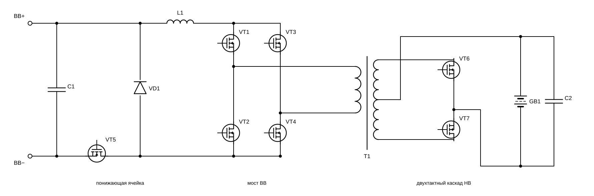
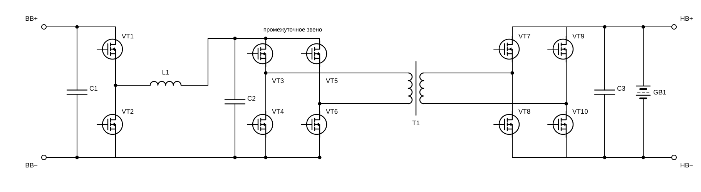
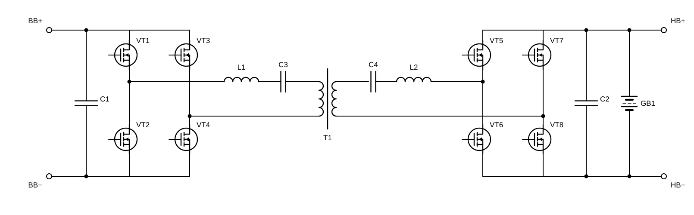
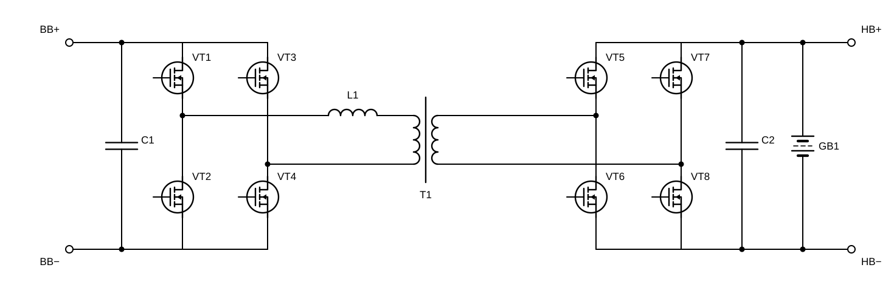
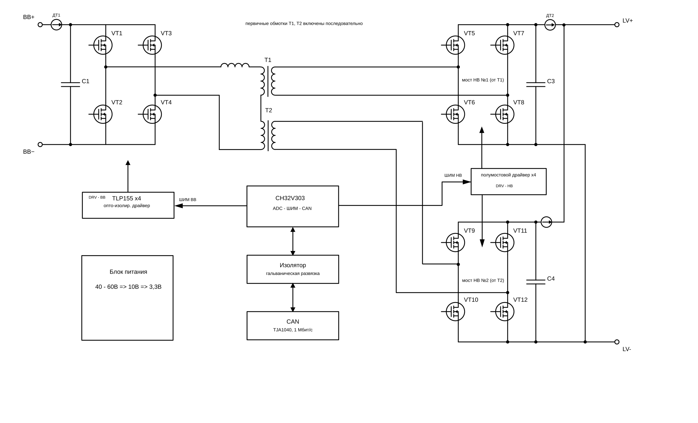

# ЭСКИЗНЫЙ ПРОЕКТ

## Двунаправленный изолированный DC-DC преобразователь

### Пояснительная записка

---

**Шифр документа:** ДЦ-ДД-001  
**Стадия:** Эскизный проект  
**Версия:** 0.1

---

# Содержание

* [Предисловие](#предисловие)
* [Перечень сокращений, обозначений и терминов](#перечень-сокращений-обозначений-и-терминов)
* [Введение](#введение)

1. [Выбор технического решения](#1-выбор-технического-решения)
   1. [Анализ возможных топологий изолированного двунаправленного DC-DC преобразователя](#11-анализ-возможных-топологий-изолированного-двунаправленного-dc-dc-преобразователя)
   2. [Сравнение вариантов и выбор топологии](#12-сравнение-вариантов-и-выбор-топологии)
   3. [Обоснование выбора способа управления преобразователем](#13-обоснование-выбора-способа-управления-преобразователем)
2. [Структурная схема преобразователя и выбор элементной базы](#2-структурная-схема-преобразователя-и-выбор-элементной-базы)
   1. [Выбор элементной базы](#21-выбор-элементной-базы)
   2. [Потоки энергии, сигналы управления и измерения](#22-потоки-энергии-сигналы-управления-и-измерения)
   3. [Взаимодействие с кластером и аккумуляторной батареей](#23-взаимодействие-с-кластером-и-аккумуляторной-батареей)
3. [Принцип действия преобразователя](#3-принцип-действия-преобразователя)
   1. [Интервалы периода коммутации](#31-интервалы-периода-коммутации)
   2. [Механизм включения при нулевом напряжении](#32-механизм-включения-при-нулевом-напряжении)
   3. [Передача энергии от высоковольтной шины к батарее](#33-передача-энергии-от-высоковольтной-шины-к-батарее)
   4. [Передача энергии от батареи к высоковольтной шине](#34-передача-энергии-от-батареи-к-высоковольтной-шине)
   5. [Пуск, переход через нулевую мощность и останов](#35-пуск-переход-через-нулевую-мощность-и-останов)
4. [Расчёт силовой части](#4-расчёт-силовой-части)
   1. [Выбор частоты коммутации](#41-выбор-частоты-коммутации)
   2. [Выбор коэффициента трансформации](#42-выбор-коэффициента-трансформации)
   3. [Расчёт передаточной индуктивности и диапазона фазового сдвига](#43-расчёт-передаточной-индуктивности-и-диапазона-фазового-сдвига)
   4. [Токи и напряжения элементов схемы по диапазону](#44-токи-и-напряжения-элементов-схемы-по-диапазону)
   5. [Границы диапазона ZVS](#45-границы-диапазона-zvs)
5. [Магнитная система](#5-магнитная-система)
   1. [Обоснование применения двух трансформаторов и схемы их включения](#51-обоснование-применения-двух-трансформаторов-и-схемы-их-включения)
   2. [Выбор материала и типоразмера магнитопровода](#52-выбор-материала-и-типоразмера-магнитопровода)
   3. [Расчёт числа витков и рабочей индукции](#53-расчёт-числа-витков-и-рабочей-индукции)
   4. [Расчёт обмоток и индуктивности рассеяния](#54-расчёт-обмоток-и-индуктивности-рассеяния)
   5. [Потери в магнитопроводе и обмотках](#55-потери-в-магнитопроводе-и-обмотках)
6. [Силовые ключи и управление затворами](#6-силовые-ключи-и-управление-затворами)
   1. [Требования к ключам сторон ВВ и НВ](#61-требования-к-ключам-сторон-вв-и-нв)
   2. [Выбор ключей стороны ВВ](#62-выбор-ключей-стороны-вв)
   3. [Выбор ключей стороны НВ](#63-выбор-ключей-стороны-нв)
   4. [Расчёт потерь в ключах](#64-расчёт-потерь-в-ключах)
   5. [Драйверы затворов и изолированное питание](#65-драйверы-затворов-и-изолированное-питание)
7. [Накопительные и фильтрующие элементы](#7-накопительные-и-фильтрующие-элементы)
   1. [Конденсаторы звена ВВ](#71-конденсаторы-звена-вв)
   2. [Конденсаторы звена НВ](#72-конденсаторы-звена-нв)
   3. [Действующие токи пульсаций и выбор типов конденсаторов](#73-действующие-токи-пульсаций-и-выбор-типов-конденсаторов)
8. [Система управления, измерения и защиты](#8-система-управления-измерения-и-защиты)
   1. [Микроконтроллер и формирование управляющих импульсов](#81-микроконтроллер-и-формирование-управляющих-импульсов)
   2. [Измерение токов и напряжений](#82-измерение-токов-и-напряжений)
   3. [Гальваническая развязка и интерфейс CAN](#83-гальваническая-развязка-и-интерфейс-can)
   4. [Защиты и поведение в аварийных режимах](#84-защиты-и-поведение-в-аварийных-режимах)
9. [Моделирование](#9-моделирование)
   1. [Состав модели и принятые параметры](#91-состав-модели-и-принятые-параметры)
   2. [Проверка режимов в номинальной точке](#92-проверка-режимов-в-номинальной-точке)
   3. [Проверка на границах диапазона напряжений и мощности](#93-проверка-на-границах-диапазона-напряжений-и-мощности)
   4. [Сопоставление результатов моделирования с расчётом](#94-сопоставление-результатов-моделирования-с-расчётом)
10. [Потери, КПД и тепловой режим](#10-потери-кпд-и-тепловой-режим)
    1. [Сводный баланс потерь](#101-сводный-баланс-потерь)
    2. [Расчётный КПД по диапазону работоспособности](#102-расчётный-кпд-по-диапазону-работоспособности)
    3. [Тепловой расчёт и система охлаждения](#103-тепловой-расчёт-и-система-охлаждения)
    4. [Конструктивное исполнение и компоновка](#104-конструктивное-исполнение-и-компоновка)
11. [Заключение](#11-заключение)
    1. [Результаты эскизного проекта](#111-результаты-эскизного-проекта)
    2. [Перечень работ последующих стадий](#112-перечень-работ-последующих-стадий)

* [Список литературы и других источников информации](#список-литературы-и-других-источников-информации)

---

# Предисловие

Настоящая пояснительная записка разработана в составе эскизного проекта двунаправленного изолированного DC-DC преобразователя.

Документ содержит обоснование принятых технических решений, описание структуры и принципа действия преобразователя, а также результаты предварительных инженерных расчётов, подтверждающих возможность реализации требований технического задания.

По мере выполнения работ содержание пояснительной записки уточняется и дополняется результатами расчётов, анализа и проектирования.

# Перечень сокращений, обозначений и терминов

| Обозначение | Определение |
|:--|:--|
| АКБ | Аккумуляторная батарея |
| ВВ | Высоковольтная шина постоянного тока |
| НВ | Низковольтная шина постоянного тока |
| DC | Постоянный ток (Direct Current) |
| DC-DC | Двунаправленный изолированный преобразователь постоянного тока |
| КПД | Коэффициент полезного действия |
| ШИМ | Широтно-импульсная модуляция |
| CAN | Controller Area Network |
| MCU | Микроконтроллер (Microcontroller Unit) |
| PWM | Pulse Width Modulation |
| ZVS | Коммутация при нулевом напряжении (Zero Voltage Switching) |
| ZCS | Коммутация при нулевом токе (Zero Current Switching) |
| EMI | Электромагнитные помехи (Electromagnetic Interference) |
| ESR | Эквивалентное последовательное сопротивление (Equivalent Series Resistance) |
| RMS | Среднеквадратичное значение (Root Mean Square) |

# Введение

«Килогерц 1-16:25:32:40:63» представляет собой семейство стабилизаторов однофазной сети 220/230 В, 50 Гц. В состав кластерного исполнения входят от двух до шести силовых инверторных модулей мощностью 2 кВт каждый, мастер-контроллер с устройством отображения информации и IoT-шлюз. Узлы кластера взаимодействуют по CAN-шине со скоростью 1 Мбит/с. Силовые модули формируют стабилизированное выходное напряжение в широком диапазоне входных напряжений, используя промежуточные звенья постоянного тока.

Разрабатываемый DC-DC является подсистемой накопления энергии в составе указанного стабилизатора. Каждый DC-DC подключается к высоковольтному звену постоянного тока соответствующего инверторного каскада и к аккумуляторной батарее LiFePO4 конфигурации 16S. Высоковольтные звенья постоянного тока отдельных инверторных каскадов не объединяются; низковольтные звенья DC-DC могут объединяться в общую аккумуляторную шину. DC-DC обеспечивает передачу энергии в обоих направлениях: от аккумуляторной батареи к DC-звену для питания нагрузки при отсутствии или недостаточном качестве сети, а также от DC-звена к аккумуляторной батарее при её заряде. Управление DC-DC, выдача команд и передача диагностической информации предусматриваются через CAN-интерфейс кластера.

Согласно техническому заданию, номинальная передаваемая мощность DC-DC равна номинальной мощности AC-каскада кластера и составляет 2 кВт. Рабочий диапазон напряжения высоковольтной стороны — 360…430 В, низковольтной стороны — 40…60 В. Передача энергии между сторонами выполняется через высокочастотный трансформатор с гальванической изоляцией. Такое построение обеспечивает функциональное отделение аккумуляторной подсистемы от высоковольтного звена инвертора и создаёт основу для работы стабилизатора как UPS или гибридного инвертора.

Настоящая пояснительная записка содержит обоснование выбора технических решений, описание структуры и принципа действия DC-DC, а также предварительные расчёты силовой части, трансформатора, накопительных элементов, потерь и теплового режима. Документ предназначен для фиксации решений эскизного проекта и последующего перехода к разработке электрической принципиальной схемы, конструкции и программы управления.

# 1 Выбор технического решения

## 1.1 Анализ возможных топологий изолированного двунаправленного DC-DC преобразователя

### 1.1.1 Исходные данные и обозначения

По техническому заданию: сторона ВВ 360…430 В, сторона НВ 40…60 В, номинальная мощность 2000 Вт, передача энергии в обоих направлениях, кремниевые силовые ключи. Полная мощность требуется в диапазоне НВ 46…57 В; на краях диапазона работоспособности, то есть при 40…46 В и 57…60 В, достаточно 200 Вт.

**Коэффициент передачи** Кп = U_НВ/U_ВВ — отношение напряжений сторон, которое преобразователь обязан обеспечить. Требуемые значения:

- при полной мощности Кп = 0,107…0,158, то есть изменяется в 1,48 раза;
- во всём диапазоне работоспособности Кп = 0,093…0,167, то есть изменяется в 1,80 раза.

**Коэффициент трансформации** n задаётся числом витков и постоянен. Произведение

$$ {\huge d = n \cdot K_{\text{п}} } ,~(1.1)$$

показывает, насколько приведённое напряжение стороны НВ совпадает с напряжением стороны ВВ. При d = 1 приведённые напряжения сторон равны — это оптимальная рабочая точка любой изолирующей топологии: реактивная составляющая тока минимальна, условия коммутации наилучшие. Поскольку n постоянен, а Кп меняется, удержать d = 1 во всём диапазоне невозможно. Выбрав n = 7,81 из условия d = 1 в номинальной точке 400 В и 51,2 В (формула (1.1)), получаем d = 0,84…1,24 при полной мощности и d = 0,73…1,30 во всём диапазоне работоспособности.

Второе исходное обстоятельство — токи сторон различаются почти на порядок: при номинальной мощности до 50 А на стороне НВ против 5,6 А на стороне ВВ. Один и тот же по схеме узел на разных сторонах преобразователя обходится совершенно по-разному.

Ниже рассмотрены четыре возможные топологии — от простейшей, воспроизводящей силовой тракт серийного прототипа, до двойного активного моста, который в итоге и выбирается.

### 1.1.2 Вариант 1 — понижающая ячейка на стороне ВВ и раздельное регулирование направлений

Вариант воспроизводит силовой тракт серийного гибридного инвертора POW-HVM3.2H и ряда других недорогих инверторов китайского производства.

Рисунок 1.1 — Силовой тракт прототипа: понижающая ячейка на стороне ВВ

Регулирующая ячейка образована ключом VT5 в отрицательной шине ВВ, диодом VD1 и дросселем L1 в плюсовой шине. Конденсатора промежуточного звена нет: мост ВВ включён внутрь контура, образованного дросселем и диодом. На рисунке каскад НВ показан так, как он выполнен в прототипе, — по схеме со средней точкой; на анализ это не влияет.

Двумя направлениями передачи энергии управляют разные узлы.

При **разряде** ведущим является каскад НВ. Он работает с изменяемой скважностью, L1 служит дросселем выходного фильтра, мост ВВ — выпрямителем, VT5 удерживается открытым и только проводит ток. Напряжение шины

$$ {\huge U_{\text{ВВ}} = 2 \cdot D \cdot n \cdot U_{\text{НВ}} } ,~(1.2)$$

где D — скважность плеча каскада НВ, не превышающая 0,5.

При **заряде** ведущей становится ячейка. VT5 работает в режиме ШИМ, L1 — дроссель понижающего преобразователя, VD1 — его обратный диод, мост ВВ инвертирует напряжение звена в трансформатор, ключи стороны НВ выпрямляют. Напряжение батареи

$$ {\huge U_{\text{НВ}} = \dfrac{D' \cdot U_{\text{ВВ}}}{n} } ,~(1.3)$$

где D′ — коэффициент заполнения VT5.

Преобразователь двунаправлен и регулируется в обе стороны. Но регулирующие узлы разнесены по разные стороны гальванической развязки, а оба направления являются понижающими: каждое способно только уменьшать напряжение своего источника.

Все каскады коммутируют жёстко; в прототипе ключи моста ВВ снабжены снабберными конденсаторами.

### 1.1.3 Вариант 2 — мост с фиксированной скважностью и повышающий каскад на стороне ВВ

Тот же принцип разделения функций, что и в варианте 1, но регулирующая ячейка здесь содержит не один ключ и диод, а два ключа — обычный неизолированный повышающий преобразователь между промежуточным звеном и стороной ВВ. Изоляция и регулирование по-прежнему разнесены по разным каскадам, и каждый занимается только своим делом.

Рисунок 1.2 — Мост с фиксированной скважностью и повышающий каскад на стороне ВВ

Изолирующий каскад — два полных моста и трансформатор со скважностью 50 % без всякого регулирования, то есть трансформатор постоянного тока. Он ничего не стабилизирует: напряжение промежуточного звена просто следует за напряжением батареи, умноженным на n. Благодаря этому каскад всегда работает при d = 1 — в оптимальной рабочей точке (формула (1.1)). Реактивная составляющая тока минимальна. Подмагничивание при этом не исчезает: скважность 50 % даёт нулевой вольт-секундный баланс лишь при идеально симметричных плечах, а реальная несимметрия сопротивлений открытых ключей и мёртвого времени накапливается и требует коррекции по измеренному току — так же, как в варианте 4 (см. п. 1.1.5).

Регулирующий каскад стабилизирует напряжение, задаёт передаваемую мощность, отрабатывает профиль заряда батареи и задаёт направление передачи энергии; изолирующий каскад собственной логики направления не содержит. В отличие от варианта 1, где эти функции разнесены по обе стороны гальванической развязки, здесь оба ключа регулирующей ячейки стоят по одну сторону — на стороне ВВ.

Коэффициент трансформации выбирается из условия

$$ {\huge n \cdot U_{\text{НВ.макс}} \le U_{\text{ВВ.мин}} } ,~(1.4)$$

откуда n ≤ 6. При n = 6 промежуточное звено работает в диапазоне 240…360 В, а наибольшее требуемое отношение напряжений регулирующего каскада составляет 430/240 = 1,79 при коэффициенте заполнения 0,44.

Существенно, что регулирующий каскад стоит на стороне ВВ. Через него проходит та же мощность, но при напряжении 240…430 В, поэтому ток составляет 5,6…8,3 А вместо 50 А: дроссель рассчитывается на ток менее 10 А, конденсатор промежуточного звена — на пульсации того же порядка. На стороне НВ тот же каскад потребовал бы дросселя на 50 А и конденсаторной батареи на такую же пульсацию.

Расплата за развязку функций — две составляющие потерь, присутствующие постоянно. Первая: условие ZVS по знаку тока в изолирующем каскаде выполняется при любой нагрузке, а по энергии — нет, поэтому индуктивность намагничивания приходится намеренно занижать, и создаваемый ею циркулирующий ток присутствует всегда, включая полную мощность. Вторая: ключи регулирующего каскада ZVS не имеют вовсе. При непрерывном токе дросселя нижний ключ включается на открытый встроенный диод верхнего, и тот восстанавливается под напряжением 360…430 В; при заряде обратного восстановления в единицы микрокулон и частоте 65 кГц это 25…50 Вт на полной мощности. Устраняется переводом каскада на границу прерывистых токов — ценой переменной частоты и удвоенной пульсации тока — либо снижением частоты коммутации.

Дополнительно индуктивность рассеяния трансформатора создаёт просадку промежуточного напряжения, пропорциональную току. Регулирующий каскад её отрабатывает, но при выборе n она уменьшает располагаемый запас.

### 1.1.4 Вариант 3 — резонансный преобразователь CLLLC

Оба предыдущих варианта разносят изоляцию и регулирование по разным каскадам. Здесь, как и в варианте 4 (см. п. 1.1.5), используется единый двухмостовой каркас — два полных моста с трансформатором между ними, — но между мостами дополнительно включён симметричный резонансный контур: последовательные индуктивность и ёмкость с каждой стороны трансформатора, а роль параллельной индуктивности играет индуктивность намагничивания. Схема ведёт себя как трансформатор с частотно-управляемым коэффициентом передачи, а форма тока в ней близка к синусоиде.

Рисунок 1.3 — Резонансный преобразователь CLLLC

В точке резонанса преобразователь работает безупречно: действующий ток минимален, мост ВВ включается при нулевом напряжении, мост НВ выключается при нулевом токе, крутых фронтов нет и уровень помех низкий. ZVS моста ВВ обеспечивается током намагничивания и потому не зависит от нагрузки — сохраняется вплоть до холостого хода.

Но именно в точке резонанса преобразователь не регулируется. Чтобы отработать изменение Кп в 1,48 раза, приходится уходить от резонанса и вверх, и вниз по частоте, а вместе с этим уходят и все перечисленные достоинства: выше резонанса теряется ZCS моста НВ, ниже резонанса уход в ёмкостную область срывает ZVS моста ВВ, растёт циркулирующая энергия. Требуемый диапазон регулирования шире того окна, в котором топология выигрывает.

Второе ограничение — конструктивное. Через резонансный конденсатор стороны НВ проходит весь ток этой стороны, то есть 40…60 А действующего значения на частоте в десятки килогерц. Это самый нагруженный элемент схемы, и именно он определяет её ресурс.

Наконец, обе резонансные частоты задаются произведением индуктивности на ёмкость, поэтому производственный разброс магнитопроводов и конденсаторов смещает рабочую точку независимо с каждой стороны.

### 1.1.5 Вариант 4 — двойной активный мост

Тот же двухмостовой каркас, что и в варианте 3, но без резонансного контура: последовательные индуктивность и ёмкости исключены, а функцию передаточной индуктивности выполняет индуктивность рассеяния самого трансформатора. Это самая экономная по составу из двунаправленных изолирующих схем: два одинаковых полных моста, между ними трансформатор и последовательная индуктивность — и больше ничего, ни выпрямителя, ни дросселя фильтра, ни разделительного конденсатора.

Рисунок 1.4 — Двойной активный мост

Оба моста формируют прямоугольное напряжение со скважностью 50 % на одной частоте. Разность фаз между этими напряжениями приложена к индуктивности, и вся передаваемая мощность определяется одной величиной — фазовым сдвигом φ:

$$ {\huge P = \dfrac{n \cdot U_{\text{ВВ}} \cdot U_{\text{НВ}} \cdot \varphi \cdot (\pi - \varphi)}{2\pi^2 f L} } ,~(1.5)$$

Смена знака φ разворачивает поток энергии. Никаких переключений в силовой части при этом не происходит, реверс занимает один период.

ZVS обеспечивается током индуктивности: к моменту коммутации он должен течь в нужную сторону и иметь достаточную энергию для перезаряда выходных ёмкостей плеча. Условие по знаку тока даёт границы по углу: для моста ВВ

$$ {\huge \varphi > \dfrac{\pi (d-1)}{2d} } ,~(1.6)$$

для моста НВ

$$ {\huge \varphi > \dfrac{\pi (1-d)}{2} } ,~(1.7)$$

В окне полной мощности, где d = 0,84…1,24, эти границы составляют 17,2° и 14,8°, а рабочий угол при 2000 Вт равен 35…37°. Запас двукратный, ZVS обеспечивается на обоих мостах во всём окне полной мощности.

Теряется ZVS при снижении мощности: при 200 Вт фазовый угол падает примерно до 3°, чего не хватает ни по знаку тока, ни по энергии даже в точке d = 1. ZCS в этой топологии не достигается нигде — оба моста выключаются вблизи максимума тока, где выключение частично демпфируется собственной ёмкостью ключей.

Отклонение d от единицы добавляет в ток трансформатора реактивную составляющую. На краях окна полной мощности действующий ток стороны ВВ растёт с 5,8 до 6,1…6,2 А, то есть на 5…6 %, а потери проводимости — примерно на 12 %.

Слабое место топологии — подмагничивание трансформатора. Управление по фазовому сдвигу не следит за вольт-секундным балансом обмотки, а разброс сопротивлений открытых ключей и длительности пауз создаёт небольшую несимметрию напряжения. При малом активном сопротивлении силового контура она накапливается в постоянную составляющую тока и смещает рабочую точку магнитопровода. Разделительный конденсатор не применяется, поэтому подавлять эту составляющую должна система управления по результатам измерения тока.

## 1.2 Сравнение вариантов и выбор топологии

Сравнение выполнено по электрическим показателям. Удобство реализации системы управления, стоимость и площадь печатной платы не рассматриваются.

Конфигурация выпрямительной части стороны НВ — полный мост или схема со средней точкой — на выбор топологии не влияет и в сравнении не учитывается: во всех вариантах она принята полномостовой, в том числе при подсчёте числа ключей.

Таблица 1.1 — Сравнение вариантов

| Показатель | Вариант 1 (мост + понижающая ячейка) | Вариант 2 (мост + повышающий каскад) | Вариант 3 (CLLLC) | Вариант 4 (DAB) |
|:--|:--|:--|:--|:--|
| Число преобразований энергии | 2 | 2 | 1 | 1 |
| Число ключей в тракте передачи энергии | 9 | 10 | 8 | 8 |
| Реактивные элементы | дроссель регулирующей ячейки | дроссель регулирующего каскада | 2 дросселя и 2 конденсатора | дроссель |
| Управление передаваемой мощностью | два контура: скважность каскада НВ при разряде, скважность ячейки при заряде | коэффициентом заполнения ячейки, один контур | частотой, один контур | фазовым сдвигом, один контур |
| Отработка изменения Кп | оба направления понижающие, требуемого n не существует (см. п. 1.2) | регулирующим каскадом, изолирующий остаётся при d = 1 | уходом от резонанса | не отрабатывается, d уходит от единицы |
| ZVS в окне полной мощности | не обеспечивается ни в одном каскаде | обеспечивается в изолирующем каскаде, отсутствует в регулирующем | ZVS моста ВВ только выше резонанса | обеспечивается на обоих мостах, запас по углу двукратный |
| ZVS при мощности 200 Вт | не обеспечивается | обеспечивается в изолирующем каскаде | обеспечивается током намагничивания | не обеспечивается |
| ZCS моста НВ | не достигается | не достигается | на резонансе и ниже | не достигается |
| Реактивная и циркулирующая составляющие тока | растут при снижении скважности каскада НВ | присутствуют постоянно, от заниженной индуктивности намагничивания | растут вне резонанса | растут на 5…6 % на краях окна полной мощности |
| Наиболее нагруженный элемент стороны НВ | ключи моста | ключи моста | резонансный конденсатор, 40…60 А | ключи моста |
| Дополнительные элементы стороны ВВ | дроссель ячейки; конденсатора промежуточного звена нет | дроссель и конденсатор промежуточного звена, 5,6…8,3 А | нет | нет |
| Подмагничивание трансформатора | то же, что в варианте 4 | то же, что в варианте 4 | блокируется резонансным конденсатором | накапливается при несимметрии плеч, требуется коррекция по току |
| Частота коммутации | постоянная | постоянная, кроме режима ZVS регулирующего каскада | переменная | постоянная |
| Чувствительность к разбросу параметров | низкая | низкая | высокая, две резонансные частоты | низкая |
| КПД в номинальной точке | 93,5…95 % | 93,5…95 % | 96…97 % | 95…96 % |
| КПД на краях окна полной мощности | 93,5…95 % | 93,5…95 % | 93…95 % | 94…95 % |
| КПД при 200 Вт на краю диапазона работоспособности | около 92 % | около 92 % | 90…93 % | около 92 % |
| Устранение слабого места | в пределах топологии не устраняется | изменением режима работы регулирующего каскада | изменением параметров резонансного контура | второй управляющей переменной, без изменения силовой схемы |

Число каскадов итоговый КПД не определяет: два каскада перемножают свои коэффициенты, но каждый из них может быть выше, чем у однокаскадной схемы, работающей вне оптимума. Однако у варианта 2 обе составляющие потерь — циркулирующий ток изолирующего каскада и обратное восстановление в регулирующем — присутствуют постоянно, поэтому его пологая характеристика проходит ниже, чем характеристика варианта 4 в окне полной мощности.

**Выбор: вариант 4, двойной активный мост.**

Решающим оказалось разделение диапазонов в техническом задании. Полная мощность требуется в окне 46…57 В, где d = 0,84…1,24, а границы сохранения ZVS составляют 17,2° и 14,8° против рабочего угла 35…37° (формулы (1.6) и (1.7)). Там, где передаётся вся мощность, обеспечивается ZVS на обоих мостах, а рост действующего тока на краях окна не превышает 6 %. Расширенный диапазон 40…60 В, где ZVS теряется, требует всего 200 Вт, и потери на перезаряд выходных ёмкостей составляют там около 5 Вт.

Вариант 3 при этом же условии выигрывает только в узкой полосе вокруг резонанса, а требуемое изменение Кп в 1,48 раза из неё выводит. Кроме того, резонансный конденсатор стороны НВ на 40…60 А остаётся самым нагруженным элементом схемы независимо от режима, а переменная частота коммутации не позволяет рассчитать фильтр электромагнитной совместимости и магнитные элементы на одну частоту.

Вариант 2 обеспечивает наиболее ровный КПД по диапазону, но его уровень ниже, поскольку обе дополнительные составляющие потерь действуют постоянно, а не только на краях. Он остаётся резервным решением на случай, если измеренный КПД варианта 4 на краях окна полной мощности не удовлетворит требованиям технического задания.

Вариант 1 двунаправлен и регулируется в обе стороны, поэтому по управляемости мощностью вариантам 2–4 он не уступает. Его ограничение количественное. Регулирование в обоих направлениях способно только снижать напряжение относительно значения, заданного коэффициентом трансформации: при разряде U_ВВ = 2·D·n·U_НВ ≤ n·U_НВ (формула (1.2)), при заряде U_НВ = D′·U_ВВ/n ≤ U_ВВ/n (формула (1.3)). Первое требует n ≥ 430/46 = 9,35, второе — n ≤ 360/57 = 6,32. Такого коэффициента трансформации не существует. Прототип с этим не сталкивается, поскольку его шина не нормирована — 300…450 В там результат, а не требование; здесь диапазон 360…430 В задан инверторным каскадом.

Второе отличие структурное. Регулирующие узлы разнесены по разные стороны гальванической развязки, поэтому нужны два контура регулирования с собственными датчиками, а смена направления означает передачу управления с одной стороны на другую. Вариант 2 обходится одним контуром: изолирующий каскад всегда работает при фиксированной скважности, всё регулирование ведёт ячейка.

По КПД варианты 1 и 2 на этой стадии неразличимы. У варианта 1 при разряде ячейка не преобразует энергию, а только проводит ток, но каскад НВ работает при скважности ниже предельной, что повышает действующие токи; у варианта 2 ячейка преобразует энергию в обоих направлениях, зато изолирующий каскад всегда остаётся при d = 1. Различие между ними лежит не в КПД, а в структуре регулирования.

Существенно и то, как устраняются слабые места. У варианта 4 потеря ZVS при малой мощности и рост реактивного тока при отклонении d от единицы устраняются введением второй управляющей переменной — дополнительного фазового сдвига внутри моста, — то есть правкой программы управления без изменения силовой схемы. Подмагничивание трансформатора устраняется там же, коррекцией по измеренному току. У варианта 3 расширение рабочего диапазона потребовало бы пересчёта резонансного контура и переделки магнитных элементов, у варианта 2 — изменения режима работы регулирующего каскада с потерей постоянной частоты коммутации.

## 1.3 Обоснование выбора способа управления преобразователем

Базовый способ управления — однофазный сдвиг (SPS). Оба моста работают со скважностью 50 %, а единственной управляющей переменной служит фазовый сдвиг φ между ними. Мощность и её направление задаются одной величиной, поэтому контур регулирования получается простым, а реверс занимает один период коммутации. Частота коммутации постоянная.

Ограничения SPS показаны в п. 1.2: ZVS сохраняется только при достаточном фазовом угле, а при отклонении d от единицы растёт реактивная составляющая тока. Поэтому предусматривается переход к расширенному фазовому сдвигу (EPS): помимо межмостового угла φ вводится внутримостовой сдвиг, укорачивающий импульс напряжения одного из мостов. Это снижает реактивный ток при d ≠ 1 и расширяет диапазон ZVS в сторону малых мощностей. Силовая схема при этом не изменяется.

Дополнительно система управления решает две задачи, вытекающие из выбранной топологии:

- подавление постоянной составляющей тока трансформатора — коррекцией длительностей импульсов по результатам измерения тока;
- плавный пуск — нарастанием φ от нуля, что исключает бросок тока и одностороннее намагничивание магнитопровода при включении.

Профиль заряда аккумуляторной батареи реализуется внешним контуром, задающим φ по командам, поступающим от кластера по CAN-интерфейсу.

# 2 Структурная схема преобразователя и выбор элементной базы

Раздел 1 определил топологию и способ управления, но не зафиксировал состав конкретных узлов и связи между силовой частью и контуром управления. Прежде чем переходить к расчётам, эту связь нужно зафиксировать целиком, одной схемой, а не по частям.

Предлагается следующая структурная схема преобразователя.

Рисунок 2.1 — Структурная схема преобразователя

Силовая часть построена на общем мосте ВВ (VT1–VT4), первичные обмотки трансформаторов T1 и T2 включены последовательно в его диагональ, а каждая вторичная обмотка нагружена на собственный полный мост НВ (VT5–VT8 и VT9–VT12 соответственно). Оба моста НВ запараллелены по шинам LV+ и LV−, поэтому передаваемая мощность делится между ними поровну независимо от разброса параметров трансформаторов. Датчики тока ДТ1 и ДТ2 контролируют, соответственно, ток моста ВВ и суммарный ток стороны НВ; их показания используются как для регулирования, так и для защиты по току.

Управляет преобразователем контроллер CH32V303: он формирует сигналы ШИМ для драйверов затворов моста ВВ (опто-изолированный TLP155×4) и мостов НВ (полумостовой драйвер), опрашивает датчики тока и обменивается данными с кластером по CAN через гальванический изолятор и трансивер TJA1040. Питание контроллера и обвязки — от собственного источника, понижающего напряжение батареи до 3,3 В независимо от состояния моста ВВ, что обеспечивает работоспособность цепей управления при пуске и в аварийных режимах.

Далее по разделу конкретизируются выбор элементной базы и принятые схемные решения — для каждого функционального узла в отдельности.

## 2.1 Выбор элементной базы

### 2.1.1 Выбор силовых транзисторов

Помимо статических потерь проводимости, важным параметром остаётся заряд обратного восстановления Qrr и время trr. ZVS в выбранной топологии гарантирован только внутри окна полной мощности (п. 1.1.5); в расширенном диапазоне 40…46 В и 57…60 В фазовый угол падает почти до нуля, условие ZVS не выполняется, и диод плеча восстанавливается под полным напряжением шины. Кроме того, выключение в DAB никогда не бывает мягким — оба моста выключаются вблизи максимума тока, ZCS не достигается нигде (п. 1.1.5), — а реальные допуски мёртвого времени и разброс параметров ключей сужают идеализированную границу ZVS и на практике. По этим причинам Qrr/trr остаётся значимым критерием отбора даже для топологии, штатный режим которой в окне полной мощности — мягкая коммутация. Второй по значимости параметр — заряды затвора и выходные ёмкости (Qg, Coss, Crss), определяющие потери на переключение и требования к драйверу. Третий — тепловое сопротивление переход-корпус RthJC: при заданном токе оно напрямую определяет допустимую температуру перехода и требования к теплоотводу, а разброс этого параметра между корпусами одного класса нередко превышает разброс самого RDS(on).

Отдельно оговаривается способ пересчёта RDS(on) в нагретом состоянии. Распространённое приближение «горячее сопротивление в полтора раза больше холодного» занижает потери проводимости почти вдвое: у проверенных по даташитам приборов множитель фактически составляет ×2,5…2,7 для 650-вольтовых Super Junction при 150 °C и ×1,8 для низковольтных Trench/SGT при 125 °C. Там, где производитель не приводит горячее значение явно, ниже применены именно эти множители, а не ×1,5.

**Таблица 2.1 — Сравнение кандидатов, сторона ВВ (650 В)**

| Параметр | [SPP20N60C3](../PDF/SPP20N60C3.pdf) | [CRJT99N65G2](../PDF/CRJT99N65G2.pdf) | [JCS20N65FH](../PDF/JCS20N65FH.pdf) | [NCE65TF099](../PDF/NCE65TF099.pdf) | [NCE65T180](../PDF/NCE65T180.pdf) |
|:--|:--|:--|:--|:--|:--|
| Технология | CoolMOS C3 | Super Junction | планарная | Super Junction | Super Junction |
| Корпус | TO-220 | TO-220 | TO-220MF (изолир.) | TO-220 | TO-220 |
| RDS(on), 25 °C | 160 мОм | 81 мОм | 440 мОм | 89 мОм | 150 мОм |
| RDS(on), горячий | 430 мОм @150 °C | 205 мОм @150 °C | ~1100 мОм (оц.) | ~222 мОм (оц.) | ~375 мОм (оц.) |
| Qg | 87 нКл | 70 нКл | 45 нКл | 45 нКл | 36 нКл |
| Qrr / trr | 11 мкКл / 500 нс | 5,92 мкКл / 347 нс | 9,3 мкКл / 660 нс | **1,6 мкКл / 180 нс** | 5,0 мкКл / 310 нс |
| Pd, 25 °C | 208 Вт | 252 Вт | 62,2 Вт | 322 Вт | 188 Вт |
| Цена, грн | 89,50 | 91,50 | 83,50 | 82,50 | 60,00 |
| Купить | [Купить](https://kosmodrom.ua/ru/tranzistor-polevoy-mosfet/spp20n60c3.html) | — | — | [Купить](https://kosmodrom.ua/ru/tranzistor-polevoy-mosfet/nce65tf099t.html) | [Купить](https://kosmodrom.ua/ru/tranzistor-polevoy-mosfet/nce65t180.html) |

Расчёт потерь проводимости на рабочем токе моста ВВ (I_RMS = 6,6 А по результатам моделирования) исключает двух кандидатов сразу. У JCS20N65FH при 1,1 Ом горячего сопротивления потери на одном ключе составляют около 48 Вт против предельно допустимых 62,2 Вт корпуса — прибор работает на пределе рассеяния уже по одной проводимости, без учёта коммутации, и изолированный корпус этого не окупает. У SPP20N60C3 реальное BVDSS составляет 600 В, а не 650, как заявлено в шапке даташита (650 В — значение при Tj max); для шины 360…430 В запас 1,40× недостаточен с учётом выбросов на индуктивности рассеяния, а горячее сопротивление 430 мОм — худшее в подборке.

Из оставшихся трёх CRJT99N65G2 даёт наименьшие потери проводимости (8,9 Вт против 9,7 Вт у NCE65TF099), но проигрывает по всем остальным показателям: заряд затвора выше на треть, а главное — заряд обратного восстановления в 3,7 раза больше (5,92 против 1,6 мкКл). На границах рабочего диапазона, где ZVS теряется (п. 1.1.5), это становится определяющим фактором. **Выбор: NCE65TF099** — по совокупности Qrr, Qg, теплового сопротивления (RthJC = 0,39 °C/Вт) и цены.

**Таблица 2.2 — Сравнение кандидатов, сторона НВ (80…100 В)**

| Параметр | [AONR62818](../PDF/AONR62818.pdf) | [CSD19503KCS](../PDF/CSD19503KCS.pdf) | [AON6226](../PDF/AON6226.pdf) | [CRSM038N10N4](../PDF/CRSM038N10N4.pdf) |
|:--|:--|:--|:--|:--|
| VDS | 80 В | 80 В | 100 В | 100 В |
| Корпус | DFN 3.3×3.3 | TO-220 | DFN 5×6 | DFN 5×6 clip |
| RDS(on), 25 °C | 5,5 мОм | 7,6 мОм | 6,4 мОм | 3,0 мОм |
| RDS(on), горячий | 9,5 мОм @125 °C | ~13,7 мОм (оц.) | 11,7 мОм @125 °C | ~5,4 мОм (оц.) |
| Qrr / trr | 100 нКл / 24 нс | 119 нКл / 72 нс | 150 нКл / 30 нс | н/д |
| RthJC | 1,8 °C/Вт | 0,8 °C/Вт | 0,9 °C/Вт | 0,5 °C/Вт |
| Цена, грн | 29,00 | 99,00 | 27,50 | 32,50 |
| Купить | [Купить](https://kosmodrom.ua/ru/tranzistor-polevoy-mosfet/aonr62818.html) | — | [Купить](https://kosmodrom.ua/ru/tranzistor-polevoy-mosfet/aon6226.html) | — |

Запас по напряжению у всех четырёх кандидатов достаточен: даже у приборов на 80 В он составляет не менее 20 В сверх максимума батареи 60 В — треть напряжения шины, — поэтому отбор по напряжению не проводится, сравнение ведётся по проводимости, тепловому сопротивлению, полноте данных и цене. CSD19503KCS проигрывает по проводимости и AONR62818, и AON6226, а стоит втрое дороже любого из них — исключается сразу. CRSM038N10N4 формально лидирует по RDS(on) и RthJC, но для него производитель не приводит Qrr/trr — параметр, значимость которого на границах ZVS-диапазона показана в начале раздела; выигрыш в потерях проводимости при этом не превышает 37 Вт на восемь ключей стороны НВ, то есть менее 2 % от номинальной мощности преобразователя, — несущественно на фоне непроверенного параметра коммутации и цены на 18 % выше.

**Выбор: AON6226.** Полностью документированный прибор (включая Qrr = 150 нКл), устойчиво доступный по складским остаткам, при цене 27,50 грн — самой низкой в подборке. RDS(on) горячий 11,7 мОм уступает CRSM038N10N4, но в пересчёте на потери разница не оправдывает риск недоказанной характеристики переключения. Корпус — DFN 5×6: теплоотвод идёт через массив переходных отверстий в плате, а не через радиатор, что становится входным условием для теплового расчёта (п. 10.3) и компоновки платы (п. 10.4).

Для NCE65TF099 производитель не приводит RDS(on) при верхней рабочей температуре; расчёты раздела 4 ведутся по множителю ×2,5, как принятое допущение до получения данных от производителя или прямого измерения. Для AON6226 горячее значение (11,7 мОм @125 °C) указано в даташите напрямую и оценки не требует.

**Итог выбора силовых ключей**

| Сторона | Позиции | Прибор | Цена, грн/шт | Сумма, грн | Купить |
|:--|:--|:--|:--|:--|:--|
| ВВ (мост, VT1–VT4) | 4 | **NCE65TF099** | 82,50 | 330,00 | [Купить](https://kosmodrom.ua/ru/tranzistor-polevoy-mosfet/nce65tf099t.html) |
| НВ (два моста, VT5–VT12) | 8 | **AON6226** | 27,50 | 220,00 | [Купить](https://kosmodrom.ua/ru/tranzistor-polevoy-mosfet/aon6226.html) |
| **Итого** | **12** | — | — | **550,00** | — |

Полные даташиты всех девяти рассмотренных кандидатов — в [`PDF/`](../PDF/).

## 2.2 Потоки энергии, сигналы управления и измерения

## 2.3 Взаимодействие с кластером и аккумуляторной батареей

# 3 Принцип действия преобразователя

## 3.1 Интервалы периода коммутации

## 3.2 Механизм включения при нулевом напряжении

## 3.3 Передача энергии от высоковольтной шины к батарее

## 3.4 Передача энергии от батареи к высоковольтной шине

## 3.5 Пуск, переход через нулевую мощность и останов

# 4 Расчёт силовой части

## 4.1 Выбор частоты коммутации

## 4.2 Выбор коэффициента трансформации

## 4.3 Расчёт передаточной индуктивности и диапазона фазового сдвига

## 4.4 Токи и напряжения элементов схемы по диапазону

## 4.5 Границы диапазона ZVS

# 5 Магнитная система

## 5.1 Обоснование применения двух трансформаторов и схемы их включения

## 5.2 Выбор материала и типоразмера магнитопровода

## 5.3 Расчёт числа витков и рабочей индукции

## 5.4 Расчёт обмоток и индуктивности рассеяния

## 5.5 Потери в магнитопроводе и обмотках

# 6 Силовые ключи и управление затворами

## 6.1 Требования к ключам сторон ВВ и НВ

## 6.2 Выбор ключей стороны ВВ

## 6.3 Выбор ключей стороны НВ

## 6.4 Расчёт потерь в ключах

## 6.5 Драйверы затворов и изолированное питание

# 7 Накопительные и фильтрующие элементы

## 7.1 Конденсаторы звена ВВ

## 7.2 Конденсаторы звена НВ

## 7.3 Действующие токи пульсаций и выбор типов конденсаторов

# 8 Система управления, измерения и защиты

## 8.1 Микроконтроллер и формирование управляющих импульсов

## 8.2 Измерение токов и напряжений

## 8.3 Гальваническая развязка и интерфейс CAN

## 8.4 Защиты и поведение в аварийных режимах

# 9 Моделирование

## 9.1 Состав модели и принятые параметры

## 9.2 Проверка режимов в номинальной точке

## 9.3 Проверка на границах диапазона напряжений и мощности

## 9.4 Сопоставление результатов моделирования с расчётом

# 10 Потери, КПД и тепловой режим

## 10.1 Сводный баланс потерь

## 10.2 Расчётный КПД по диапазону работоспособности

## 10.3 Тепловой расчёт и система охлаждения

## 10.4 Конструктивное исполнение и компоновка

# 11 Заключение

## 11.1 Результаты эскизного проекта

## 11.2 Перечень работ последующих стадий

# Список литературы и других источников информации
